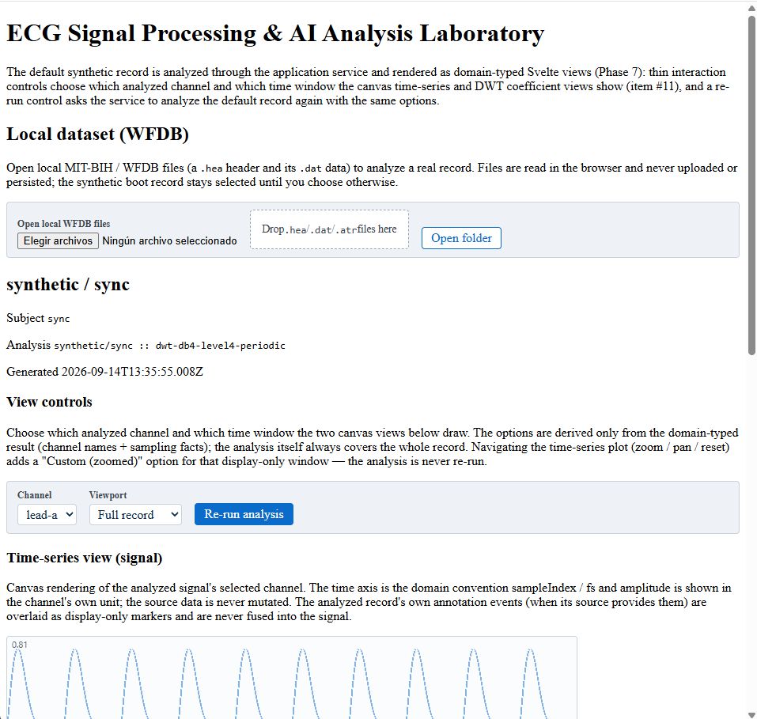
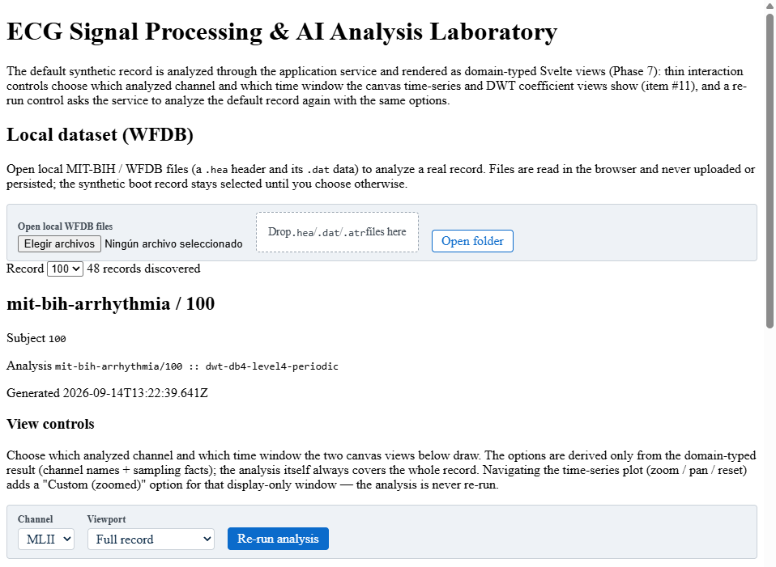
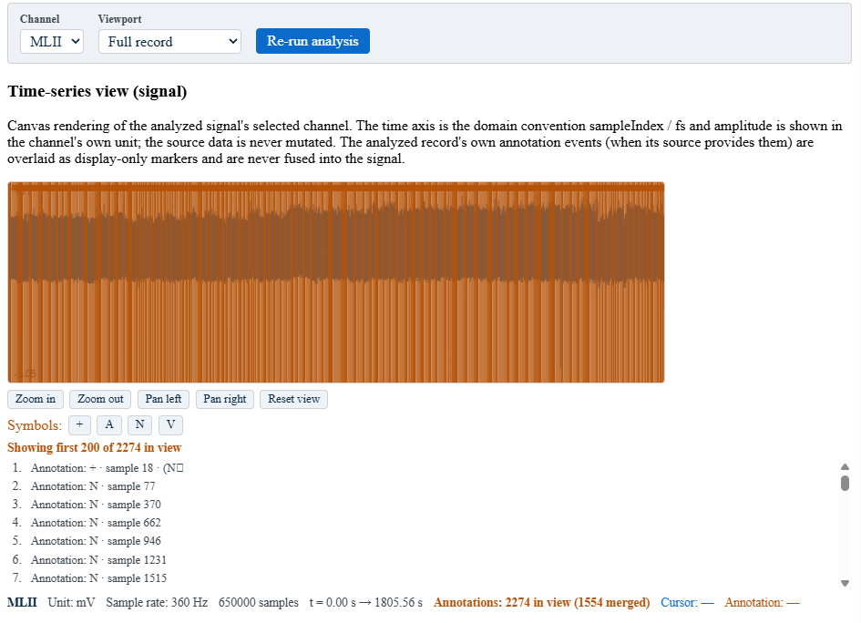
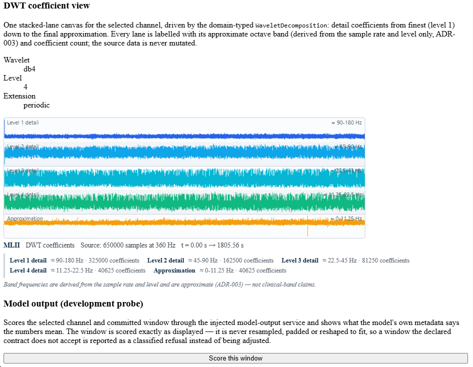
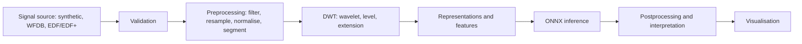
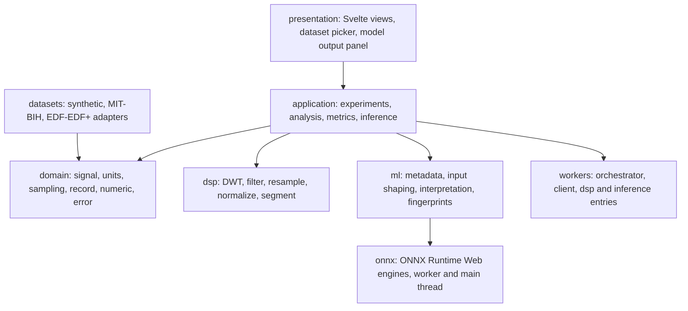

# ECG DWT Analyzer

A browser-first, local-first laboratory for ECG signal processing, wavelet analysis
and ONNX model inference. Signals are ingested, transformed and analysed entirely on
the user's machine; nothing is uploaded, because there is no server to upload to.

| | |
| --- | --- |
| Stage | Research and engineering prototype — Phases 1–18 complete |
| Licence | Apache-2.0 for the source in this repository; datasets keep their own upstream terms |
| Measured quality | 838 tests across 66 test files, plus type-checking, Svelte validation, linting and a production build of 181 modules |
| Runtime | Browser. Local-only: signals are read and processed on your machine |
| Hosted build | https://manwell47.github.io/ECG-Analyzer/ |

## Not a medical device

This is a research and engineering prototype. It is **not a medical device**, it is not
a diagnostic system, and it has not been validated for any clinical purpose: no
evaluation study has been performed on this repository, and no accuracy, sensitivity,
specificity or other performance figure is claimed anywhere in it. Model outputs are
*predictions* over signal windows. They are not diagnoses, not clinical findings and
not recommendations for patient care, and must never be read as any of those things.

## Contents

- [Try it](#try-it)
- [What you can do](#what-you-can-do)
- [Screenshots](#screenshots)
- [Reading the interface (clinician guide)](#reading-the-interface-clinician-guide)
- [How it works](#how-it-works)
- [Data policy](#data-policy)
- [Quality and testing](#quality-and-testing)
- [Documentation](#documentation)
- [Limitations and non-goals](#limitations-and-non-goals)
- [License](#license)

## Try it

**Hosted build — interface preview.** A static build is published at
**https://manwell47.github.io/ECG-Analyzer/**. Treat it as a preview of the interface
rather than as a working analysis service: it is the real application served as static
files, but whether ONNX model inference initialises in that deployed build has not been
established, so nothing about inference should be inferred from the hosted copy. It
also brings no dataset with it — real recordings are read from the machine you are
sitting at, so analysing your own data means running the application locally.

**Locally on Windows — one double-click.** Run [`App.cmd`](App.cmd) in the repository
root. It checks that `node` and `npm` are on `PATH`, installs dependencies with
`npm ci` when `node_modules` is missing, then starts the dev server and opens the
browser.

**Locally, any platform.**

```bash
npm install
npm run dev
```

Requirements: Node.js 20 or newer (`package.json` declares `engines.node >= 20`), and a
modern browser. Folder ingestion uses the File System Access API and therefore needs a
Chromium-based browser; single-file ingestion works wherever the application runs.

| Script | Purpose |
| --- | --- |
| `npm run dev` | Start the Vite development server |
| `npm run check` | Full gate: `typecheck` → `svelte-check` → `lint` → `test` → `build` |
| `npm run typecheck` | `tsc --noEmit` |
| `npm run svelte-check` | Svelte diagnostics and template type-checking |
| `npm run lint` | ESLint over `src` and `vite.config.ts` |
| `npm run test` | Vitest, single run |
| `npm run test:watch` | Vitest in watch mode |
| `npm run bench` | Vitest benchmarks; raw output is deliberately never committed |
| `npm run build` | Production build |
| `npm run fixtures:write` | Regenerate the golden fixtures (sets `FIXTURES_OVERWRITE=1`) |

## What you can do

Each row is a stage of the pipeline, in the order the pipeline runs.

| Stage | What the application lets you do |
| --- | --- |
| Import | Boot on a deterministic synthetic record (`sync`, 360 Hz) with no dataset and no network access; open local WFDB files — a MIT-BIH `.hea` header with its `.dat` data, plus `.atr` annotations when present — either as individual files or, in a Chromium-based browser, as a whole folder; recognise EDF/EDF+ headers. Unsupported layouts are refused with a classified error rather than guessed at. |
| Inspect | Draw the selected channel as a time-series canvas, choose the displayed channel and the viewport, zoom in and out, pan left and right, overlay the recording's own annotations as display-only markers, filter which annotation symbols are drawn, and read the cursor time and the nearest annotation from a numeric readout. |
| Preprocess | Filtering, resampling, normalisation and segmentation exist as declared, independently testable DSP stages; the analysis id names exactly which of them ran. The default analysis applies no filter. |
| Multiscale analysis | Decompose with the Daubechies `db4` wavelet at 4 levels with periodic extension, view the coefficients level by level with their nominal dyadic bands, and rely on reconstruction being asserted numerically against the original signal. |
| Inference | Score the displayed window with a committed ONNX probe model through ONNX Runtime Web in a Web Worker. The window is scored exactly as displayed — never resampled, padded or reshaped to fit the model's declared contract — so a window the contract does not accept is reported as a classified refusal instead of being quietly adjusted. |
| Experiment | A deterministic experiment runner and metric definitions sit at the application layer for reproducible evaluation, with fingerprints and stable ids so a run can be identified. This is a library-level surface, not a screen in the UI. |
| Measure | `npm run bench` measures DSP, pipeline and worker scenarios. Raw benchmark output is per-machine and is never committed. |

## Screenshots

Captured from real browser sessions of this application, at its own panels, with the
files and settings shown in each caption. They illustrate the interface; per
[`ADR-017`](plans/adr/ADR-017-real-data-verification.md) a screenshot is an observation
of appearance and is never verification evidence, and it is not a substitute for any row
of the manual-verification protocol. No figure may be read as a performance or
validation claim.

### 1. Startup on the synthetic default



The application as it opens on a fresh clone: the "Local dataset (WFDB)" panel with its
empty file input, the record summary `synthetic / sync`, an analysis id of the form
`<dataset>/<record> :: dwt-db4-level4-periodic`, and the time-series view below. The
signal is the deterministic synthetic record — nothing was loaded and nothing left the
machine. The time axis is the recording's own time, `sampleIndex / fs` in seconds, and
amplitude is drawn in the channel's unit (mV). The wavelet configuration is the default
`db4`, 4 levels, periodic extension, and no filter is applied.

### 2. Opening a local record



Four WFDB files chosen through the application's own in-page picker, with the discovered
record `100` selected and the loaded record summary `mit-bih-arrhythmia / 100`. Those
files are read in the browser and never uploaded or persisted. The frame deliberately
contains no operating-system dialogue, no local path and no local file name — the
picker shown belongs to the page, not to the desktop.

### 3. Time-series view of a real record



Record `100`, channel `MLII`, full record: the readout gives `Unit:mV`, `Sample rate:
360 Hz`, 650 000 samples from `t = 0.00 s` to `1805.56 s`, and `2274` annotation events
in view. Amplitude is therefore in millivolts, and time follows from the sample rate and
the sample index. The orange stems over the trace are the **recording's own reference
annotations**, decoded from its `.atr` file and drawn for display only; they are not
detections produced by this application and carry no clinical meaning here. The
recorder's cursor and annotation fields read `—`, i.e. nothing is selected in this frame.

### 4. Wavelet coefficient view



`db4`, level 4, periodic extension, for the same recording (650 000 samples at 360 Hz).
The level bands read `≈ 90-180 Hz`, `≈ 45-90 Hz`, `≈ 22.5-45 Hz`, `≈ 11.25-22.5 Hz` and
`≈ 0-11.25 Hz`; the panel carries its own disclaimer that band frequencies are derived
from the sample rate and the level, are approximate, and are not clinical-band claims.
The "Model output (development probe)" panel is shown with its control and **no score**,
so this figure depicts no completed inference.

### Attribution

The three figures above that render dataset data — `02-open-local-record.png`,
`03-time-series.png` and `04-dwt-coefficients.png` — show **record 100, channel MLII** of
the **MIT-BIH Arrhythmia Database**, published by **PhysioNet** at
<https://physionet.org/content/mitdb/> and used under the **Open Data Commons
Attribution License v1.0** (<https://opendatacommons.org/licenses/by/1-0/>).

The dataset itself is **not redistributed** by this repository: what is committed is the
rendered interface screenshot, not the recording. The modification shown relative to the
raw record is the analysis, the channel selection and the rendering performed on screen
by this application from a copy of the dataset fetched locally by the project owner into
the git-ignored `data/raw/` directory. No patient metadata from the dataset's `.hea`
header comments — age, sex, height, weight or medication — appears in any figure. The
capture protocol and this attribution record live in
[`docs/screenshots/README.md`](docs/screenshots/README.md).

## Reading the interface (clinician guide)

This section explains how to **read the interface** — what each panel measures and what
its words mean. It deliberately does not explain how to interpret a patient, because
this software does not do that and cannot support it.

### Record identity, axes and units

- **Identity is displayed, never assumed.** The record summary row shows
  `<dataset> / <record>` and the subject identifier, and the analysis row shows the
  analysis id, which names the dataset, the record and the exact transform chain. Read
  the identity off the panel in front of you: which record is loaded depends on the copy
  of the dataset on your own machine, not on any document.
- **Time is physical time.** The horizontal axis is `sampleIndex / sampleRate`, drawn in
  seconds. Sample numbers are never presented as seconds.
- **Amplitude is in the channel's own unit.** For MIT-BIH that is millivolts, after the
  dataset's own gain and baseline conversion from ADC counts. A channel declared in
  anything other than mV is refused rather than silently reinterpreted, so a plotted
  millivolt value is a calibrated value.
- **The sampling rate belongs to the recording, not to the view.** It is shown with the
  signal (for MIT-BIH, 360 Hz) and it does not change when you zoom, pan or switch
  channels. Zooming changes which samples are drawn, never how they are sampled, and the
  displayed signal is never silently resampled.

### The annotation layer

- The trace is drawn in blue. Where the recording carries annotation events, they appear
  as **orange vertical stems labelled with their event symbol**, and the legend
  (`Symbols: …`) toggles which symbols are drawn. A bounded list below the plot lists the
  events in view, with a caption saying how many of the total are shown.
- The `Cursor:` and `Annotation:` readout reports the time under the pointer and the
  nearest annotation event. When nothing is selected both read `—`.
- **These annotations are the dataset's own reference annotations**, decoded from the
  `.atr` file that ships with the recording, and they are drawn for display only — they
  are never fused into the signal and never recomputed. They are not findings produced
  by this application, and they are not a clinical interpretation of anything.

### The wavelet panel

- A decomposition level shows **coefficients**, not an ECG trace. Do not read a
  coefficient plot as a waveform: its vertical axis is a coefficient amplitude at that
  scale, not a millivolt deflection of the recording.
- **Lower levels carry the faster content, higher levels the slower content.** Level 1 is
  the finest scale; each successive level describes what is left after the faster content
  has been removed.
- The band label on each level (`≈ 90-180 Hz`, `≈ 45-90 Hz`, …) is a **nominal dyadic
  range computed arithmetically from the sampling rate and the level**. It is approximate
  and it is emphatically not a clinical frequency band; the panel says so on screen. The
  configuration in use is stated beside the plot (`Wavelet`, `Level`, `Extension`) — in
  the default configuration, `db4` with 4 levels and periodic extension.

### The model panel

- The only model committed to this repository is a small **development probe model**, and
  its own metadata describes its task as development seam-validation rather than a
  physiological classifier. Its agreement oracle is an analytic sign-of-sum labeler whose
  agreement with the probe is true **by construction**, which means the agreement is not
  evidence of any accuracy.
- Pressing `Score this window` scores the window exactly as displayed. The window is
  never resampled, padded or reshaped to satisfy the model, so a window the declared
  contract does not accept is reported as a classified refusal instead of being adapted.
- The displayed number is a **model score or a predicted probability**; it is not a
  calibrated confidence and it is not medical certainty. The panel demonstrates that the
  inference plumbing works — contract validation, tensor construction, a worker-hosted
  ONNX session, and explicit interpretation of the output — and nothing more.

### When the input is not valid

Invalid, unsupported or malformed input is **refused, not repaired**. Refusals are
reported as `<ErrorName> (<code>): <message>` on the page, and the analysis stops rather
than continuing with adjusted data. Typical reasons include a file whose format is not
supported, a header that does not describe the accompanying data, a channel whose
declared unit is not millivolts, and a signal that fails validation. If you see a
refusal, the honest reading is that the input is outside the contract this software
declares — not that the software found something interesting.

### What a reader must not conclude

- Nothing about a person. No panel diagnoses, stages, risks or rules anything in or out,
  and no combination of panels should be assembled into a patient-level conclusion.
- Nothing about model performance. No figure here reports accuracy, sensitivity,
  specificity, AUROC or any validated measure, and such a figure cannot be derived from
  what is shown.
- Nothing clinical from the annotation letters. They are the dataset's reference labels,
  rendered, not findings.
- Nothing clinical from a wavelet level or a band label. The bands are arithmetic
  derivations from the sampling rate and the level.
- Nothing about the hosted build's inference. Whether inference initialises in the
  deployed build has not been established here.
- Nothing about confidence from a probability-like number. It is a model score or
  predicted probability, uncalibrated, with no clinical meaning.

## How it works

The conceptual pipeline, whose stages are independently testable and independently
inspectable:



The dependency direction between modules is strictly downward: presentation depends on
the application, the application depends on the domain and on the DSP/ML/worker seams,
and the domain depends on nothing. DSP and ML code never lives inside a UI component.



| Directory | Contents |
| --- | --- |
| `src/domain/` | Invariant value types and pure numeric primitives |
| `src/dsp/` | DWT decomposition and reconstruction, filtering, resampling, normalisation, segmentation |
| `src/application/` | Experiment orchestration, record analysis, metrics and the inference seam |
| `src/ml/` | Model lifecycle: metadata, input shaping, interpretation, fingerprints; `src/ml/onnx/` holds the ONNX Runtime Web engines (worker-hosted and main-thread) |
| `src/workers/` | Worker channel: protocol, client, orchestrator, DSP and inference entries |
| `src/datasets/` | Dataset abstraction and adapters: synthetic, MIT-BIH, EDF/EDF+ |
| `src/presentation/` | Svelte 5 UI: dataset picker, view controls, time-series, DWT coefficient and model output views |
| `src/fixtures/` | Deterministic RNG, canonical reference signals and the golden-artifact tooling |
| `src/bench/` | Benchmarks and scenario definitions |
| `data/fixtures/` | Committed, small, provenance-documented golden artifacts |
| `data/raw/` | Git-ignored: local records, never redistributed |
| `docs/screenshots/` | Capture protocol, the published figures and their attribution record |
| `plans/` | Plans, audits, checkpoints, ADRs and the manual-verification protocols |

Key design decisions — including the alternatives that were rejected and the residual
risk accepted — are recorded as ADRs under `plans/adr/`.

## Data policy

This repository is **local-first by construction**, and that principle is enforced
mechanically rather than by convention.

- `data/raw/` holds raw records (for example the MIT-BIH Arrhythmia Database) and
  `data/processed/` holds intermediate output. **Both are git-ignored and are never
  committed or redistributed.**
- The MIT-BIH Arrhythmia Database is published by PhysioNet under the Open Data Commons
  Attribution License (ODC-BY 1.0). Fetch it yourself into `data/raw/mitdb/`; the adapter
  discovers records by scanning that directory.
- `data/fixtures/` **is** committed because it contains only small, derived artifacts: a
  probe ONNX model generated by a script in this repository, and reference arrays derived
  from the project's own DSP outputs. Each has a `README.md` documenting its provenance.
- Raw benchmark output in `bench-results/` is per-machine and timing-dependent, so it is
  ignored; the committed artifacts are the policy document and the labelled baseline
  snapshot.
- **Signals do not leave the machine.** There is no telemetry, no analytics, no cloud
  inference dependency, no upload path and no network call that carries signal data, and
  raw waveforms are not logged.
- **The published figures are renderings, not data.** The screenshots in
  `docs/screenshots/` are interface captures; the dataset they render is not redistributed
  with them. Three of the four render MIT-BIH data and carry the attribution recorded in
  the [Screenshots](#screenshots) section above.
- The four screenshots were checked before publication for exactly this: no local file
  path, no operating-system picker, no window title, no taskbar, no developer tools and no
  `.hea` header metadata appears in any frame.

## Quality and testing

The gate is `npm run check`, which chains type-checking, Svelte validation, linting, the
full test suite and a production build. It is green at:

| Metric | Value |
| --- | --- |
| Test files | 66 |
| Tests | 838 |
| Build modules (production bundle) | 181 |

The suite is layered so that each layer fails for one reason only:

- **Domain invariants** — units, sampling, signal construction, numeric primitives.
- **DSP behaviour** — filtering, resampling, normalisation and segmentation against
  deterministic inputs and golden values, plus DWT decomposition and reconstruction.
- **Dataset adapters** — MIT-BIH headers, format-212 decoding, annotation parsing,
  EDF/EDF+ calibration, and parity tests against golden artifacts.
- **Worker channel** — protocol, binding, identity, client/orchestrator contracts and
  main-thread-versus-worker parity.
- **Machine learning** — metadata validation, input shaping, interpretation and
  fingerprints, with a stub engine and the real probe model.
- **Presentation** — Svelte components under jsdom.
- **Opt-in real data** — end-to-end reads of genuine records, skipped cleanly when the
  dataset is absent.

Reference signals are committed rather than invented per test: the canonical fixtures
share the laboratory's 360 Hz, millivolt convention and cover an impulse, a constant
signal, a single sinusoid, a multi-tone signal, a chirp, seeded noise and a synthetic
ECG-like morphology. Their samples and measured properties are stored under
`data/fixtures/reference/`, together with the `db4` filterbank and its invariants, and
they only change when `FIXTURES_OVERWRITE=1` is set deliberately.

Honest caveats:

- **Real-browser manual passes remain pending.** Interactive behaviour is verified by a
  human following the protocol in
  [`plans/phase-18-manual-verification.md`](plans/phase-18-manual-verification.md). Per
  [`ADR-017`](plans/adr/ADR-017-real-data-verification.md) those observations are recorded
  but never treated as automated gates, and an unperformed row is not a pass. Screenshots
  do not change this.
- **Real-record integration tests skip on a clean clone.** They read the git-ignored
  dataset under `data/raw/`. When it is absent they skip with the reason *"data/raw/mitdb
  is absent (gitignored) — opt-in real-data gate skipped"*, and the default suite passes
  without it.
- **The deployment workflow runs no test gate.** It publishes the build; the suite is run
  by hand on Windows. The numbers above are the ones the gate actually reported.
- **Benchmark numbers are per-machine.** Raw output is not committed, and no performance
  claim in this repository rests on uncommitted timings.

## Documentation

| Document | Contents |
| --- | --- |
| [`AGENTS.md`](AGENTS.md) | The binding engineering protocol and non-negotiable constraints |
| [`App.cmd`](App.cmd) | The Windows launcher: dependency check, `npm ci` when needed, dev server, browser |
| `plans/ecg-lab-architecture.md` | The system architecture |
| `plans/phase-18-plan.md` | Scope and items of the most recent phase |
| `plans/phase-18-audit.md` | What was built, with evidence and residual risk |
| `plans/phase-18-checkpoint.md` | Verified state at the close of the phase |
| `plans/phase-18-manual-verification.md` | The human real-browser protocol |
| `plans/adr/` | Architecture Decision Records, `ADR-001` onward |
| `plans/adr/ADR-022-repository-publication-and-licensing.md` | Publication, licensing and the attribution conditions for published figures |
| `plans/adr/ADR-023-public-hosting-and-public-facing-documentation.md` | Hosting, and the claim rules this README is written under |
| `plans/repository-publication-plan.md` | Publication and licensing decisions for this repository |
| `docs/origin-brief.md` | The original architecture brief that started the project |
| [`docs/screenshots/`](docs/screenshots/README.md) | Capture protocol, the published figures and their attribution record |

- **Running, verifying and resuming work on this project:**
  [`plans/project-handover-and-resumption.md`](plans/project-handover-and-resumption.md) records the
  frozen state, how to bring the project back up, the verification gate, the open work queue and the
  resumption protocol.

## Limitations and non-goals

- **Not a medical device, and not a clinical tool.** No diagnosis, no risk score, no
  treatment guidance, no clinical decision support, and no claim of clinical validity.
- **No performance claims.** No evaluation study has been performed on this repository.
  There is no trained clinical classifier here to evaluate: the only committed model is a
  development probe with an analytic oracle, whose agreement is true by construction.
- **The hosted build is a preview.** Whether model inference loads in the deployed build
  has not been established, and the hosted copy carries no dataset.
- **Verification is partly pending.** Interactive, real-browser rows are recorded as
  observations, and several of them are outstanding.
- **Input coverage is deliberately narrow.** MIT-BIH WFDB records (format 212, `.hea`,
  `.dat`, optional `.atr`) and EDF/EDF+; anything outside those layouts is refused rather
  than approximated. A record whose channel is not declared in millivolts is refused.
- **One channel is displayed at a time.** There is no multi-lead simultaneous view, no
  rhythm-strip mode and no reporting surface.
- **No training pipeline.** The runtime is an inference and analysis environment; nothing
  in the application trains a model, and no training data is shipped.
- **Not a viewer replacement.** It is an experimentation laboratory for signal processing
  and inference plumbing, not a validated ECG viewer, and it must not be used as one.

## License

Source code in this repository is licensed under the **Apache License 2.0**; see
[`LICENSE`](LICENSE) and [`NOTICE`](NOTICE).

The license covers the source in this repository only. It does not extend to the
datasets referenced by the code, which remain under their own upstream terms and are not
redistributed here. The published screenshots that render MIT-BIH data are interface
renderings and are attributed as described in the
[Screenshots](#screenshots) section.
