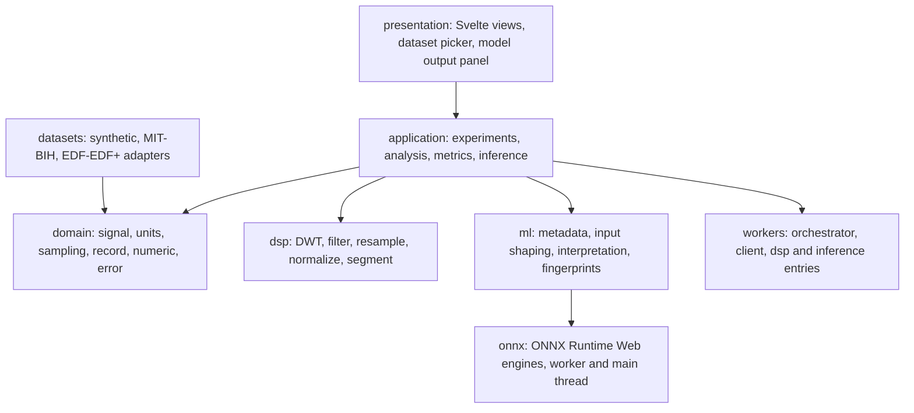

# ECG DWT Analyzer

A browser-first, local-first laboratory for ECG signal processing, wavelet analysis
and ONNX model inference. Signals are ingested, transformed and analysed entirely
on the user's machine; nothing is uploaded to a server.

> **Not a medical device.** This is a research and engineering prototype, not a
> diagnostic system. Model outputs are *predictions* over signal windows and must
> never be read as diagnoses, clinical findings or recommendations for patient
> care.

---

## Status

Phases 1–18 are complete. The quality gate — `npm run check`, which chains
type-checking, Svelte validation, linting, the full test suite and a production
build — is green at:

| Metric | Value |
| --- | --- |
| Test files | 66 |
| Tests | 838 |
| Build modules (production bundle) | 181 |

Two honest caveats:

- **Real-browser manual passes remain pending.** Interactive behaviour is verified
  by a human following the protocol in `plans/phase-18-manual-verification.md`. Per
  ADR-017, those observations are recorded but are never treated as automated
  gates, and an unperformed row is not a pass.
- **Real-record integration gates skip on a clean clone.** They read the
  git-ignored dataset under `data/raw/`. When it is absent they skip with the
  reason *"data/raw/mitdb is absent (gitignored) — opt-in real-data gate skipped"*,
  and the default suite passes without it.

---

## Requirements

- Node.js 20 or newer
- A modern browser. Local **folder** ingestion uses the File System Access API and
  therefore needs a Chromium-based browser; individual file ingestion works
  wherever the app runs.

## Quick start

```bash
npm install
npm run dev      # Vite dev server
npm run check    # the full quality gate
```

| Script | Purpose |
| --- | --- |
| `npm run dev` | Start the Vite development server |
| `npm run check` | Full gate: `typecheck` → `svelte-check` → `lint` → `test` → `build` |
| `npm run typecheck` | `tsc --noEmit` |
| `npm run svelte-check` | Svelte diagnostics and template type-checking |
| `npm run lint` | ESLint over `src` and `vite.config.ts` |
| `npm run test` | Vitest, single run |
| `npm run test:watch` | Vitest in watch mode |
| `npm run bench` | Vitest benchmarks; raw output is deliberately never committed |
| `npm run build` | Production build |
| `npm run fixtures:write` | Regenerate the golden fixtures (sets `FIXTURES_OVERWRITE=1`) |

---

## Architecture

The dependency direction is strictly downward: presentation depends on the
application, the application depends on the domain and the DSP/ML/worker seams,
and the domain depends on nothing.



```text
src/
  domain/        Invariant value types and pure numeric primitives
  dsp/           DWT decomposition/reconstruction, filtering, resampling, normalisation, segmentation
  application/   Experiment orchestration, analysis, metrics, inference seams
  ml/            Model lifecycle: metadata, input shaping, interpretation, fingerprints
    onnx/        ONNX Runtime engines (worker-hosted and main-thread)
  workers/       Worker channel: protocol, client, orchestrator, DSP/inference entries
  datasets/      Dataset abstraction and adapters: synthetic, MIT-BIH, EDF/EDF+
  presentation/  Svelte 5 UI: dataset picker, view controls, time-series, DWT coefficient and model output views
  fixtures/      Deterministic RNG and golden artifacts used by tests
  bench/         Benchmarks and scenario definitions
data/
  fixtures/      Committed, small, provenance-documented golden artifacts
  raw/           Git-ignored: local records, never redistributed
plans/           Plans, audits, checkpoints, ADRs, manual-verification protocols
```

Key design decisions — including the alternatives that were rejected and the
residual risk accepted — are recorded as ADRs under `plans/adr/`.

---

## Data policy

This repository is **local-first by construction**, and that principle is enforced
mechanically rather than by convention.

- `data/raw/` holds raw records (for example the MIT-BIH Arrhythmia Database) and
  `data/processed/` holds intermediate output. **Both are git-ignored and are never
  committed or redistributed.**
- The MIT-BIH Arrhythmia Database is published by PhysioNet under the Open Data
  Commons Attribution License (ODC-BY 1.0). Fetch it yourself and place it under
  `data/raw/mitdb/`; the adapter discovers records by scanning that directory.
- `data/fixtures/` **is** committed because it contains only small, derived
  artifacts: a probe ONNX model generated by a script in this repository, and
  reference arrays derived from the project's own DSP outputs. Each has a
  `README.md` documenting its provenance.
- Raw benchmark output in `bench-results/` is per-machine and timing-dependent, so
  it is ignored; the committed artifacts are the policy document and the labelled
  baseline snapshot.

---

## Testing approach

The suite is layered so that each layer fails for one reason only:

- **Domain invariants** — units, sampling, signal construction, numeric primitives.
- **DSP behaviour** — filtering, resampling, normalisation and segmentation against
  deterministic inputs and golden values.
- **Dataset adapters** — MIT-BIH headers, format-212 decoding, annotation parsing,
  EDF/EDF+ calibration, plus parity tests against golden artifacts.
- **Worker channel** — protocol, binding, identity, client/orchestrator contracts and
  main-thread-versus-worker parity.
- **Machine learning** — metadata validation, input shaping, interpretation and
  fingerprints, with a stub engine and a real ONNX probe model.
- **Presentation** — Svelte components under jsdom.
- **Opt-in real data** — end-to-end reads of genuine records, skipped cleanly when
  the dataset is absent.

Benchmarks live in `src/bench/`; see `plans/phase-9-bench-policy.md` for what may and
may not be committed from a benchmark run.

---

## Documentation

| Document | Contents |
| --- | --- |
| `AGENTS.md` | The binding engineering protocol and non-negotiable constraints |
| `plans/ecg-lab-architecture.md` | The system architecture |
| `plans/phase-18-plan.md` | Scope and items of the most recent phase |
| `plans/phase-18-audit.md` | What was built, with evidence and residual risk |
| `plans/phase-18-checkpoint.md` | Verified state at the close of the phase |
| `plans/phase-18-manual-verification.md` | The human real-browser protocol |
| `plans/adr/` | Architecture Decision Records, `ADR-001` onward |
| `plans/repository-publication-plan.md` | Publication and licensing decisions for this repository |
| `docs/origin-brief.md` | The original architecture brief that started the project |
| `docs/screenshots/` | Capture protocol and holding area for the interface screenshots referenced above |

---

## License

Source code in this repository is licensed under the **Apache License 2.0**; see
[`LICENSE`](LICENSE) and [`NOTICE`](NOTICE).

The license covers the source in this repository only. It does not extend to the
datasets referenced by the code, which remain under their own upstream terms and
are not redistributed here.
