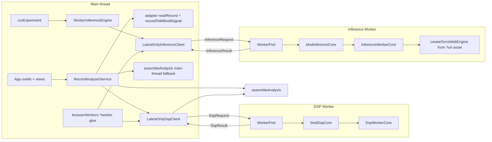

# Phase 10 Plan — Worker Offload (real browser Worker glue)

Recorded 2026-09-13. Purpose: a resumable, itemized Phase-10 plan to execute
item-by-item in Code mode with a green `npm run check` gate at every item —
mirroring the `plans/phase-9-plan.md` / `plans/phase-8-plan.md` cadence.

## Active increment (approved)

> "Plan Phase 10 = worker offload (ADR-005 seam #3): wire real browser Worker
> glue so whole-record DSP + full-record inference leave the main thread."

This is the first **real optimization** after the measurement-only Phase 9. The
Phase-9 baseline (ADR-010) measured whole-record DSP ops at 4.8–340 ms and
full-record inference batches at 121–214 ms on the 650 000-sample record — all
far over the ≈16.7 ms frame budget — which is exactly why the §I worker
placement exists. Phase 10 makes that placement real: the main thread keeps
UI/state/rendering, and the CPU-bound scientific work executes in Workers behind
the already-built, transport-free envelope protocol. **No scientific algorithm
changes** — the same `src/dsp` / `src/ml` code runs, just off the main thread
(ADR-005: single shared implementation; rules §30).

## Verified state (baseline)

- **Baseline green** (Phase 9 close): `npm run check` passed — typecheck,
  svelte-check 0/0, lint, **49 test files / 506 tests**, Vite build (135 modules
  / 76.32 kB). Node v24.18.0, npm 11.16.0, Vitest 3.2.7.
- **Worker layer is complete and transport-free** (ADR-005): envelope protocol
  [`src/workers/types.ts`](../src/workers/types.ts:26), latest-only inference
  client [`src/workers/client.ts`](../src/workers/client.ts:47), worker cores
  [`src/workers/core.ts`](../src/workers/core.ts:99)
  (`InferenceWorkerCore`, `DspWorkerCore`), identity gate
  [`src/workers/identity.ts`](../src/workers/identity.ts:12), and the barrel
  [`src/workers/index.ts`](../src/workers/index.ts:1). Its header states the
  browser `Worker` glue "belongs to the presentation wiring (a later phase)" —
  Phase 10 is that phase.
- **What is missing (seam #3):**
  - **No real `new Worker(...)`** and no `*.worker.ts` entry files; no binder
    that connects a port's `onmessage` to a core's `handle`.
  - **No DSP client** — only `LatestOnlyInferenceClient` exists
    ([`src/workers/client.ts`](../src/workers/client.ts:47)); the DSP request
    kind has a worker core but no main-thread client.
  - The app runs analysis **synchronously on the main thread**:
    [`analyzeRecord()`](../src/application/analysis.ts:174) calls
    `recordToMillivoltSignal` → optional `filterSignal` → `decomposeSignal`
    inline; [`RecordAnalysisService`](../src/application/analysis.ts:204) just
    delegates to it; [`src/main.ts`](../src/main.ts:33) composes it and
    [`App.svelte`](../src/presentation/App.svelte:67) awaits `service.analyze`.
- **The probe-model accessor is Node-only**
  ([`probeModel.ts`](../src/ml/testing/probeModel.ts:1) imports `node:fs`/
  `node:crypto`), so inference-in-worker needs a **browser-loadable `.onnx`
  URL**; the committed artifact exists at
  [`data/fixtures/models/ecg-lab-probe-linear-mean-2.onnx`](../data/fixtures/models/ecg-lab-probe-linear-mean-2.onnx)
  (543 B, SHA-256 `deec0c5b…7052`).
- **Config facts that shape the design:**
  - [`tsconfig.json`](../tsconfig.json:4) `lib: ["ES2022","DOM","DOM.Iterable"]`
    — **no `webworker` lib**, `strict`, `noUncheckedIndexedAccess`. Worker entry
    files must typecheck against DOM typings (cast a local port interface; do
    **not** add the `webworker` lib and risk DOM-global conflicts).
  - [`vite.config.ts`](../vite.config.ts:1) is the single Vite/Vitest config;
    `test.environment: 'node'`, `test.include: ['src/**/*.test.ts']`. The glue
    must therefore be **Node-testable via in-memory ports**; only the thin
    browser entry files are untested-by-vitest (still typechecked + linted +
    built).
  - ESLint lints `src` + `vite.config.ts`; anything under `src/` must be
    lint-clean.
  - `onnxruntime-web ^1.29.0` is already a dependency; the engine factory is
    [`createOnnxWebEngine()`](../src/ml/onnx/ortWebEngine.ts:174).
  - `vite-env.d.ts` references `vite/client`
    ([`src/vite-env.d.ts`](../src/vite-env.d.ts:1)), which supplies the
    `*?worker` and `*?url` ambient module types Vite needs.

## Honesty framing (must stay true through every item)

Rules §50/§51/§52, ADR-005 and ADR-010 govern the whole phase:

- This phase **moves work off the main thread; it does not make the algorithm
  faster.** The Phase-9 DSP op durations are a property of the shared code and
  are unchanged by relocation. Any "faster/slower" statement must be a
  before/after measurement on the same machine (rules §51) — and the only
  honest metric here is **main-thread synchronous time removed**, not DSP
  throughput.
- **Parity is the correctness gate.** The worker path must produce a
  byte-identical `AnalysisResult` (analysis id, signal id + provenance,
  decomposition arrays) to the synchronous path; the worker path is an
  *execution* change, never a numerical one. No committed test asserts a
  duration (rules §51).
- **In-browser responsiveness cannot be measured in Node.** The Node harness can
  measure the main-thread *handoff* cost (envelope post + await) versus the
  synchronous cost it replaces; the real browser UI-responsiveness effect is
  validated **manually** via `npm run dev` and recorded as a manual observation,
  never as a CI gate.
- **No clinical claim, no model-quality claim** (§47/§49; ADR-009): the probe is
  a seam-validation artifact; inference-in-worker remains seam-validation scope.
- Buffers stay `Float64Array`/`Float32Array`; the byte-parity test is what
  permits (optional) transferables — if transfer semantics cannot be shown
  byte-identical, keep structured cloning (AGENTS §15; no premature copy
  optimization).

## Design decisions

### 1. A transport-free binder (Node-testable), entry files as thin shells

The cores already take an envelope and return an envelope. The missing piece is
a binding between a **port** and a **core**, written once and shared by both
worker kinds:

- New `src/workers/port.ts`: a `WorkerPort` interface
  `{ postMessage(message, transfer?): void; onmessage: ((message: unknown) => void) | null }`
  — the minimal surface a `DedicatedWorkerGlobalScope` and an in-memory fake
  both satisfy.
- New `src/workers/bind.ts`: `bindDspCore(port, core)` and
  `bindInferenceCore(port, core)` set `port.onmessage` to dispatch through the
  core's `handle` (guarded by the existing `isDspRequest`/`isInferenceRequest`
  guards) and post the returned envelope back. Unknown/other-kind messages are
  ignored.
- The real entry files are then ~3 lines each and own **no logic**:
  `src/workers/entries/dsp.worker.ts` and
  `src/workers/entries/inference.worker.ts` construct a core and call the
  binder with `self as unknown as WorkerPort` (DOM-typed; no `webworker` lib).
- The binder + ports are unit-tested in Node with an in-memory two-way port
  (`src/workers/__tests__/bind.test.ts`), mirroring the existing
  [`dspCore.test.ts`](../src/workers/__tests__/dspCore.test.ts:1) /
  [`client.test.ts`](../src/workers/__tests__/client.test.ts:1) patterns.

### 2. One latest-only orchestrator, two thin clients (rules §30)

`LatestOnlyInferenceClient` currently contains the whole latest-only state
machine (monotonic ids, supersede, stale-drop, dispose). Phase 10 adds a DSP
client with the *same* semantics; duplicating that logic would violate §30.
Therefore:

- Extract a small internal `LatestOnlyOrchestrator` (or a generic
  `LatestOnlyClient<TRequest, TResult, TError>`) that owns the gate, the pending
  map, supersede-on-issue, stale-drop-in-handle and dispose.
- **Refactor `LatestOnlyInferenceClient` to compose it while keeping its public
  API and behaviour identical** — the existing
  [`client.test.ts`](../src/workers/__tests__/client.test.ts:83) must stay green
  unchanged, proving no behaviour drift.
- Add `LatestOnlyDspClient` (same core) with
  `request(signalId, signal, dwt, filter?) → Promise<{ signal, decomposition }>`,
  dropping non-DSP envelopes; a new `src/workers/__tests__/dspClient.test.ts`
  mirrors every inference-client case (echo, supersede, stale drop, classified
  error, dispose).
- Export the shared transport-type shape once
  (`WorkerClientTransport { postMessage }`) so both clients share it.

### 3. Application seam: one assembly function, two execution strategies

`analyzeRecord` currently does load → mV → (filter) → DWT → assemble. The
worker request kind carries exactly `{ signal, filter?, dwt }` and returns
`{ signal (post-filter), decomposition }` — so the worker covers the CPU-bound
tail of the same chain. To avoid a second assembly path (§30):

- Extract a shared assembler `assembleAnalysis(sourceRecord, options, signal,
  decomposition)` from the current tail of
  [`analyzeRecord()`](../src/application/analysis.ts:174) — it computes
  `analysisIdOf`, runs `assertCoherentAnalysis`, and freezes the
  `AnalysisResult`. Both strategies call it.
- Define a `DspExecutor` strategy with two implementations:
  - `MainThreadDspExecutor` — the current inline `filterSignal` +
    `decomposeSignal` (unchanged code, just relocated behind the seam);
  - `WorkerDspExecutor` — wraps `LatestOnlyDspClient`, posts a `DspRequest`,
    awaits the `DspResult`, returns its `{ signal, decomposition }`; `EcgError`s
    from `dsp-error` propagate; a superseded request rejects as
    `request-superseded` (rules §31).
- [`RecordAnalysisService`](../src/application/analysis.ts:204) gains an optional
  executor, **defaulting to main-thread** so
  [`createDefaultLabService()`](../src/application/defaults.ts:64) keeps its
  current behaviour and the jsdom slice
  [`App.test.ts`](../src/presentation/__tests__/App.test.ts:38) stays green
  untouched. A new factory composes the worker-backed service for the browser
  bootstrap.
- **Parity gate** `src/application/__tests__/workerAnalysis.parity.test.ts`
  (Node, in-memory port bound to a real `DspWorkerCore`): run the synchronous
  path and the worker path over the default record (unfiltered **and** filtered)
  and assert byte-identical `analysisId`, `signal.id` + provenance,
  `decomposition.signalId`, and every coefficient array.

### 4. Full-record inference leaves the main thread via an engine adapter

`runExperiment` accepts any
[`InferenceEngine`](../src/ml/engine.ts:23) and calls
`run(metadata, input)` per window. The cleanest seam is a delegating engine:

- New `WorkerInferenceEngine implements InferenceEngine`: `backendId` (e.g.
  `'worker-onnx-web'`); `run(metadata, input)` posts an `InferenceRequest` for
  the model id/version carried by `metadata` via `LatestOnlyInferenceClient` and
  resolves the `ModelPrediction`; `dispose()` disposes the client.
- The **inference worker entry** constructs an `InferenceWorkerCore`, loads the
  probe engine from a browser-loadable asset URL, and `register`s it before the
  binder starts serving — so the ONNX session and every `run` live off the main
  thread ("full-record inference leaves the main thread"). `runExperiment` and
  its tests are unchanged.
- **Browser-loadable probe asset:** new `src/ml/onnx/probeAsset.ts` (browser-safe)
  imports the committed model with `?url`
  (`import probeModelUrl from '../../data/fixtures/models/ecg-lab-probe-linear-mean-2.onnx?url'`)
  and exposes browser-safe `PROBE_MODEL_METADATA` literals (id/version/sampling/
  window/input/output/labels) plus the URL. A Node parity test
  `src/ml/onnx/__tests__/probeAsset.parity.test.ts` pins those literals — and the
  fetched byte length + SHA-256 — against
  [`probeModel.ts`](../src/ml/testing/probeModel.ts:1), so the browser bundle can
  never silently name a different artifact (same drift-proofing pattern as
  `createProbeSeamExperimentConfiguration`).
- Only the worker entry imports the ONNX factory, so the main bundle never pulls
  `onnxruntime-web` into the UI thread.

### 5. Browser wiring lives in one browser-only module; Node never imports it

- New `src/presentation/workers/browserWorkers.ts` (browser-only) with the Vite
  `?worker` idiom:
  `import DspWorker from '../../workers/entries/dsp.worker?worker'`. It exports
  factories that construct the `Worker`s and return the paired
  `LatestOnlyDspClient` / `LatestOnlyInferenceClient` bound to
  `worker.postMessage` and `worker.onmessage` (plus a `terminate()` for context
  change, per ADR-005 resource release).
- [`src/main.ts`](../src/main.ts:33) becomes the only place that composes the
  worker-backed service + `WorkerInferenceEngine` and mounts `App.svelte` with
  it. `App.svelte` is unchanged (still calls `service.analyze`).
- No test imports `browserWorkers.ts`; it is typechecked, linted and built.

### 6. Measurement honesty under the ADR-010 policy

- New `src/bench/worker.bench.ts`: measures the main-thread **synchronous** cost
  the offload removes (the Phase-9 before) alongside the worker-bound path's
  main-thread **handoff** cost through an in-memory loopback port (envelope post
  + await), clearly labelled "Node loopback — not a browser worker".
- Re-run `npm run bench`; record the before/after pair on this machine in
  `plans/phase-10-measurement.md` with the explicit caveat that in-browser
  responsiveness is validated manually via `npm run dev`, and that DSP op
  durations are unchanged (the win is main-thread availability, rules §50/§51).
- Record the execution-model decision in a new **ADR-011** (glue design,
  placement, parity gate, non-worker fallback, latest-only sharing, tsconfig
  decision, browser-loadable model asset), update architecture §I / §M and the
  decision register.

## Checklist (items 0–8, each ends green on `npm run check`)

0. **Pre-flight (no behavior change)** — confirm the Phase-9 close state is green
   and unchanged: `npm run check` (expect 49 test files / 506 tests; build 135
   modules / 76.32 kB). No files touched.
   - Gate: `npm run check` green.

1. **Transport-free port binder + Node tests** — add `src/workers/port.ts`
   (`WorkerPort`) and `src/workers/bind.ts` (`bindDspCore`, `bindInferenceCore`)
   that dispatch a port's `onmessage` through the relevant core's `handle` and
   post the returned envelope; ignore unknown/other-kind messages. Export both
   from [`src/workers/index.ts`](../src/workers/index.ts:1). Add
   `src/workers/__tests__/bind.test.ts` using an in-memory two-way port: DSP
   decompose → `dsp-result` echo; inference with/without a registered model →
   `inference-result` / classified `inference-error`; guards mutually exclusive.
   - Gate: `npm run check` green (test-file count rises to 50).

2. **Shared latest-only orchestrator + DSP client** — extract the latest-only
   state machine from
   [`LatestOnlyInferenceClient`](../src/workers/client.ts:47) into a shared
   internal core and make both `LatestOnlyInferenceClient` (public API/behaviour
   unchanged) and a new `LatestOnlyDspClient` compose it. Add
   `request(signalId, signal, dwt, filter?) → Promise<{ signal, decomposition }>`,
   drop non-DSP envelopes, dispose/supersede identically. New
   `src/workers/__tests__/dspClient.test.ts` mirroring every case in
   [`client.test.ts`](../src/workers/__tests__/client.test.ts:83). Export the DSP
   client + shared transport type from the barrel.
   - Gate: `npm run check` green — the **existing** client tests must pass
     unchanged (proof of no behaviour drift).

3. **Worker entry files + Vite `?worker` glue** — add
   `src/workers/entries/dsp.worker.ts` and
   `src/workers/entries/inference.worker.ts` (thin: construct a core, cast
   `self as unknown as WorkerPort`, bind). Add browser-only
   `src/presentation/workers/browserWorkers.ts` using `?worker` imports to build
   the paired clients + a `terminate()` release (the inference factory also
   triggers model registration). Keep `tsconfig` libs unchanged (DOM-only,
   documented). Not executed by vitest; must typecheck, lint and build.
   - Gate: `npm run check` green; `npm run build` emits a separate worker chunk
     (confirm in the build output listing).

4. **Worker-backed DSP execution + parity gate** — extract
   `assembleAnalysis` from
   [`analyzeRecord()`](../src/application/analysis.ts:174); add the `DspExecutor`
   strategy with `MainThreadDspExecutor` (current inline code) and
   `WorkerDspExecutor` (over `LatestOnlyDspClient`); give
   [`RecordAnalysisService`](../src/application/analysis.ts:204) an optional
   executor defaulting to main-thread (so existing behaviour/tests are
   untouched) and add a worker-backed service factory. New
   `src/application/__tests__/workerAnalysis.parity.test.ts` (Node, in-memory
   port → real `DspWorkerCore`) asserting byte-identical results for unfiltered
   and filtered analysis, plus `request-superseded` on a superseded run.
   - Gate: `npm run check` green.

5. **Full-record inference off the main thread** — add browser-safe
   `src/ml/onnx/probeAsset.ts` (`?url` model + `PROBE_MODEL_METADATA` literals)
   and `WorkerInferenceEngine implements InferenceEngine` (delegates `run` to
   `LatestOnlyInferenceClient`); make the inference worker entry load/register
   the probe engine from the asset URL; wire it in
   [`src/main.ts`](../src/main.ts:33). Add
   `src/ml/onnx/__tests__/probeAsset.parity.test.ts` pinning the literals + byte
   length + SHA-256 against [`probeModel.ts`](../src/ml/testing/probeModel.ts:1).
   `runExperiment` and its tests are unchanged.
   - Gate: `npm run check` green (build succeeds with the worker chunks + the
     emitted `.onnx` asset).

6. **Measurement honesty: worker-path bench + before/after** — add
   `src/bench/worker.bench.ts` (synchronous main-thread cost vs Node-loopback
   handoff cost, labelled "not a browser"); re-run `npm run bench`; write
   `plans/phase-10-measurement.md` with the before/after pair, the explicit
   "DSP durations unchanged; the win is main-thread availability" statement, and
   the manual `npm run dev` validation note. No committed timing assertion.
   - Gate: `npm run check` green; local `npm run bench` captures numbers.

7. **ADR-011 + architecture update** — write
   `plans/adr/ADR-011-worker-execution-model.md` (real glue, placement, parity
   gate, main-thread fallback, shared latest-only orchestration, DOM/worker
   typing decision, browser-loadable model asset, resource release). Update
   architecture §I (mark seam #3 glue implemented + ADR-011 pointer),
   §M ([`plans/ecg-lab-architecture.md`](../plans/ecg-lab-architecture.md:325))
   with the Phase-10 entry/annotation, and the decision register with the
   ADR-011 line.
   - Gate: `npm run check` green.

8. **Audit + final gate** — write `plans/phase-10-audit.md` mirroring the
   phase-6/7/8/9 cadence: approved scope, files added/touched, the parity
   evidence, the measured before/after (marked a snapshot), what offload proves
   and does **not** prove (off-thread placement, not a faster algorithm; browser
   responsiveness validated manually), residual risk (browser entry glue is
   build/type/lint-verified but not unit-tested), item mapping, and test counts.
   - **Final full gate**: `npm run check` green; note new test-file/test counts.

## Key files to create / touch

- Create: `src/workers/port.ts`, `src/workers/bind.ts`,
  `src/workers/entries/dsp.worker.ts`, `src/workers/entries/inference.worker.ts`
  (items 1, 3); `src/workers/__tests__/bind.test.ts`,
  `src/workers/__tests__/dspClient.test.ts` (items 1, 2);
  `src/presentation/workers/browserWorkers.ts` (item 3);
  `src/application/dspExecutor.ts` (item 4);
  `src/application/__tests__/workerAnalysis.parity.test.ts` (item 4);
  `src/ml/onnx/probeAsset.ts`, `src/ml/onnx/workerInferenceEngine.ts`,
  `src/ml/onnx/__tests__/probeAsset.parity.test.ts` (item 5);
  `src/bench/worker.bench.ts` (item 6); `plans/phase-10-measurement.md` (item 6);
  `plans/adr/ADR-011-worker-execution-model.md` (item 7);
  `plans/phase-10-audit.md` (item 8).
- Touch: [`src/workers/client.ts`](../src/workers/client.ts:47) (extract shared
  latest-only core; keep public API), [`src/workers/index.ts`](../src/workers/index.ts:1)
  (export binder + DSP client), [`src/application/analysis.ts`](../src/application/analysis.ts:174)
  (extract `assembleAnalysis`, add executor seam),
  [`src/application/defaults.ts`](../src/application/defaults.ts:64) (worker-backed
  service factory), [`src/main.ts`](../src/main.ts:33) (compose worker-backed
  service + `WorkerInferenceEngine`),
  [`plans/ecg-lab-architecture.md`](../plans/ecg-lab-architecture.md:255) (§I
  pointer / §M annotation / decision register, item 7).
- Do **not** touch: [`App.svelte`](../src/presentation/App.svelte:1) and
  [`App.test.ts`](../src/presentation/__tests__/App.test.ts:38) (the jsdom slice
  keeps using the main-thread default service), `runExperiment` and its tests,
  `tsconfig.json` libs, and every scientific algorithm under `src/dsp` /
  `src/ml` (relocation only — rules §30).
- Read-only inputs: [`src/workers/types.ts`](../src/workers/types.ts:1),
  [`src/workers/core.ts`](../src/workers/core.ts:99),
  [`src/workers/identity.ts`](../src/workers/identity.ts:12),
  [`src/ml/engine.ts`](../src/ml/engine.ts:23),
  [`src/ml/onnx/ortWebEngine.ts`](../src/ml/onnx/ortWebEngine.ts:174),
  [`src/ml/testing/probeModel.ts`](../src/ml/testing/probeModel.ts:1),
  [`src/domain/signal.ts`](../src/domain/signal.ts:44),
  [`src/datasets/load.ts`](../src/datasets/load.ts:35),
  [`plans/adr/ADR-005-browser-worker-strategy.md`](../plans/adr/ADR-005-browser-worker-strategy.md:1),
  [`plans/adr/ADR-010-performance-measurement-policy.md`](../plans/adr/ADR-010-performance-measurement-policy.md:1).

## Reminders for execution

- **Every item ends with a green `npm run check`.** No item is "done" until the
  full pipeline (typecheck + svelte-check + lint + test + build) passes.
- **Relocation, not optimization.** Do not change any DSP/ML numeric code. The
  correctness gate is byte-identical parity between the main-thread and worker
  paths (item 4).
- **Keep the existing client tests green unchanged** when extracting the shared
  latest-only core (item 2) — that is the proof the refactor is behaviour-
  preserving (§30, no duplicated orchestration).
- **No wall-clock assertion** in any committed test (rules §51). The worker bench
  is local and machine-specific; never add it to `npm run check`.
- **Node testability first:** all binder/client/executor logic is transport-free
  and tested with in-memory ports; only `*.worker.ts` entry files and
  `browserWorkers.ts` are browser-only and are covered by typecheck + lint +
  build, not vitest.
- **No `webworker` tsconfig lib:** type the worker entries by casting
  `self` to the local `WorkerPort` interface (documented), to avoid DOM-global
  conflicts.
- **The browser bundle must not import Node-only modules:** never import
  `src/ml/testing/probeModel.ts` (or `ml/testing/index.ts`) into application,
  worker-entry or presentation code; use the browser-safe `probeAsset.ts`
  literals, pinned by the Node parity test.
- **Inference stays seam-validation scope** (§47/§49; ADR-009) — no clinical or
  model-quality wording anywhere in this phase.
- **Resource release** (ADR-005; AGENTS §15): the worker factories expose
  `terminate()`; the inference worker releases the ONNX session on
  unregister/dispose. No leaked workers or object URLs.
