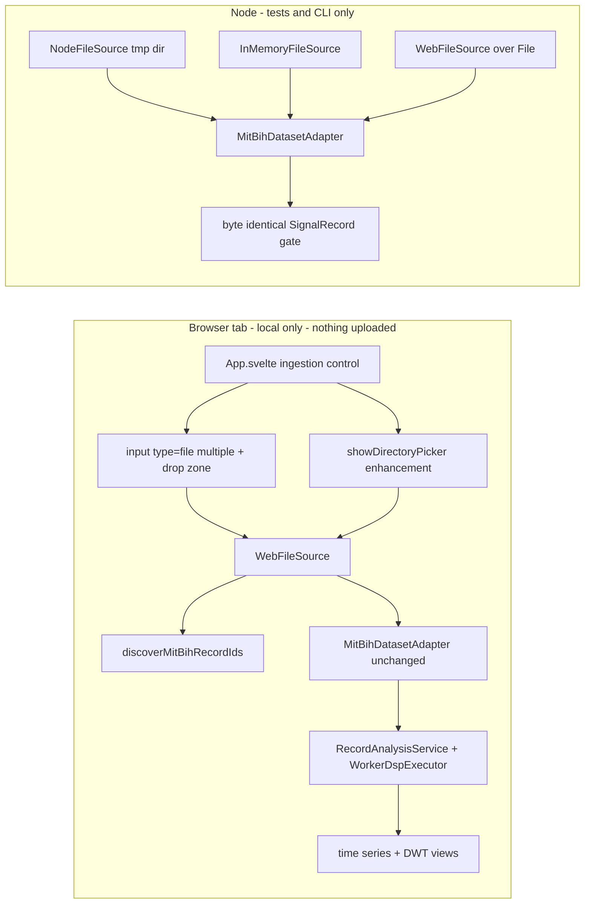

# Phase 11 — Browser-local real-signal ingestion (WFDB) with Node↔browser parity

Status: proposed (awaiting approval)
Baseline: Phase 10 complete and green — 53 test files / 530 tests, build 149 modules
Owner: Architect (this document) → Code (execution, item by item)

---

## Active increment (approved)

The user approved planning **Phase 11 centered on local ingestion of real signals in the
browser (WFDB) with Node↔browser parity**, with the mechanism fixed as:

> Portable base: `<input type=file multiple>` plus drag-drop over the Web `File`/`Blob`
> API (works everywhere, incl. jsdom tests), with the File System Access directory picker
> layered on as a progressive enhancement. Parity gate is hermetic: identical bytes through
> `InMemoryFileSource`, `NodeFileSource` (temp dir) and the new `WebFileSource` must yield
> byte-identical `SignalRecord`, plus an opt-in real-data test that skips when
> `data/raw/mitdb` is absent.

This is an **ingestion** increment, not an analysis or optimization increment. No scientific
algorithm, DSP/DWT, ML, or worker code changes. The correctness gate is **byte-identical
`SignalRecord`** produced from identical bytes across every `DatasetFileSource`
implementation — never a UI/DOM assertion and never a timing assertion.

---

## Verified state (baseline)

- `npm run check` = `typecheck && svelte-check && lint && test && build`; the Phase-10 close
  state is green: **53 test files / 530 tests**, build **149 modules** (worker chunks
  `dsp.worker` / `inference.worker`, emitted probe `.onnx`, ORT bundle + wasm).
- Machine: win32 x64, Windows 11, Node v24.18.0, npm 11.16.0, Vitest 3.2.7,
  onnxruntime-web 1.29.0.
- The dataset seam is already built for this and is **unchanged** by this phase:
  - [`DatasetFileSource`](src/datasets/source.ts:20) is a three-method interface
    (`readTextFile`, `readBinaryFile`, `listFileNames`); its header explicitly anticipates
    "a future WASM/OPFS or remote source" dropping in without touching parsers.
  - [`MitBihDatasetAdapter`](src/datasets/mitbih/adapter.ts:182) depends **only** on
    `DatasetFileSource`; [`catalogMitBih()`](src/datasets/mitbih/catalog.ts:102) and
    [`recordToMillivoltSignal()`](src/datasets/load.ts:35) likewise.
  - [`InMemoryFileSource`](src/datasets/source.ts:48) is the hermetic fixture source;
    [`NodeFileSource`](src/datasets/nodeSource.ts:26) is the `node:fs` source and is
    **deliberately not** re-exported from [`src/datasets/index.ts`](src/datasets/index.ts:1)
    so Vite never bundles `node:fs`.
  - [`createDefaultLabService()`](src/application/defaults.ts:70) is browser-safe over the
    synthetic adapter; the browser boot in [`src/main.ts`](src/main.ts:34) is a thin
    composition root.
- The gap this phase closes: **the browser can currently only load the synthetic fixture**
  — the real MIT-BIH adapter is reachable in the browser only through a source that does not
  yet exist.

---

## Honesty framing

- This phase makes the **browser able to read real WFDB/MIT-BIH files the user picks
  locally**. It does **not** add a backend, does not upload anything, does not persist
  anything, and does not train anything (ADR-006 local-first clause restated).
- Parity here means **the source seam is behaviour-preserving**: the same bytes parsed
  through a browser-only source and through the Node source yield the *same* canonical
  `SignalRecord`. It is **not** a claim that arbitrary user files are clinically valid, nor
  a re-derivation of WFDB semantics — the parsers are unchanged and already gated.
- The File System Access directory picker is a **Chromium-only progressive enhancement**;
  the portable `<input type=file>` / drag-drop path is the guaranteed floor and is the path
  the jsdom slice exercises. No test depends on a File System Access API.
- The canonical DWT stays `db4 / 4 / periodic` (no science-config control added); a real
  record too short to host it surfaces the **existing** classified `invalid-input` error
  rather than any new UI-owned science decision (ADR-008/009 hold).

---

## Design decisions

### 1. The source seam is the only insertion point (rules §30)

Implement a browser-safe `WebFileSource implements DatasetFileSource` over the Web
`File`/`Blob` API. It normalises its input to a minimal structural type so every producer
funnels through one class:

```ts
export interface WebFileEntry {
    readonly name: string;
    arrayBuffer(): Promise<ArrayBuffer>;
}
```

`File` satisfies `WebFileEntry` directly (Node defines a global `File` too, so the class is
testable in Node **and** runs unchanged in the browser). `listFileNames()` returns **bare**
names (any directory prefix such as `webkitRelativePath` is stripped to the final segment,
matching the seam's "file names are bare" contract). Text is decoded with `TextDecoder`;
binary is `new Uint8Array(await entry.arrayBuffer())`. Missing file → the same
`file-not-found` classified error shape as [`InMemoryFileSource`](src/datasets/source.ts:37);
duplicate base names → a classified error (ambiguous dataset directory). **No parser, no
adapter, and no DSP/ML file changes.**

### 2. Portable base, File System Access as a thin enhancement

- The always-available path is `<input type="file" multiple>` and a drop zone. Both yield a
  `FileList` → `File[]` → `WebFileSource`.
- The enhancement is a directory picker (`showDirectoryPicker()`), walked recursively into
  `WebFileEntry` objects (`{ name, arrayBuffer: () => handle.getFile().then(f => f.arrayBuffer()) }`)
  → the **same** `WebFileSource`. There is exactly one source implementation behind both.
- `File System Access` types are **not** in the TypeScript DOM lib; a tiny local ambient
  declaration file provides the minimal shapes (`showDirectoryPicker`, `FileSystemDirectoryHandle`,
  `getFile`). **No new dependency** and no `webworker`/extra lib is added to `tsconfig`.

### 3. Browser record discovery is browser-authoritative; CLI stays strict

`listMitBihRecordIds()` (canonical `RECORDS` file, throwing `file-not-found` when absent) is a
Phase-5 validation requirement and is **unchanged**. A browser user may pick a folder or a
subset without a `RECORDS` file, so add a separate pure helper:

```ts
export async function discoverMitBihRecordIds(source: DatasetFileSource): Promise<readonly RecordId[]>
```

that derives ids from the `.hea` stems present (sorted, deduplicated, no `RECORDS`
requirement). The adapter's strict per-record validation on `readRecord` is unchanged, so a
malformed or incomplete record still fails loudly and classified.

### 4. Correctness gate is byte-identical `SignalRecord` across sources

One Node test builds identical MIT-BIH bytes and reads them through **three** sources:
[`InMemoryFileSource`](src/datasets/source.ts:48), [`NodeFileSource`](src/datasets/nodeSource.ts:26)
(over `node:os` tmpdir) and the new `WebFileSource` (over Node global `File`). It asserts
identical `readTextFile`/`readBinaryFile` results and a **deep-equal `SignalRecord`** from
`MitBihDatasetAdapter`, plus identical `recordToMillivoltSignal` output. An **opt-in**
integration test exercises a real `data/raw/mitdb` record when present and is skipped when
the gitignored directory is absent (`it.skipIf`), so the default suite never depends on the
raw dataset (ADR-006).

### 5. One service, two dataset bindings; presentation still only calls the service

`main.ts` keeps booting the synthetic default over the worker-backed `DspExecutor`
(unchanged). A browser-only factory builds a `RecordAnalysisService` over a picked
`WebFileSource` (reusing the same worker executor). The presentation layer gains a thin,
controlled ingestion control that reports the chosen record id up; `App.svelte` still calls
only `service.analyze` / `service.listRecordIds`. No science configuration is invented in the
UI (ADR-008/009).

### 6. Record the decision (ADR-012) and update the architecture

Browser-local ingestion is a material decision (new browser-only source, the `RECORDS`-less
discovery relaxation, the progressive-enhancement layering, the DOM-lib type gap, the parity
gate). It is recorded as **ADR-012** and folded into architecture §J / §M / the decision
register.



---

## Checklist (items 0–7, each ends green on `npm run check`)

0. **Pre-flight (no behavior change)** — confirm the Phase-10 close state is green and
   unchanged: `npm run check` (expect **53 test files / 530 tests**; build **149 modules**).
   No files touched.
   - Gate: `npm run check` green.

1. **`WebFileSource` + unit tests** — add browser-safe `src/datasets/fileSource.ts`
   (`WebFileEntry` structural type + `WebFileSource implements DatasetFileSource`, plus a
   `webFileSourceFrom(entries)` convenience factory). Bare-name listing (strip directory
   prefixes), `TextDecoder` text reads, verbatim `Uint8Array` binary reads, `file-not-found`
   for missing names, classified error for duplicate base names. Export from
   [`src/datasets/index.ts`](src/datasets/index.ts:1). Add
   `src/datasets/__tests__/fileSource.test.ts` mirroring
   [`source.test.ts`](src/datasets/__tests__/source.test.ts:28) (UTF-8 round trip incl.
   non-ASCII, byte-verbatim, list, empty file, missing-file classified, duplicate-name
   classified, path-prefix stripping) built over Node global `File`.
   - Gate: `npm run check` green (test-file count rises to **54**).

2. **Browser record discovery** — add `discoverMitBihRecordIds(source)` to
   [`catalog.ts`](src/datasets/mitbih/catalog.ts:77) (derive ids from `.hea` stems; sorted,
   deduplicated; **no** `RECORDS` requirement; ignores non-`.hea` entries). Extend
   [`catalog.test.ts`](src/datasets/mitbih/__tests__/catalog.test.ts:1) with: a RECORDS-less
   directory, ordering, non-`.hea` ignored, and empty-directory → `[]`. `listMitBihRecordIds`
   stays unchanged and still throws for a missing `RECORDS`.
   - Gate: `npm run check` green.

3. **Source-seam parity gate (Node↔browser) + `NodeFileSource` coverage** — add
   `src/datasets/__tests__/source.parity.test.ts`: build identical MIT-BIH bytes (a `.hea` +
   format-212 `.dat`, optionally `.atr`) and read them through `InMemoryFileSource`,
   `NodeFileSource` (write to a `node:os` tmpdir) and `WebFileSource` (over Node global
   `File`); assert identical text/binary reads and a **deep-equal `SignalRecord`** from
   [`MitBihDatasetAdapter`](src/datasets/mitbih/adapter.ts:182), plus identical
   `recordToMillivoltSignal` output. Add `src/datasets/__tests__/nodeSource.test.ts` pinning
   the tmp-dir listing/read/missing behaviours. Add an **opt-in**
   `src/datasets/__tests__/realData.integration.test.ts` that reads one `data/raw/mitdb`
   record when present (via `it.skipIf` on a filesystem probe) and is otherwise skipped, with
   a comment stating the skip is expected on a clean clone.
   - Gate: `npm run check` green (default suite passes with the raw dataset absent).

4. **Presentation ingestion control + browser glue** — add
   `src/presentation/dataset/DatasetPicker.svelte` (thin, controlled: `<input type="file"
   multiple>`, a drop zone, and an optional "Open folder" button that calls
   `showDirectoryPicker` when supported), emitting the selected `File[]`. Add browser-only
   `src/presentation/dataset/fileIngestion.ts` (turn a `FileList` / `FileSystemDirectoryHandle`
   into a `WebFileSource`, call `discoverMitBihRecordIds`) and
   `src/presentation/dataset/browserDatasetService.ts` (build a `RecordAnalysisService` over
   the picked source reusing the browser worker `DspExecutor`, mirroring
   [`browserWorkers.ts`](src/presentation/workers/browserWorkers.ts:1)). Add the minimal local
   ambient declaration for the File System Access types. No test imports the browser-only
   modules; they typecheck, lint and build.
   - Gate: `npm run check` green; confirm `npm run build` does not pull `node:fs` into the
     bundle (inspect the build listing / dependency note).

5. **Wire into the app + extend the jsdom slice** — [`App.svelte`](src/presentation/App.svelte:1)
   gains a "Open local WFDB files" control that, on selection, lists the discovered record
   ids and re-analyzes the chosen one through the **application service** (synthetic boot
   record unchanged). [`main.ts`](src/main.ts:34) wires the ingestion factory and passes it
   to `App`. Extend [`App.test.ts`](src/presentation/__tests__/App.test.ts:38): simulate a
   file selection of synthetic MIT-BIH files (a `File`-backed format-212 fixture whose length
   the canonical `db4/4/periodic` config accepts — a multiple of 16 and long enough for db4)
   and assert the picked record identity renders and analysis resolves; every existing
   assertion stays green unchanged.
   - Gate: `npm run check` green.

6. **ADR-012 + architecture update** — write
   `plans/adr/ADR-012-browser-local-ingestion.md` (browser `DatasetFileSource` over the Web
   `File`/`Blob` API; portable file input + drop with File System Access as a Chromium-only
   enhancement; `RECORDS`-less discovery in the browser while the CLI/validation path stays
   strict; single source implementation, parsers unchanged; local-first restated; DOM-lib type
   gap handled by a local ambient declaration; byte-identical-`SignalRecord` parity gate +
   opt-in real-data test). Update [`plans/ecg-lab-architecture.md`](plans/ecg-lab-architecture.md:279)
   §J (insertion point realized), §M (new item 11), the decision register (ADR-012) and the
   open-decisions list if the raw-data policy note needs refreshing.
   - Gate: `npm run check` green.

7. **Audit + final gate** — write `plans/phase-11-audit.md` mirroring the Phase-9/10 cadence:
   approved scope, files added / touched, the parity evidence, what browser ingestion **proves
   and does not prove** (seam parity yes; clinical validity no; File System Access Chromium-only;
   no persistence/upload), residual risk, item mapping, and test counts. **Final full gate**:
   `npm run check` green; note the new test-file/test counts.
   - Gate: `npm run check` green.

---

## Key files to create / touch

### Create

- `src/datasets/fileSource.ts` — browser-safe `WebFileSource` / `WebFileEntry`.
- `src/datasets/__tests__/fileSource.test.ts` — source contract tests.
- `src/datasets/__tests__/nodeSource.test.ts` — `NodeFileSource` temp-dir coverage.
- `src/datasets/__tests__/source.parity.test.ts` — byte-identical `SignalRecord` across
  `InMemoryFileSource` / `NodeFileSource` / `WebFileSource`.
- `src/datasets/__tests__/realData.integration.test.ts` — opt-in, skipped when
  `data/raw/mitdb` is absent.
- `src/presentation/dataset/DatasetPicker.svelte` — thin controlled ingestion control.
- `src/presentation/dataset/fileIngestion.ts` — `FileList` / directory handle → `WebFileSource`.
- `src/presentation/dataset/browserDatasetService.ts` — service factory over a picked source
  (reuses the browser worker `DspExecutor`).
- `src/presentation/dataset/fileSystemAccess.d.ts` — minimal ambient File System Access types.
- `plans/adr/ADR-012-browser-local-ingestion.md`
- `plans/phase-11-audit.md`

### Touch

- [`src/datasets/index.ts`](src/datasets/index.ts:1) — export `./fileSource` (browser-safe).
- [`src/datasets/mitbih/catalog.ts`](src/datasets/mitbih/catalog.ts:77) — add
  `discoverMitBihRecordIds`.
- [`src/datasets/mitbih/__tests__/catalog.test.ts`](src/datasets/mitbih/__tests__/catalog.test.ts:1)
  — discovery cases.
- [`src/presentation/App.svelte`](src/presentation/App.svelte:1) — ingestion control wiring.
- [`src/main.ts`](src/main.ts:34) — pass the ingestion factory to `App`.
- [`src/presentation/__tests__/App.test.ts`](src/presentation/__tests__/App.test.ts:38) — new
  file-selection case; existing cases unchanged.
- [`plans/ecg-lab-architecture.md`](plans/ecg-lab-architecture.md:279) — §J / §M / decision
  register.

### Do not touch

- Parsers [`header.ts`](src/datasets/mitbih/header.ts:1) / `format212.ts` / `atr.ts` and
  [`adapter.ts`](src/datasets/mitbih/adapter.ts:182) — the adapter and parsers are consumed
  unchanged (rules §30).
- [`src/datasets/source.ts`](src/datasets/source.ts:1) /
  [`nodeSource.ts`](src/datasets/nodeSource.ts:26) / [`load.ts`](src/datasets/load.ts:35) —
  unchanged.
- `src/dsp/**`, `src/ml/**`, `src/workers/**`, `src/domain/**` — no science or worker change.
- [`vite.config.ts`](vite.config.ts:1), [`tsconfig.json`](tsconfig.json:1) — no lib/dependency
  change (the File System Access type gap is closed with a local ambient declaration).

### Read-only (for grounding)

- [`plans/adr/ADR-006-dataset-abstraction.md`](plans/adr/ADR-006-dataset-abstraction.md:1),
  [`plans/adr/ADR-011-worker-execution-model.md`](plans/adr/ADR-011-worker-execution-model.md:1),
  [`plans/phase-10-plan.md`](plans/phase-10-plan.md:1),
  [`plans/phase-10-audit.md`](plans/phase-10-audit.md:1).

---

## Reminders for execution (Code mode)

- **One item at a time.** Do not start item *n+1* until item *n* ends green on
  `npm run check`. Report the exact test-file / test / module counts after each gate.
- **Relocation, not new science.** The parsers and adapter are consumed, never edited; if a
  change seems needed there, stop and escalate — it would violate the increment.
- **Parity is the gate.** Assert byte-identical `SignalRecord` (`identity`, `subjectId`,
  `sampling`, per-channel `samples`/`calibration`/`unit`, `annotations`, `provenance`) across
  sources — never a DOM or timing assertion (rules §51).
- **Hermetic by default.** The default suite must pass with `data/raw/mitdb` absent; the
  real-data test is opt-in (`it.skipIf`) and documents why it may be skipped on a clean clone.
- **Browser safety.** `src/datasets/fileSource.ts` and the `src/presentation/dataset/**`
  modules must import no `node:*` built-in; the only place `node:fs` appears is
  [`nodeSource.ts`](src/datasets/nodeSource.ts:26) (already non-barrel-exported) and Node-only
  tests.
- **Types.** Use `import type` for type-only imports (`verbatimModuleSyntax` +
  `consistent-type-imports`); keep `tsconfig` libs DOM-only and add the File System Access
  shapes in the local `.d.ts`. For the jsdom ingestion fixture, pick a format-212 record
  length the canonical `db4/4/periodic` config accepts (a multiple of 16, long enough for
  db4); do not invent a new DWT config.
- **Docs before the final gate.** Write ADR-012, the architecture edits, and
  `plans/phase-11-audit.md`, then run the final full `npm run check`.
