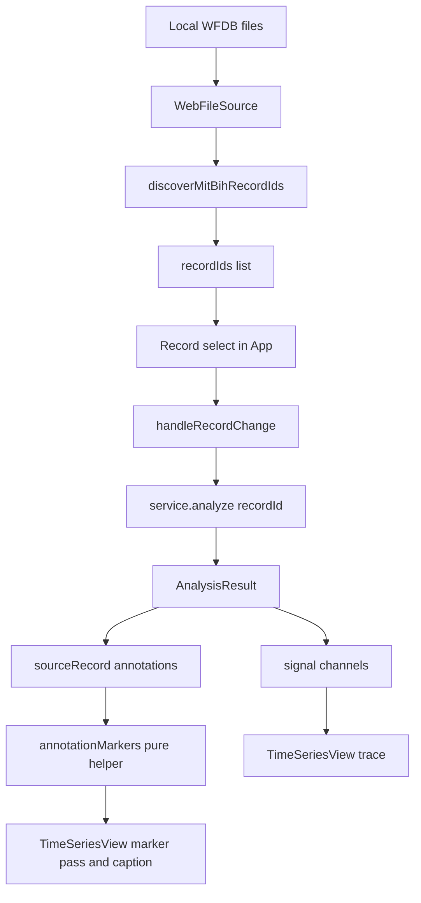

# Phase 12 — Complete the local browsing workflow: multi-record selection + annotation rendering

Status: proposed (awaiting approval)
Baseline: Phase 11 complete and green — 57 test files / 556 tests, build 165 modules
Owner: Architect (this document) → Code (execution, item by item)

---

## Active increment (approved)

The user approved planning **Phase 12 = A + B**:

- **A — Multi-record selection.** Choose among the records a local WFDB dataset exposes and
  re-analyze on switch.
- **B — Annotation rendering.** Draw the analyzed record's annotation events on the
  time-series view.

This is a **presentation-layer** increment. No domain, DSP/DWT, ML, worker, parser or adapter
code changes. Data still reaches the views only through the application service; the views
stay display-only and never mutate source buffers.

---

## Verified state (baseline)

- `npm run check` = `typecheck && svelte-check && lint && test && build`; the Phase-11 close
  state is green: **57 test files / 556 tests**, build **165 modules**.
- Machine: win32 x64, Windows 11, Node v24.18.0, npm 11.16.0, Vitest 3.2.7, Svelte 5.57,
  `@testing-library/svelte` 5.4.2, jsdom 30.
- The pieces this phase builds on already exist and are unchanged by it:
  - [`AnalysisResult.sourceRecord`](src/application/analysis.ts:87) is the raw validated
    record; its doc states "annotations and per-channel calibration remain available to the
    views without any downstream fusion" — so annotation rendering needs **no application
    change**.
  - [`AnnotationEvent`](src/domain/record.ts:46) is `{ sampleIndex, symbol, code?, auxNote }`
    with absolute `sampleIndex`, sorted ascending, on
    [`SignalRecord.annotations`](src/domain/record.ts:85).
  - The record `<select>` already exists in [`App.svelte`](src/presentation/App.svelte:325)
    with [`handleRecordChange()`](src/presentation/App.svelte:214),
    [`selectedRecordId`](src/presentation/App.svelte:107) and
    [`analyzeRecordById()`](src/presentation/App.svelte:128) — added during Phase 11.
  - The pure viewport→sample/decimation helpers live in
    [`geometry.ts`](src/presentation/views/timeSeries/geometry.ts:104)
    ([`sampleWindowOfTime()`](src/presentation/views/timeSeries/geometry.ts:104),
    [`partitionSampleWindow()`](src/presentation/views/timeSeries/geometry.ts:138),
    [`envelopeColumns()`](src/presentation/views/timeSeries/geometry.ts:192)) and delegate all
    time↔sample arithmetic to [`src/domain/sampling.ts`](src/domain/sampling.ts:1).
  - [`TimeSeriesView.svelte`](src/presentation/views/timeSeries/TimeSeriesView.svelte:30) takes
    `signal`/`channelName`/`viewport` and draws a min/max envelope (`drawTrace`,
    [`xOfTime`](src/presentation/views/timeSeries/TimeSeriesView.svelte:144)); it has **no**
    annotation support.

---

## Honesty framing

- **A is already largely real, not greenfield.** The `Record` combobox shipped in Phase 11 as
  a consequence of local ingestion and is already *asserted* (the option "700" appears) in
  [`App.test.ts`](src/presentation/__tests__/App.test.ts:296), but it is **never switched** —
  there is no switch-record test and no multi-record fixture, unlike the channel/viewport
  switch tests. Phase 12 therefore **completes and proves** A: it adds the two-record fixture
  and the switch-record slice, and leaves the working selector behaviour untouched. No new
  selection code is invented where working code already exists.
- **B is genuinely new and needs no application change.** `AnalysisResult.sourceRecord`
  already carries the domain annotations to the views; nothing in
  [`src/application`](src/application/analysis.ts:1) or
  [`src/datasets`](src/datasets/1) changes.
- **Annotation rendering is display of domain facts, never science.** It does not detect
  beats, does not change the analysis, and does not fuse annotations into DSP — annotations
  stay "events, not ground-truth fused into DSP" (§J,
  [`ecg-lab-architecture.md`](plans/ecg-lab-architecture.md:286)).
- **The synthetic boot record has no annotations.** `generateSyntheticRecord` always sets
  `annotations: []`, so the default path renders `Annotations: none`; a non-empty rendering is
  reachable only through a real/local record. The repo deliberately has an `.atr` **parser but
  no encoder**, so the App slice fabricates a minimal `.atr` by hand (the pattern already used
  by [`adapter.test.ts`](src/datasets/mitbih/__tests__/adapter.test.ts:28)) rather than
  round-tripping.
- **jsdom has no 2d canvas context**, so canvas *drawing* is never the gate. The numerical
  gate is the pure Node helper test; the jsdom gate is the markup/caption.

---

## Design decisions

### 1. Annotation geometry is a pure, DOM-free helper (mirrors `geometry.ts`)

New module [`src/presentation/views/timeSeries/annotationGeometry.ts`](src/presentation/views/timeSeries/annotationGeometry.ts:1).
It maps each [`AnnotationEvent.sampleIndex`](src/domain/record.ts:46) to a visible x position
using only the domain conversions (the sample math is **never** re-implemented):

```ts
export interface AnnotationMarker {
    readonly sampleIndex: number;
    readonly symbol: string;
    readonly xFraction: number;   // 0..1 across the plot width
    readonly mergedCount: number; // annotations collapsed into this marker (>= 1)
}
export interface AnnotationMarkers {
    readonly markers: readonly AnnotationMarker[];
    readonly visibleCount: number; // annotations inside the window
    readonly mergedCount: number;  // visibleCount - markers.length
    readonly symbols: readonly string[]; // distinct symbols in the window, sorted
}
export function annotationMarkers(
    annotations: readonly AnnotationEvent[],
    viewport: TimeViewport,
    sampling: SamplingInfo,
    columnCount: number,
): AnnotationMarkers;
```

Rules (every one tested):

- **Half-open inclusion:** an annotation is visible when
  `startSample <= sampleIndex < endSample`, where the window comes from
  [`sampleWindowOfTime()`](src/presentation/views/timeSeries/geometry.ts:104) — consistent with
  the existing window convention (an annotation exactly at `endSample` is excluded).
- **Position:** `xFraction = (timeSecOfSample(sampleIndex, sampling) - viewport.startSec) / viewport.durationSec`,
  clamped to `[0, 1]`, so markers align with the trace's own
  [`xOfTime()`](src/presentation/views/timeSeries/TimeSeriesView.svelte:144).
- **Degenerate input:** a non-positive `durationSec` (or an empty window) yields no markers.
- **Density cap:** at most one marker per pixel column. Annotations in the same column merge
  into the first (lowest `sampleIndex`) marker, whose `mergedCount` records how many were
  collapsed, so `visibleCount` still reflects every event in the window and nothing is
  silently dropped from the caption.
- **Legend:** `symbols` is the distinct symbol set present in the window, sorted, for the
  caption legend.

### 2. The view gains an `annotations?` prop and states counts in the caption

[`TimeSeriesView.svelte`](src/presentation/views/timeSeries/TimeSeriesView.svelte:30) adds
`annotations?: readonly AnnotationEvent[]` (default `[]`). The existing
[`drawTrace()`](src/presentation/views/timeSeries/TimeSeriesView.svelte:117) gains a final
marker pass — vertical stems with a short symbol label — driven **entirely** by
`annotationMarkers(...)`. The `figcaption` gains one span with an exact, tested string:

- no annotations in the window → `Annotations: none`
- otherwise → `Annotations: {visibleCount} in view`, plus ` ({mergedCount} merged)` when
  `mergedCount > 0`
- when symbols exist → an extra span `Symbols: N, V` (sorted, comma-space separated)

The figure's `aria-label` (channel identity) is unchanged, so the existing accessibility
assertions still pass.

### 3. App passes the record's annotations; the analysis path is untouched

[`App.svelte`](src/presentation/App.svelte:394) passes
`annotations={result.sourceRecord.annotations}` to `TimeSeriesView`. No service call, no
option and no science configuration is added (ADR-008/009 hold): `service.analyze` is
unchanged and each view still receives its channel/viewport exactly as before.

### 4. Multi-record selection is proved, not rebuilt

Keep the existing wiring exactly: `recordIds` is the discovery result carried by the prepared
dataset ([`ingest()`](src/presentation/App.svelte:182)), `selectedRecordId` drives the
`<select>`, [`handleRecordChange()`](src/presentation/App.svelte:214) re-analyzes the chosen
id, and [`analyzeRecordById()`](src/presentation/App.svelte:128) resets the display selection
to first channel + full record. Phase 12 adds only the missing **evidence**: an App slice over
a two-record local dataset that switches the `Record` combobox and asserts the second id was
analyzed and the identity/display selection reset.

Considered and rejected: sourcing the option list from `service.listRecordIds()` on every
render. The prepared discovery list is already the authoritative, sorted result of the
ingestion the user performed; calling the service again would add a round trip and a second
source of truth for no behavioural gain. Recorded here so the choice is explicit rather than
accidental.

### 5. A display ADR records the annotation-rendering decision

`plans/adr/ADR-013-annotation-display.md` follows the
[ADR-008](plans/adr/ADR-008-display-selection-controls.md:1) template (Status/Date/Scope →
Context → Considered alternative → Decision → Consequences → References). It records that
annotations are displayed as **events over the trace, never fused into the signal**, that the
geometry is a pure Node-gated helper, and that the caption is the jsdom-observable surface.

### Data flow



---

## Checklist (each item ends green on `npm run check`)

- **Item 0 — Pre-flight.** Confirm the baseline is green (57 files / 556 tests / 165
  modules). No files touched.
- **Item 1 — Pure annotation helper.** Create
  [`annotationGeometry.ts`](src/presentation/views/timeSeries/annotationGeometry.ts:1) with
  `AnnotationMarker` / `AnnotationMarkers` / `annotationMarkers()` and a **Node** test
  `src/presentation/views/timeSeries/__tests__/annotationGeometry.test.ts` covering: window
  mapping; half-open edges (annotation exactly at `endSample` excluded, at `startSample`
  included); clamping to `[0, 1]`; a non-zero `startTimeSec` axis; the density cap and
  `mergedCount` accounting; `visibleCount`/`symbols`; empty annotations; a degenerate window.
  Gate green (new test file + cases).
- **Item 2 — `TimeSeriesView` annotation rendering.** Add the `annotations?` prop, the marker
  draw pass in [`drawTrace()`](src/presentation/views/timeSeries/TimeSeriesView.svelte:117),
  and the caption spans (`Annotations: …`, `Symbols: …`). Extend
  [`TimeSeriesView.test.ts`](src/presentation/views/timeSeries/__tests__/TimeSeriesView.test.ts:1)
  (jsdom) with: `Annotations: none` when absent; an exact count string with annotations; the
  `(N merged)` form when a density cap applies; the `Symbols:` legend; and that the existing
  caption/aria assertions still pass. Gate green.
- **Item 3 — App wiring + end-to-end non-empty annotation.** Pass
  `annotations={result.sourceRecord.annotations}` in
  [`App.svelte`](src/presentation/App.svelte:394). Extend the App local fixture
  ([`localHeader()`](src/presentation/__tests__/App.test.ts:231) /
  [`localFiles()`](src/presentation/__tests__/App.test.ts:257)) with a minimal hand-built
  `.atr` (byte pairs, reusing the pattern in
  [`adapter.test.ts`](src/datasets/mitbih/__tests__/adapter.test.ts:28)) and assert the
  annotation caption end-to-end through the service path. Gate green.
- **Item 4 — Multi-record selection proof.** Extend the App local fixture to **two** records
  (distinct ids) and add a jsdom test that switches the `Record` combobox; assert the service
  was asked to analyze the second id, the identity header updated, and the display selection
  reset to first channel + full-window viewport. Gate green. (This is the only multi-record
  work; no production code changes — see Design decision 4.)
- **Item 5 — ADR-013 + architecture updates.** Create
  `plans/adr/ADR-013-annotation-display.md`; add a §J bullet and a §M item 12 (and a
  decision-register entry) in
  [`plans/ecg-lab-architecture.md`](plans/ecg-lab-architecture.md:279). Gate green.
- **Item 6 — Audit + final gate.** Write `plans/phase-12-audit.md` (scope quote, files
  added/touched/not-touched, item map, evidence, prove/does-not-prove, residual risk, test
  counts, gate history) and run the final full `npm run check`. Gate green.

---

## Key files

### To create

- [`src/presentation/views/timeSeries/annotationGeometry.ts`](src/presentation/views/timeSeries/annotationGeometry.ts:1)
  — pure annotation→marker helper (Item 1).
- [`src/presentation/views/timeSeries/__tests__/annotationGeometry.test.ts`](src/presentation/views/timeSeries/__tests__/annotationGeometry.test.ts:1)
  — Node numerical gate (Item 1).
- [`plans/adr/ADR-013-annotation-display.md`](plans/adr/ADR-013-annotation-display.md:1) — display
  decision (Item 5).
- [`plans/phase-12-audit.md`](plans/phase-12-audit.md:1) — completion record (Item 6).

### To touch

- [`src/presentation/views/timeSeries/TimeSeriesView.svelte`](src/presentation/views/timeSeries/TimeSeriesView.svelte:1)
  — `annotations?` prop, marker draw pass, caption spans (Item 2).
- [`src/presentation/views/timeSeries/__tests__/TimeSeriesView.test.ts`](src/presentation/views/timeSeries/__tests__/TimeSeriesView.test.ts:1)
  — jsdom markup assertions (Item 2).
- [`src/presentation/App.svelte`](src/presentation/App.svelte:1) — pass
  `result.sourceRecord.annotations` (Item 3).
- [`src/presentation/__tests__/App.test.ts`](src/presentation/__tests__/App.test.ts:1) — minimal
  `.atr` fixture + annotation caption (Item 3); two-record fixture + switch-record test
  (Item 4).
- [`plans/ecg-lab-architecture.md`](plans/ecg-lab-architecture.md:1) — §J / §M item 12 /
  decision register (Item 5).

### Do not touch

- `src/domain/*` (`record.ts`, `sampling.ts`, `signal.ts`, `units.ts`, `numeric.ts`, `error.ts`).
- `src/datasets/*` (parsers, adapter, `fileSource.ts`, `catalog.ts`, `load.ts`) and
  `src/datasets/mitbih/atr.ts` (**no `.atr` encoder may be added** — the parser stays parse-only).
- `src/dsp/*`, `src/ml/*`, `src/workers/*`, `src/bench/*`.
- [`src/application/analysis.ts`](src/application/analysis.ts:1) and
  [`src/application/defaults.ts`](src/application/defaults.ts:1) — no application change.
- [`src/application/dspExecutor.ts`](src/application/dspExecutor.ts:1),
  `src/presentation/dataset/*`, `src/presentation/workers/*`, `src/main.ts`.
- The canonical DWT stays `db4 / 4 / periodic`; no science-config control is added.

### Read-only references

- [`plans/phase-11-plan.md`](plans/phase-11-plan.md:1) and
  [`plans/phase-11-audit.md`](plans/phase-11-audit.md:1) — the plan/audit templates.
- [`plans/adr/ADR-008-display-selection-controls.md`](plans/adr/ADR-008-display-selection-controls.md:1)
  — the display-ADR template and the "selection is a display concern" precedent.
- [`src/presentation/views/dwt/coefficientGeometry.ts`](src/presentation/views/dwt/coefficientGeometry.ts:1)
  — the sibling pure-helper stride pattern to mirror.

---

## Reminders for execution (Code mode)

1. **Work item by item; do not batch.** After each item run `npm run check` and confirm exit 0
   before starting the next. Report the captured test-file / test / module counts.
2. **Never re-implement sample math.** Every time↔sample conversion goes through
   [`src/domain/sampling.ts`](src/domain/sampling.ts:1) (`timeSecOfSample`,
   `durationSecOf`, `sampleIndexOfTimeSec`) via the existing `geometry.ts` helpers.
3. **Views are read-only.** Never write to a channel's `Float64Array`; the annotation pass
   only reads.
4. **No science moves into presentation.** Do not add analysis options or algorithm choices;
   the App passes domain data through unchanged.
5. **`import type` everywhere** (`verbatimModuleSyntax`, `consistent-type-imports`) and keep
   `no-explicit-any` clean; TS is strict with `noUnusedLocals`/`noUnusedParameters`.
6. **jsdom cannot draw.** Stub `HTMLCanvasElement.prototype.getContext = () => null` (as the
   existing slices do) and assert only markup/caption text — never pixels.
7. **Keep the existing assertions passing.** The channel/viewport/re-run/ingestion App tests
   and all `TimeSeriesView`/`geometry` tests must remain green unchanged.
8. **`.atr` fixtures are hand-built.** Use the byte-pair pattern from
   [`adapter.test.ts`](src/datasets/mitbih/__tests__/adapter.test.ts:28); do **not** add an
   encoder to `atr.ts`.
9. **Update the architecture doc last**, and re-read the exact target lines before applying
   the edit (a prior partial `apply_diff` on that file required a re-read).
10. **Report honestly.** If A turns out to need more than a test (e.g. a discovered selector
    defect), stop and report rather than silently expanding the change.
