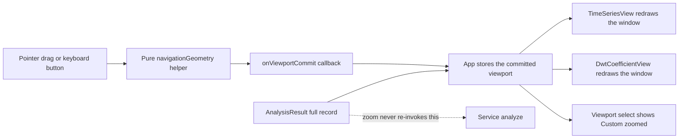

# Phase 13 — Interactive signal navigation: cursor readout, zoom and pan (presentation only)

Status: proposed (awaiting approval)
Baseline: Phase 12 complete and green — 58 test files / 574 tests, build 166 modules
Owner: Architect (this document) → Code (execution, item by item)

---

## Active increment (approved)

The user approved planning **Phase 13 = A + B**, the first candidate recorded in
[`plans/phase-12-checkpoint.md`](plans/phase-12-checkpoint.md) (canvas interaction):

- **A — Cursor readout.** Pointing at the plotted trace reports the time and sample under the
  cursor, and the nearest annotation symbol when one is close by.
- **B — Zoom and pan.** Narrow and slide the visible time window — by pointer drag over the
  trace and by keyboard-accessible controls — with an explicit reset back to the full record.

This is a **presentation-layer** increment. No domain, DSP/DWT, ML, worker, parser, adapter or
application-service change. Data still reaches the views only through the application service;
the views stay display-only and never mutate source buffers.

**The single most important honesty constraint:** zoom and pan change **only what is drawn**.
They never re-invoke the service, never re-run the DWT and never alter the analysis — the
analysis stays full-record over every channel (ADR-008). A zoomed window is a *display*
selection over the one `AnalysisResult`, exactly like the existing viewport presets.

---

## Verified state (baseline)

- `npm run check` = `typecheck && svelte-check && lint && test && build`; the Phase-12 close
  state is green: **58 test files / 574 tests**, build **166 modules**.
- Machine: win32 x64, Windows 11, Node v24.18.0, npm 11.16.0, Vitest 3.2.7, Svelte 5.57,
  `@testing-library/svelte` 5.4.2, jsdom 30. The workspace is **not** a git repository.
- The pieces this phase builds on already exist and are unchanged by it:
  - [`TimeViewport`](src/presentation/views/timeSeries/geometry.ts:31) is the one visible-window
    type (`{ startSec, durationSec }`); every time↔sample conversion is delegated to
    [`src/domain/sampling.ts`](src/domain/sampling.ts:1) — never re-implemented in presentation.
  - [`viewportPresets()`](src/presentation/views/controls/presets.ts:42) builds the base options
    (index 0 = the whole acquisition window, "Full record", then 4 equal sub-windows);
    [`TimeViewport`](src/presentation/views/controls/presets.ts:23) is imported from the
    time-series geometry module, so a preset and a zoom are the *same type*.
  - [`App`](src/presentation/App.svelte:274) owns the display selection: `selectedChannelName`,
    `selectedViewportIndex`, the derived [`activeViewport`](src/presentation/App.svelte:274), and
    it **resets the selection to first channel + index 0 on every (re-)analysis**
    ([`analyzeRecordById()`](src/presentation/App.svelte:128)).
  - [`TimeSeriesView`](src/presentation/views/timeSeries/TimeSeriesView.svelte:40) takes
    `signal`/`channelName`/`viewport`/`annotations` and draws the trace + the Phase-12 markers in
    one guarded `$effect` ([line 133](src/presentation/views/timeSeries/TimeSeriesView.svelte:133));
    it has **no pointer handlers and no navigation controls**.
  - [`DwtCoefficientView`](src/presentation/views/dwt/DwtCoefficientView.svelte:43) takes the same
    optional `viewport` prop, so a zoomed window already works there unchanged.
  - The sibling pure helpers show the pattern to mirror:
    [`geometry.ts`](src/presentation/views/timeSeries/geometry.ts:104) and
    [`annotationGeometry.ts`](src/presentation/views/timeSeries/annotationGeometry.ts:1).

---

## Honesty framing

- **Zoom is not re-analysis.** The service is called only by
  [`analyzeRecordById()`](src/presentation/App.svelte:128) and `ingest()`; navigation must add
  **no** new `service.analyze` call. The `Re-run analysis` button is the only way to re-run the
  science, and it stays unchanged.
- **jsdom cannot measure layout.** `getBoundingClientRect()` returns zeros in jsdom, so a
  pointer-drag slice can never prove geometry. The **numerical** gate is a pure Node helper
  test; the **DOM** gate is the keyboard-accessible button path (deterministic, no layout) plus
  the cursor-readout markup. Pointer handlers must be *inert* (guarded) when there is no layout
  — that inertness is itself asserted.
- **A minimum zoom window is a display guard, not a clinical threshold.** Below a couple of
  samples a window resolves nothing useful and the canvas (and the DWT lane mapping) degrades;
  the floor is expressed in *samples* and documented as a presentation guard.
- **No science configuration is added.** No wavelet/level/extension control, no filter control,
  no channel/window influence on the analysis. The canonical `db4 / 4 / periodic` config and
  `RecordAnalysisOptions` are untouched.
- **The toolbar stays thin.** [`ViewControls.svelte`](src/presentation/views/controls/ViewControls.svelte:1)
  and [`presets.ts`](src/presentation/views/controls/presets.ts:1) are **not** modified: `App`
  composes the extra "Custom (zoomed)" option itself, so the toolbar keeps its single
  "selection is a display concern" contract (ADR-008).
- **Existing assertions are a regression gate.** In particular
  [`App.test.ts`](src/presentation/__tests__/App.test.ts:203) asserts that **exactly two**
  elements show the window string `t = … s → … s` (the two view captions). Any new caption span
  must therefore use a **different** format (the cursor readout is `Cursor: … s · sample …`),
  never the `t = … → …` form.

---

## Design decisions

### 1. Navigation geometry is a pure, DOM-free helper (mirrors `geometry.ts`)

New module [`src/presentation/views/timeSeries/navigationGeometry.ts`](src/presentation/views/timeSeries/navigationGeometry.ts:1).
It owns **all** navigation arithmetic and re-implements none of the time↔sample conversion
(that stays in [`src/domain/sampling.ts`](src/domain/sampling.ts:1)):

```ts
export interface ViewportBounds {
    readonly startSec: number;
    readonly durationSec: number;
}

export const ZOOM_STEP_FACTOR = 0.5;   // one button step halves the window
export const PAN_STEP_FRACTION = 0.25; // one button step moves a quarter window
export const MIN_VIEWPORT_SAMPLES = 2; // display guard, not a science threshold

export function clampFraction(fraction: number): number;                       // -> [0, 1]
export function viewportBoundsOf(sampling: SamplingInfo, sampleCount: number): ViewportBounds;
export function minViewportDurationSec(sampling: SamplingInfo): number;
export function clampViewport(viewport: TimeViewport, bounds: ViewportBounds,
                              minDurationSec: number): TimeViewport;
export function zoomViewport(viewport: TimeViewport, bounds: ViewportBounds, factor: number,
                             anchorFraction: number, minDurationSec: number): TimeViewport;
export function panViewport(viewport: TimeViewport, bounds: ViewportBounds,
                            deltaFraction: number): TimeViewport;
export function viewportFromFractions(bounds: ViewportBounds, startFraction: number,
                                      endFraction: number, minDurationSec: number): TimeViewport;
export function readoutAtFraction(xFraction: number, viewport: TimeViewport,
                                  sampling: SamplingInfo):
    { readonly timeSec: number; readonly sampleIndex: number };
```

Rules (every one tested):

- **Everything stays inside `bounds`.** The result of every function is contained in the full
  acquisition window; a window can never drift off the record or grow past it.
- **Duration is never zero or negative.** `clampViewport`/`zoomViewport`/`viewportFromFractions`
  enforce `durationSec >= minDurationSec`; `panViewport` never changes the duration.
- **Normalised drags.** `viewportFromFractions` accepts a reversed drag (`end < start`) and
  normalises it; a zero-width drag collapses to `minDurationSec` at that point.
- **`readoutAtFraction`** clamps the fraction to `[0, 1]` and derives the sample index through
  the domain's `sampleIndexOfTimeSec` — it is never a second sample-math implementation.
- **Validation.** Non-finite inputs, a non-positive `bounds.durationSec`, a non-positive `factor`
  or a non-positive `minDurationSec` are classified `invalid-input` (the existing taxonomy), not
  silently coerced.

### 2. The view owns rendering and transient pointer state; the parent owns the committed viewport

[`TimeSeriesView.svelte`](src/presentation/views/timeSeries/TimeSeriesView.svelte:40) gains **one**
prop and **no** science:

```ts
onViewportCommit?: ((viewport: TimeViewport) => void) | undefined;
```

- **Transient state stays in the view:** `cursorFraction`, `dragStartFraction`, `dragEndFraction`
  (`$state`). It is UI-only and never leaves the component except through the callback.
- **Committed state stays in the parent:** every zoom/pan/reset calls
  `onViewportCommit(nextViewport)`; `App` stores it (Design decision 4). This keeps each canvas
  view a *controlled* component, exactly as the channel/viewport props already are.
- **Accessible controls (the jsdom gate).** When `onViewportCommit` is provided, the figure
  renders a `role="group"` `aria-label="View navigation"` row of five buttons — `Zoom in`,
  `Zoom out`, `Pan left`, `Pan right`, `Reset view` — each calling the pure helper and emitting
  the result. They require no layout, are keyboard reachable, and are the deterministic DOM
  surface (the canvas itself is `aria-hidden`).
- **Pointer handlers (guarded).** `onpointerdown` / `onpointermove` / `onpointerup` /
  `onpointerleave` / `onpointercancel` on the canvas map `clientX` to a fraction via
  `getBoundingClientRect()` and **return early when `rect.width <= 0`** — so jsdom runs the
  inert path instead of throwing or dividing by zero. A live drag paints a translucent band; the
  band is decoration and is never asserted.
- **Cursor readout.** A new caption span `Cursor: —` (idle) or
  `Cursor: {timeSec.toFixed(2)} s · sample {sampleIndex}` (hovering), derived from
  `readoutAtFraction`. It deliberately does **not** use the `t = … → …` form (see Honesty
  framing) and it does not add a fourth window string.

### 3. One commit path, two inputs

Pointer drag and the keyboard buttons both funnel through a single local
`emitViewport(next)` helper, which is the only place that calls `onViewportCommit`. There is no
second, divergent navigation path and no duplicated clamping — both inputs call the same pure
functions. Pointer drag uses `viewportFromFractions`; the buttons use `zoomViewport` /
`panViewport` / `clampViewport(bounds, …)` for reset.

### 4. `App` stores a custom viewport and keeps the Viewport control honest

- New state `let customViewport = $state<TimeViewport | null>(null)`.
- `activeViewport` becomes `customViewport ?? presetOptions[selectedViewportIndex].viewport`, and
  it is passed to **both** canvas views, so a zoom applies to the trace and the coefficient
  stack together (they already share one viewport).
- The base list stays `viewportPresets(...)`; when `customViewport !== null`, `App` **appends**
  `{ label: "Custom (zoomed)", viewport: customViewport }` for the `<select>` only, and reports
  that index as selected. This is what keeps the toolbar from claiming "Full record" while the
  view draws a narrow window.
- Selecting a preset clears `customViewport`; [`analyzeRecordById()`](src/presentation/App.svelte:128)
  also clears it, so a record switch or a re-run restores the full window (mirroring the
  existing first-channel/full-window reset the Phase-12 test already pins).
- **No clamping is duplicated in `App`:** the view emits an already-bounded viewport, so `App`
  stores it verbatim and never imports the navigation helper.

### Data flow



---

## Checklist (each item ends green on `npm run check`)

- **Item 0 — Pre-flight.** Confirm the baseline is green (58 files / 574 tests / 166 modules). No
  files touched.
- **Item 1 — Pure navigation helper.** Create
  [`navigationGeometry.ts`](src/presentation/views/timeSeries/navigationGeometry.ts:1) with the
  exports above and a **Node** test
  `src/presentation/views/timeSeries/__tests__/navigationGeometry.test.ts` covering:
  `clampFraction` bounds; `viewportBoundsOf` from sampling + sample count; `minViewportDurationSec`;
  `clampViewport` inside-bounds, off-left/off-right and over-long windows, and the minimum-duration
  floor; `zoomViewport` in (factor < 1) and out (factor > 1) about a centre and an off-centre
  anchor, clamped at both edges; `panViewport` left/right, clamped at both edges with duration
  preserved; `viewportFromFractions` forward, reversed, zero-width and out-of-range drags;
  `readoutAtFraction` at fractions 0/0.5/1, out-of-range clamping, and the exact sample index; and
  the `invalid-input` rejections. Gate green (new test file + cases).
- **Item 2 — `TimeSeriesView` navigation controls + cursor readout.** Add the
  `onViewportCommit` prop, the five-button `role="group"` row, and the `Cursor:` caption span;
  wire the readout through the pure helper. Extend
  [`TimeSeriesView.test.ts`](src/presentation/views/timeSeries/__tests__/TimeSeriesView.test.ts:1)
  (jsdom) with: no navigation group and `Cursor: —` when the callback is omitted; the group and its
  five accessible button names when it is provided; `Zoom in` emits a strictly narrower window
  inside the current bounds; `Zoom out` at the full record stays at the full record; `Reset view`
  emits exactly the full bounds; `Pan right`/`Pan left` move `startSec` without changing
  `durationSec` and clamp at the edges. Gate green.
- **Item 3 — Pointer drag to zoom (guarded).** Add the canvas pointer handlers, the
  `cursorFraction`/drag state and the drag-band draw pass. Extend
  [`TimeSeriesView.test.ts`](src/presentation/views/timeSeries/__tests__/TimeSeriesView.test.ts:1)
  with the **inert** proof: with no layout (`getBoundingClientRect()` width 0) a synthetic
  `pointerdown`/`pointermove`/`pointerup` emits **nothing** (the callback is never called) and the
  readout stays `Cursor: —`; and a `pointerleave` cancels a drag without emitting. Gate green.
  (Drag *geometry* is the Item-1 Node gate; jsdom can only prove inertness.)
- **Item 4 — `App` custom-viewport wiring + end-to-end proof.** Add `customViewport`, the
  `activeViewport` / appended-option / selected-index derivations, the clearing on preset change
  and on `analyzeRecordById()`, and pass `onViewportCommit` to `TimeSeriesView`. Extend
  [`App.test.ts`](src/presentation/__tests__/App.test.ts:1) (jsdom) with: default markup unchanged
  (no `Custom (zoomed)` option, Viewport combobox still the base presets); `Zoom in` in the view
  adds/updates the `Custom (zoomed)` option, selects it, and narrows the window reported by
  **both** captions; `Reset view` returns the select to `Full record` and restores the full window;
  switching the `Record` combobox (the Phase-12 two-record fixture) clears the custom zoom; and
  `analyzeSpy` is **not** called by any navigation action. Gate green.
- **Item 5 — ADR-014 + architecture updates.** Create
  `plans/adr/ADR-014-signal-navigation.md` (Status/Date/Scope → Context → Considered alternative →
  Decision → Consequences → References, mirroring ADR-013); add a §I bullet (display navigation is
  main-thread and display-only, never a re-analysis), a §M item 13 (Phase 13) and a
  decision-register entry in [`plans/ecg-lab-architecture.md`](plans/ecg-lab-architecture.md:255).
  Gate green.
- **Item 6 — Audit + final gate.** Write `plans/phase-13-audit.md` (scope quote, files
  added/touched/not-touched, item map, evidence at Node/jsdom/end-to-end levels,
  proves/does-not-prove, residual risk, test counts, gate history) and run the final full
  `npm run check`. Gate green.

---

## Key files

### To create

- [`src/presentation/views/timeSeries/navigationGeometry.ts`](src/presentation/views/timeSeries/navigationGeometry.ts:1)
  — pure navigation helper: clamp / zoom / pan / drag-to-window / cursor readout (Item 1).
- [`src/presentation/views/timeSeries/__tests__/navigationGeometry.test.ts`](src/presentation/views/timeSeries/__tests__/navigationGeometry.test.ts:1)
  — Node numerical gate (Item 1).
- [`plans/adr/ADR-014-signal-navigation.md`](plans/adr/ADR-014-signal-navigation.md:1) — display
  navigation decision (Item 5).
- [`plans/phase-13-audit.md`](plans/phase-13-audit.md:1) — completion record (Item 6).

### To touch

- [`src/presentation/views/timeSeries/TimeSeriesView.svelte`](src/presentation/views/timeSeries/TimeSeriesView.svelte:1)
  — `onViewportCommit` prop, navigation button row, cursor readout span, guarded pointer handlers,
  drag-band draw (Items 2–3).
- [`src/presentation/views/timeSeries/__tests__/TimeSeriesView.test.ts`](src/presentation/views/timeSeries/__tests__/TimeSeriesView.test.ts:1)
  — jsdom markup/interaction assertions (Items 2–3).
- [`src/presentation/App.svelte`](src/presentation/App.svelte:1) — `customViewport` state,
  `activeViewport`/options/index derivations, `onViewportCommit` (Item 4).
- [`src/presentation/__tests__/App.test.ts`](src/presentation/__tests__/App.test.ts:1) — custom
  option + end-to-end zoom/reset/record-switch assertions (Item 4).
- [`plans/ecg-lab-architecture.md`](plans/ecg-lab-architecture.md:1) — §I bullet / §M item 13 /
  decision register (Item 5).

### Do not touch

- `src/domain/*` (`record.ts`, `sampling.ts`, `signal.ts`, `units.ts`, `numeric.ts`, `error.ts`).
- `src/datasets/*` (parsers, adapter, `fileSource.ts`, `catalog.ts`, `load.ts`,
  `mitbih/atr.ts` — no `.atr` encoder may be added; the parser stays parse-only).
- `src/dsp/*`, `src/ml/*`, `src/workers/*`, `src/bench/*`.
- [`src/application/analysis.ts`](src/application/analysis.ts:1) and
  [`src/application/defaults.ts`](src/application/defaults.ts:1) — no application change; the
  service is never re-invoked by navigation.
- [`src/presentation/views/controls/ViewControls.svelte`](src/presentation/views/controls/ViewControls.svelte:1)
  and [`src/presentation/views/controls/presets.ts`](src/presentation/views/controls/presets.ts:1)
  — the toolbar stays thin; `App` composes the custom option.
- [`src/presentation/views/dwt/DwtCoefficientView.svelte`](src/presentation/views/dwt/DwtCoefficientView.svelte:1)
  — it already accepts `viewport`; it only ever *reads* the new window.
- `src/presentation/dataset/*`, `src/presentation/workers/*`, `src/main.ts`.
- The canonical DWT stays `db4 / 4 / periodic`; no science-config control is added.

### Read-only references

- [`src/presentation/views/timeSeries/annotationGeometry.ts`](src/presentation/views/timeSeries/annotationGeometry.ts:1)
  — the sibling pure-helper shape and its validation/`invalid-input` style.
- [`src/presentation/views/timeSeries/geometry.ts`](src/presentation/views/timeSeries/geometry.ts:104)
  — `TimeViewport`, the half-open/clamping conventions, and the "delegate to the domain" rule.
- [`plans/phase-12-plan.md`](plans/phase-12-plan.md:1) and
  [`plans/phase-12-audit.md`](plans/phase-12-audit.md:1) — the plan/audit templates.
- [`plans/adr/ADR-013-annotation-display.md`](plans/adr/ADR-013-annotation-display.md:1) — the
  display-ADR template and the "display of domain facts, never science" precedent.
- [`plans/adr/ADR-008-display-selection-controls.md`](plans/adr/ADR-008-display-selection-controls.md:1)
  — "selection is a display concern over a full-record result".

---

## Reminders for execution (Code mode)

1. **Work item by item; do not batch.** After each item run `npm run check` and confirm exit 0
   before starting the next. Report the captured test-file / test / module counts.
2. **Never re-implement sample math.** Every time↔sample conversion goes through
   [`src/domain/sampling.ts`](src/domain/sampling.ts:1) (`timeSecOfSample`,
   `durationSecOf`, `sampleIndexOfTimeSec`) — inside `navigationGeometry.ts`, not the view.
3. **Zoom must not re-analyse.** No navigation action may call `service.analyze`; add an assertion
   that the service spy count is unchanged by zoom/pan/reset.
4. **Views are read-only.** Never write to a channel's `Float64Array`; navigation only changes
   which window is read.
5. **jsdom cannot measure layout.** Guard every pointer handler on `rect.width > 0` so the DOM
   slices run the inert path; assert inertness rather than fake geometry. Stub
   `HTMLCanvasElement.prototype.getContext = () => null` as the existing slices do.
6. **Keep the two window strings.** [`App.test.ts`](src/presentation/__tests__/App.test.ts:203)
   pins exactly two `t = … s → … s` elements; the cursor readout must use the distinct
   `Cursor: … s · sample …` format.
7. **`import type` everywhere** (`verbatimModuleSyntax`, `consistent-type-imports`); keep
   `no-explicit-any` clean and honour `noUnusedLocals`/`noUnusedParameters`.
8. **Keep the existing assertions passing.** The channel/viewport/re-run/ingestion/annotation App
   tests and all `TimeSeriesView`/`geometry`/`annotationGeometry`/`presets`/`ViewControls` tests
   must remain green unchanged; default markup (no custom zoom) must be byte-identical in intent.
9. **Update the architecture doc last**, and re-read the exact target lines before applying the
   edit (a prior partial `apply_diff` on that file required a re-read).
10. **Report honestly.** If any navigation step turns out to need a production change outside
    `TimeSeriesView.svelte`/`App.svelte` (e.g. a `ViewControls` prop), stop and report rather than
    silently widening the change.
