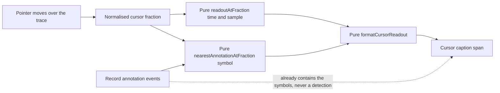

# Phase 14 — Cursor annotation readout: the nearest annotation symbol (presentation only)

Status: proposed (awaiting approval)
Baseline: Phase 13 complete and green — 59 test files / 636 tests, build 167 modules
Owner: Architect (this document) → Code (execution, item by item)

---

## Active increment (approved)

The user approved **Candidate 3** from the Phase-13 checkpoint: **add the nearest-annotation
symbol to the cursor readout** — the one remaining piece of the approved Phase-13 "A" wording
("Pointing at the plotted trace reports the time and sample under the cursor, **and the nearest
annotation symbol when one is close by**") that the executed Item-2 spec deliberately narrowed to
time + sample only.

This is a **presentation-layer** increment. No domain, DSP/DWT, ML, worker, parser, adapter or
application-service change; `App.svelte` is unchanged (it already forwards
`result.sourceRecord.annotations`). Data still reaches the views only through the application
service; the views stay display-only and never mutate source buffers.

**The single most important honesty constraint:** the readout names the **record's own** annotation
symbol — it is the *display* of a domain fact, exactly like the Phase-12 overlay legend, and is
**never a detection** and never a clinical/model claim (rules §47/§49). It must not imply the app
found a beat; it only echoes what the source file already contains.

---

## Verified state (baseline)

- `npm run check` = `typecheck && svelte-check && lint && test && build`; the Phase-13 close state
  is green: **59 test files / 636 tests**, build **167 modules** (svelte-check 0/0).
- Machine: win32 x64, Windows 11, Node v24.18.0, npm 11.16.0, Vitest 3.2.7, Svelte 5.57,
  `@testing-library/svelte` 5.4.2, jsdom 30. The workspace is **not** a git repository.
- The pieces this phase builds on already exist and are unchanged by it:
  - [`annotationGeometry.ts`](src/presentation/views/timeSeries/annotationGeometry.ts:1) owns the
    pure, DOM-free annotation→marker mapping (`AnnotationMarker`, `AnnotationMarkers`,
    [`annotationMarkers()`](src/presentation/views/timeSeries/annotationGeometry.ts:105),
    `EMPTY_MARKERS`). It already fixes the conventions this phase reuses: an annotation is visible
    when its `sampleIndex` falls inside the **half-open** sample window
    `[startSample, endSample)`; positions are normalised to `xFraction ∈ [0, 1]`
    (`clampUnitFraction`); the time↔sample maths is delegated to the domain
    (`timeSecOfSample`, `sampleWindowOfTime`) and never re-implemented.
  - [`navigationGeometry.ts`](src/presentation/views/timeSeries/navigationGeometry.ts:1) owns the
    cursor readout type [`CursorReadout`](src/presentation/views/timeSeries/navigationGeometry.ts:47)
    and [`readoutAtFraction()`](src/presentation/views/timeSeries/navigationGeometry.ts:273) (clamped
    fraction → `{ timeSec, sampleIndex }`).
  - [`TimeSeriesView.svelte`](src/presentation/views/timeSeries/TimeSeriesView.svelte:1) already
    takes `annotations?: readonly AnnotationEvent[]` ([line 72](src/presentation/views/timeSeries/TimeSeriesView.svelte:72)),
    derives [`cursorReadout`](src/presentation/views/timeSeries/TimeSeriesView.svelte:186) from
    `readoutAtFraction`, and renders the caption span
    [`cursorLabel`](src/presentation/views/timeSeries/TimeSeriesView.svelte:193)
    ([line 563](src/presentation/views/timeSeries/TimeSeriesView.svelte:563)) as
    `Cursor: —` (idle) / `Cursor: {t} s · sample {i}` (hovering) — a format deliberately distinct
    from the two `t = … s → … s` window captions.

---

## Honesty framing

- **Display of a domain fact, never a detection.** The readout echoes a `symbol` already present in
  `result.sourceRecord.annotations`. The synthetic boot record always sets `annotations: []`, so its
  readout can never name a symbol; a non-empty readout is reachable only via a real/local record.
- **The tolerance is a display guard, not a measurement threshold.** "Close by" is a screen-distance
  convenience; it is expressed as a normalised plot fraction and documented as presentation-only.
- **It names one nearest symbol; the legend still enumerates the window's whole set.** The resolver
  does not replace `annotationMarkers`; the density-capped overlay and its `Symbols:` legend are
  unchanged.
- **A readout is not a data access.** [`readoutAtFraction`](src/presentation/views/timeSeries/navigationGeometry.ts:273)
  warns that its index can equal the window's exclusive end sample; the resolver and the label must
  never index a sample buffer with it.
- **Existing assertions are a regression gate.** [`App.test.ts`](src/presentation/__tests__/App.test.ts:203)
  pins **exactly two** elements showing `t = … s → … s`; the cursor span keeps the distinct
  `Cursor: …` form, so that assertion stays untouched.
- **jsdom cannot measure layout.** The pointer path is still guarded on `rect.width > 0`; the
  numerical gate for the resolver and the label is a **pure Node** test, never a DOM-geometry test.

---

## Design decisions

### 1. The nearest-annotation resolver is a pure, DOM-free helper in `annotationGeometry.ts`

Extend the existing annotation module (same file, same conventions) rather than inventing a new one:
annotation semantics belong together, and the resolver needs the same half-open-window rule the
overlay already uses. New exports:

```ts
/** Display tolerance: how near, in plot fractions, an annotation must be to be named. */
export const CURSOR_ANNOTATION_TOLERANCE_FRACTION = 0.02;

/** The annotation nearest a cursor position, inside the visible window and tolerance. */
export interface NearestAnnotation {
    readonly symbol: string;
    readonly sampleIndex: number;
    /** |annotation.xFraction - cursor.xFraction|, in normalised plot units. */
    readonly distanceFraction: number;
}

export function nearestAnnotationAtFraction(
    annotations: readonly AnnotationEvent[],
    xFraction: number,
    viewport: TimeViewport,
    sampling: SamplingInfo,
    sampleCount: number,
    toleranceFraction?: number, // defaults to CURSOR_ANNOTATION_TOLERANCE_FRACTION
): NearestAnnotation | null;
```

Rules (every one tested):

- **Same visibility rule as the overlay.** Only annotations whose `sampleIndex` falls inside the
  half-open window `[startSample, endSample)` (from
  [`sampleWindowOfTime`](src/presentation/views/timeSeries/geometry.ts:104)) are considered, so the
  readout can never name a symbol the drawn overlay hides.
- **Clamped cursor.** `xFraction` is clamped to `[0, 1]` (a non-finite fraction maps to 0), exactly
  like [`clampFraction`](src/presentation/views/timeSeries/navigationGeometry.ts:113) and
  `clampUnitFraction`.
- **Deterministic nearest.** The winner is the smallest `distanceFraction`; ties break to the lower
  `sampleIndex`, then to the lexicographically smaller `symbol`, so the result never depends on the
  input order.
- **Null is first-class.** An empty annotation list, a degenerate viewport (non-positive duration),
  or a nearest farther than `toleranceFraction` yields `null` — the readout then falls back to
  time + sample only.
- **Validation.** A non-finite or negative `toleranceFraction` is classified `invalid-input` (the
  existing taxonomy); `sampleCount` is validated by `sampleWindowOfTime`. Nothing is silently
  coerced.
- **Read-only.** No buffer is ever indexed or written; the resolver only reads `sampleIndex`/`symbol`.

### 2. The cursor label becomes a pure, Node-tested formatter in `navigationGeometry.ts`

Phase 13 left the hover label as an inline template literal in the view, with no test on the
hovering branch (jsdom cannot easily set a pointer fraction). Phase 14 removes that gap by extracting
the string into a pure formatter next to the [`CursorReadout`](src/presentation/views/timeSeries/navigationGeometry.ts:47)
it renders:

```ts
/** Idle cursor label. */
export const CURSOR_IDLE_LABEL = "Cursor: \u2014";

export function formatCursorReadout(
    readout: CursorReadout | null,
    annotationSymbol?: string | null, // defaults to null
): string;
```

- `null` readout → `Cursor: —` (byte-identical to the current idle string).
- Otherwise → `Cursor: {timeSec.toFixed(2)} s \u00b7 sample {sampleIndex}` and, when
  `annotationSymbol` is a non-empty string, ` \u00b7 nearest {symbol}`.
- An empty/absent symbol adds **no** suffix, so the readout never shows a dangling `nearest`.

This is a deliberate, small improvement over Phase 13: the label's every branch (idle / hover /
hover-with-symbol / empty-symbol) is now pinned by a Node test rather than left to a DOM slice that
jsdom cannot reliably drive.

### 3. The view composes the two pure helpers; no new prop, no science, no service call

[`TimeSeriesView.svelte`](src/presentation/views/timeSeries/TimeSeriesView.svelte:1) gains **one**
derived and changes **one** derived; the props, the navigation buttons, the pointer handlers, the
overlay and the summary/legend are all untouched:

```ts
let nearestAnnotation = $derived.by((): NearestAnnotation | null => {
    const view = resolvedViewport;
    if (cursorFraction === null || view === null) {
        return null;
    }
    return nearestAnnotationAtFraction(
        annotations, cursorFraction, view, signal.sampling, sampleCount,
    );
});
let cursorLabel = $derived(formatCursorReadout(cursorReadout, nearestAnnotation?.symbol ?? null));
```

- The view keeps owning transient cursor state and the caption span; it still imports no service and
  writes no buffer.
- `cursorReadout` (time + sample) and `nearestAnnotation` (the symbol) stay separate derivations, so
  a symbol cannot leak into the sample maths.
- No new prop is added; `App` needs no change because it already forwards the annotations.

### 4. One documented, material decision → a short ADR-015

The anti-detection property is material enough for a record, mirroring the ADR-013/ADR-014 cadence:
**ADR-015 — Cursor annotation readout (display only)** pins that the readout may name the record's
own nearest annotation within a display tolerance, that it is never a detection and never a data
access, and that the tolerance is a presentation guard, not a measurement threshold.

### Data flow



---

## Checklist (each item ends green on `npm run check`)

- **Item 0 — Pre-flight.** Confirm the baseline is green (**59 files / 636 tests / 167 modules**).
  No files touched.
- **Item 1 — Pure resolver + label formatter.** Add `CURSOR_ANNOTATION_TOLERANCE_FRACTION`,
  `NearestAnnotation` and [`nearestAnnotationAtFraction()`](src/presentation/views/timeSeries/annotationGeometry.ts:1)
  to [`annotationGeometry.ts`](src/presentation/views/timeSeries/annotationGeometry.ts:1), and
  `CURSOR_IDLE_LABEL` + `formatCursorReadout()` to
  [`navigationGeometry.ts`](src/presentation/views/timeSeries/navigationGeometry.ts:1). Extend the
  **Node** gates: [`annotationGeometry.test.ts`](src/presentation/views/timeSeries/__tests__/annotationGeometry.test.ts:1)
  (new describe) covering null cases (no annotations / beyond tolerance / degenerate viewport), the
  exact hit, the nearer of two, the deterministic tie-break, the half-open end exclusion, an interior
  window, an out-of-plot fraction clamp, a non-zero acquisition start, a tolerance override
  (including 0), and the `invalid-input` rejection; and
  [`navigationGeometry.test.ts`](src/presentation/views/timeSeries/__tests__/navigationGeometry.test.ts:1)
  (new describe) covering `formatCursorReadout` idle / hover / hover-with-symbol / empty-symbol. Gate
  green (expected +~16 Node tests; no new file, build unchanged).
- **Item 2 — `TimeSeriesView` wiring.** Add the `nearestAnnotation` derived and route `cursorLabel`
  through `formatCursorReadout` (Design decision 3). Extend
  [`TimeSeriesView.test.ts`](src/presentation/views/timeSeries/__tests__/TimeSeriesView.test.ts:1)
  (jsdom) with: the idle `Cursor: —` still rendered (now with annotations in scope) and in the
  **distinct** `Cursor:` format (the two `t = … → …` window strings stay exactly two); and an
  integration slice that stubs `HTMLCanvasElement.prototype.getBoundingClientRect` and dispatches a
  synthetic `pointermove` (a `MouseEvent` typed `pointermove`, carrying `clientX`) to move the cursor,
  asserting the label reflects the readout and the `· nearest {symbol}` suffix when an annotation is
  within tolerance. The **numerical/format gate stays the Node test**; the DOM slice only exercises
  the view's wiring, never window geometry. Gate green (expected +~3 jsdom tests).
- **Item 3 — ADR-015 + architecture updates.** Create
  [`plans/adr/ADR-015-cursor-annotation-readout.md`](plans/adr/ADR-015-cursor-annotation-readout.md:1)
  (Status/Date/Scope → Context → Decision → Consequences → References, mirroring ADR-013/014, with a
  "Rejected alternative:" paragraph); add a §I bullet (the cursor may name the record's own nearest
  annotation within a display tolerance — display of a domain fact, never a detection), a §M item 14
  (Phase 14) and a decision-register entry in
  [`plans/ecg-lab-architecture.md`](plans/ecg-lab-architecture.md:390). Gate green (docs-only).
- **Item 4 — Audit + final gate.** Write `plans/phase-14-audit.md` (scope quote, files
  added/touched/not-touched, item map, evidence at Node/jsdom levels, proves/does-not-prove, residual
  risk, test counts, gate history) and run the final full `npm run check`. Gate green.

---

## Key files

### To create

- [`plans/adr/ADR-015-cursor-annotation-readout.md`](plans/adr/ADR-015-cursor-annotation-readout.md:1)
  — the readout decision (Item 3).
- [`plans/phase-14-audit.md`](plans/phase-14-audit.md:1) — completion record (Item 4).

### To touch

- [`src/presentation/views/timeSeries/annotationGeometry.ts`](src/presentation/views/timeSeries/annotationGeometry.ts:1)
  — `CURSOR_ANNOTATION_TOLERANCE_FRACTION`, `NearestAnnotation`, `nearestAnnotationAtFraction()`
  (Item 1).
- [`src/presentation/views/timeSeries/__tests__/annotationGeometry.test.ts`](src/presentation/views/timeSeries/__tests__/annotationGeometry.test.ts:1)
  — Node gate for the resolver (Item 1).
- [`src/presentation/views/timeSeries/navigationGeometry.ts`](src/presentation/views/timeSeries/navigationGeometry.ts:1)
  — `CURSOR_IDLE_LABEL`, `formatCursorReadout()` (Item 1).
- [`src/presentation/views/timeSeries/__tests__/navigationGeometry.test.ts`](src/presentation/views/timeSeries/__tests__/navigationGeometry.test.ts:1)
  — Node gate for the formatter (Item 1).
- [`src/presentation/views/timeSeries/TimeSeriesView.svelte`](src/presentation/views/timeSeries/TimeSeriesView.svelte:1)
  — the `nearestAnnotation` derived and the `cursorLabel` wiring (Item 2).
- [`src/presentation/views/timeSeries/__tests__/TimeSeriesView.test.ts`](src/presentation/views/timeSeries/__tests__/TimeSeriesView.test.ts:1)
  — the idle/format guard + the stubbed-rect integration slice (Item 2).
- [`plans/ecg-lab-architecture.md`](plans/ecg-lab-architecture.md:1) — §I bullet / §M item 14 /
  decision register (Item 3).

### Do not touch

- [`src/presentation/App.svelte`](src/presentation/App.svelte:1) — it already forwards
  `result.sourceRecord.annotations`; the readout is entirely a view concern.
- `src/domain/*` (`record.ts`, `sampling.ts`, `signal.ts`, `units.ts`, `numeric.ts`, `error.ts`).
- `src/datasets/*` (no parser/adapter/`.atr` change; the parser stays parse-only).
- `src/dsp/*`, `src/ml/*`, `src/workers/*`, `src/bench/*`.
- [`src/application/analysis.ts`](src/application/analysis.ts:1) / `defaults.ts` / `dspExecutor.ts`
  — the service is never touched by a readout.
- [`src/main.ts`](src/main.ts:1); `src/presentation/dataset/*`, `src/presentation/workers/*`.
- [`ViewControls.svelte`](src/presentation/views/controls/ViewControls.svelte:1) and
  [`presets.ts`](src/presentation/views/controls/presets.ts:1) — the toolbar stays thin.
- [`DwtCoefficientView.svelte`](src/presentation/views/dwt/DwtCoefficientView.svelte:1) — the readout
  is a time-series concern only; no annotation readout is added there.
- The canonical DWT stays `db4 / 4 / periodic`; no science-config control is added.

### Read-only references

- [`src/presentation/views/timeSeries/geometry.ts`](src/presentation/views/timeSeries/geometry.ts:104)
  — `sampleWindowOfTime`, the half-open-window convention and the "delegate to the domain" rule.
- [`src/presentation/views/timeSeries/navigationGeometry.ts`](src/presentation/views/timeSeries/navigationGeometry.ts:273)
  — `readoutAtFraction`, the `CursorReadout` type and the "a readout is not a data access" note.
- [`plans/adr/ADR-013-annotation-display.md`](plans/adr/ADR-013-annotation-display.md:1) — "display of
  domain facts, never science; never a detection".
- [`plans/adr/ADR-014-signal-navigation.md`](plans/adr/ADR-014-signal-navigation.md:1) — the navigation
  decision and the ADR template.
- [`plans/phase-13-plan.md`](plans/phase-13-plan.md:1) and
  [`plans/phase-13-audit.md`](plans/phase-13-audit.md:1) — the plan/audit templates.

---

## Reminders for execution (Code mode)

1. **Work item by item; do not batch.** After each item run `npm run check` and confirm exit 0 before
   starting the next. Report the captured test-file / test / module counts.
2. **Never re-implement sample math.** The resolver reuses `sampleWindowOfTime` and `timeSecOfSample`;
   nothing defines a second time↔sample conversion.
3. **Read-only.** The resolver only reads `sampleIndex`/`symbol`; it never indexes a sample buffer and
   never mutates an input.
4. **Keep the idle string byte-identical.** `CURSOR_IDLE_LABEL` must equal the current
   `"Cursor: \u2014"`, and the hovering form must equal the current
   `Cursor: {t} s · sample {i}` so the existing jsdom assertions stay green.
5. **Keep the two window strings.** [`App.test.ts`](src/presentation/__tests__/App.test.ts:203) pins
   exactly two `t = … s → … s` elements; the cursor span keeps the distinct `Cursor: …` form.
6. **jsdom cannot measure layout.** Guard every pointer handler on `rect.width > 0` as before; the DOM
   integration slice stubs `getBoundingClientRect` **only** to exercise the label wiring and never
   asserts window geometry (that stays the Node gate).
7. **`import type` everywhere** (`verbatimModuleSyntax`, `consistent-type-imports`); keep
   `no-explicit-any` clean and honour `noUnusedLocals`/`noUnusedParameters`.
8. **Keep the existing assertions passing.** All `annotationGeometry` / `navigationGeometry` /
   `TimeSeriesView` / `App` / `geometry` / `presets` / `ViewControls` tests must remain green
   unchanged; default markup (no cursor) must be byte-identical in intent.
9. **Update the architecture doc last**, and re-read the exact target lines before applying the edit.
10. **Report honestly.** If the label can only be exercised through a production change outside the
    files above, stop and report rather than silently widening the change.
