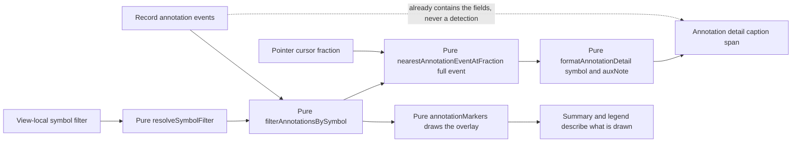

# Phase 15 — Annotation interaction: hover detail and an optional symbol filter (presentation only)

Status: proposed (awaiting approval)
Baseline: Phase 14 complete and green — 59 test files / 657 tests, build 167 modules
Owner: Architect (this document) → Code (execution, item by item)

---

## Active increment (approved)

The user approved **Candidate 1** from the Phase-14 checkpoint: **annotation interaction** —
hover/click a marker to show its `symbol` / `auxNote`, plus an **optional symbol filter** — the
natural presentation follow-on now that the Phase-14 cursor readout can already *name* the nearest
marker.

This is a **presentation-layer** increment. No domain, DSP/DWT, ML, worker, parser, adapter or
application-service change; [`App.svelte`](src/presentation/App.svelte:483) is unchanged (it already
forwards `annotations={result.sourceRecord.annotations}` and `onViewportCommit`). Data still reaches
the views only through the application service; the views stay display-only and never mutate source
buffers.

**The single most important honesty constraint:** the detail line and the filter operate on the
**record's own** annotations — the *display* of a domain fact, exactly like the Phase-12 overlay
legend and the Phase-14 readout, and **never a detection** and never a clinical/model claim (rules
§47/§49). A filter **hides** markers; it never asserts a finding, never re-runs the analysis, and
never changes what the science computed.

---

## Verified state (baseline)

- `npm run check` = `typecheck && svelte-check && lint && test && build`; the Phase-14 close state is
  green: **59 test files / 657 tests**, build **167 modules** (svelte-check 0/0).
- Machine: win32 x64, Windows 11, Node v24.18.0, npm 11.16.0, Vitest 3.2.7, Svelte 5.57,
  `@testing-library/svelte` 5.4.2, jsdom 30. The workspace is **not** a git repository.
- The pieces this phase builds on already exist and are unchanged by it:
  - [`annotationGeometry.ts`](src/presentation/views/timeSeries/annotationGeometry.ts:1) already owns
    the pure, DOM-free annotation mapping and the Phase-14 resolver:
    [`CURSOR_ANNOTATION_TOLERANCE_FRACTION`](src/presentation/views/timeSeries/annotationGeometry.ts:71)
    (`0.02`), [`NearestAnnotation`](src/presentation/views/timeSeries/annotationGeometry.ts:74)
    (`{ symbol, sampleIndex, distanceFraction }`), and
    [`nearestAnnotationAtFraction()`](src/presentation/views/timeSeries/annotationGeometry.ts:244)
    (the half-open window rule, the clamped cursor, the deterministic total order, `null`
    first-class, `invalid-input` tolerance, read-only). **It deliberately drops `auxNote`/`code`.**
  - [`TimeSeriesView.svelte`](src/presentation/views/timeSeries/TimeSeriesView.svelte:1) already takes
    `annotations?: readonly AnnotationEvent[]` ([line 81](src/presentation/views/timeSeries/TimeSeriesView.svelte:81)),
    derives [`annotationResult`](src/presentation/views/timeSeries/TimeSeriesView.svelte:170) via
    `annotationMarkers`, resolves
    [`nearestAnnotation`](src/presentation/views/timeSeries/TimeSeriesView.svelte:206) via
    `nearestAnnotationAtFraction`, and renders the caption spans
    [`series-annotations`](src/presentation/views/timeSeries/TimeSeriesView.svelte:584) /
    [`series-symbols`](src/presentation/views/timeSeries/TimeSeriesView.svelte:585) /
    [`series-cursor`](src/presentation/views/timeSeries/TimeSeriesView.svelte:588).
  - [`record.ts`](src/domain/record.ts:46) owns
    [`AnnotationEvent`](src/domain/record.ts:46) =
    `{ readonly sampleIndex: number; readonly symbol: string; readonly code?: number; readonly auxNote: string }`
    — so "show symbol/auxNote" is a pure presentation read of an existing field.
- Existing pointer tests (the regression boundary this phase must respect):
  [`TimeSeriesView.test.ts`](src/presentation/views/timeSeries/__tests__/TimeSeriesView.test.ts:303)
  drives `pointerDown`/`pointerMove`/`pointerUp` **only** in the *inert without layout* slice
  (zero-width rect), and the Phase-14 stubbed-rect slice
  ([line 362](src/presentation/views/timeSeries/__tests__/TimeSeriesView.test.ts:362)) dispatches
  **only** `pointerMove`. **No test pins a canvas click's current effect**, and
  [`App.test.ts`](src/presentation/__tests__/App.test.ts:50) never drives a canvas drag — so a bounded
  click gesture (Item 4, optional) is additive to the suite.

---

## Honesty framing

- **Display of a domain fact, never a detection.** The detail line echoes `symbol` / `auxNote` already
  present in `result.sourceRecord.annotations`. The synthetic boot record always sets
  `annotations: []`, so a non-idle detail line is reachable only via a real/local record.
- **A filter is a display selection, not a query or a claim.** It changes only which markers are
  drawn and what the caption summarises — the ADR-008 rule "display controls change what is drawn,
  never what is computed". The service is never re-invoked.
- **Displayed detail and drawn overlay must agree.** The detail is resolved from the **same filtered
  list** the overlay and the cursor readout use, under the same half-open window rule, so the app can
  never describe a marker it is not drawing.
- **The tolerance stays a display guard, not a measurement threshold.** The pin/click logic (if kept)
  reuses the documented Phase-14 display fraction; nothing here is a detection or a clinical
  threshold (ADR-015).
- **A readout is not a data access.** The returned event and its `sampleIndex` are readouts
  ([`readoutAtFraction`](src/presentation/views/timeSeries/navigationGeometry.ts:273) can return the
  window's exclusive end sample); nothing here indexes a sample buffer.
- **jsdom cannot measure layout.** Every pointer path stays guarded on `rect.width > 0`; the
  numerical/format gate is a **pure Node** test, and the DOM slices only exercise wiring through the
  stubbed `200×100` rect precedent.

---

## Design decisions

### 1. One spine: a hit resolver returning the full event; the Phase-14 summary becomes a projection

Phase 14's [`NearestAnnotation`](src/presentation/views/timeSeries/annotationGeometry.ts:74)
deliberately carries only `{ symbol, sampleIndex, distanceFraction }`. Phase 15 needs `auxNote`, so
add a resolver that returns the **record's own event** and re-express the Phase-14 function on top of
it, so the two can never diverge. New export in
[`annotationGeometry.ts`](src/presentation/views/timeSeries/annotationGeometry.ts:1):

```ts
/** The record's own annotation nearest a cursor, with its display distance. */
export interface AnnotationHit {
    /** The event verbatim from the record (never synthesised, never copied-then-edited). */
    readonly event: AnnotationEvent;
    /** |annotation.xFraction - cursor.xFraction|, in normalised plot units. */
    readonly distanceFraction: number;
}

export function nearestAnnotationEventAtFraction(
    annotations: readonly AnnotationEvent[],
    xFraction: number,
    viewport: TimeViewport,
    sampling: SamplingInfo,
    sampleCount: number,
    toleranceFraction?: number, // defaults to CURSOR_ANNOTATION_TOLERANCE_FRACTION
): AnnotationHit | null;
```

- **Identical rules to Phase 14** — the half-open window `[startSample, endSample)`, the clamped cursor
  fraction, the deterministic total order (distance → lower sample index → lexicographically smaller
  symbol), `null` first-class, `invalid-input` for a bad tolerance, read-only. The change is only
  *what is returned*.
- **[`nearestAnnotationAtFraction()`](src/presentation/views/timeSeries/annotationGeometry.ts:244) is
  kept** and re-expressed as a projection over the new resolver (returning `null` when the hit is
  `null`, else the three-field summary), so its 11 existing Node cases stay green **unchanged** and
  there is exactly one selection spine.
- **Rejected alternative:** widen `NearestAnnotation` with `auxNote`/`code`. Rejected because the
  summary type is a *display projection*; widening it makes the readout carry a data payload and
  invites a second, divergent scan. A projection keeps one definition of "nearest".

### 2. The symbol filter and its resolution are pure, testable helpers

A filter must be a pure function of the annotation list, and a filter a *new window* no longer
contains must fall back deterministically. New exports in
[`annotationGeometry.ts`](src/presentation/views/timeSeries/annotationGeometry.ts:1):

```ts
/** The events whose symbol equals `symbol`; `null`/"" is the identity (order preserved). */
export function filterAnnotationsBySymbol(
    annotations: readonly AnnotationEvent[],
    symbol: string | null,
): readonly AnnotationEvent[];

/** `active` when it is a non-empty member of `available`, else `null` ("All"). */
export function resolveSymbolFilter(
    active: string | null,
    available: readonly string[],
): string | null;
```

- `filterAnnotationsBySymbol` returns the input **unchanged** for `null`/`""` (identity, order
  preserved) and otherwise the exact-match subset in input order. Read-only; never mutates.
- `resolveSymbolFilter` returns `active` only when it is a non-empty member of `available`, else
  `null`. That makes a filter that a channel/window change removed fall back to "All" **without** an
  effect or a manual reset — a pure, order-independent rule. The available set is the **unfiltered**
  window's distinct symbols (so the user can always switch back).

### 3. A pure detail-line formatter, next to the annotation types it formats

Mirroring `formatCursorReadout` (which sits beside `CursorReadout`), the annotation detail formatter
lives beside `AnnotationHit` in
[`annotationGeometry.ts`](src/presentation/views/timeSeries/annotationGeometry.ts:1):

```ts
/** Idle annotation detail label. */
export const ANNOTATION_DETAIL_IDLE_LABEL = "Annotation: \u2014";

export function formatAnnotationDetail(hit: AnnotationHit | null): string;
```

- `null` → `Annotation: —`.
- Otherwise `Annotation: {symbol} · sample {sampleIndex}` and, when `auxNote` is a non-empty string,
  ` · {auxNote}` (the `\u00b7` middle dot, matching the cursor caption).
- An empty/absent note adds **no** suffix, so the line never shows a dangling separator.
- `code` is deliberately **not** rendered: the note is the human-readable field this increment is
  about and the symbol is the marker vocabulary; a numeric code would add noise without adding a fact
  the note does not already carry. (`code` stays available on the event — a documented decision, not
  a loss.)

### 4. The view shows the detail on hover and owns an optional symbol filter — no new prop

[`TimeSeriesView.svelte`](src/presentation/views/timeSeries/TimeSeriesView.svelte:574) gains, in the
figcaption:

- a new span `series-annotation-detail` fed by `formatAnnotationDetail(hit)`, where `hit` is resolved
  from the **filtered** list so the detail, the cursor readout and the drawn overlay can never
  disagree;
- a view-local `let symbolFilter = $state<string | null>(null)` and a keyboard-accessible
  `<select aria-label="Symbol filter">` offering `All symbols` plus the window's distinct symbols;
- `annotationResult` computed from `filterAnnotationsBySymbol(annotations, resolvedFilter)`, a new
  `allSymbols` derived (the **unfiltered** window symbols) feeding the select options, and
  `resolvedFilter = resolveSymbolFilter(symbolFilter, allSymbols)`.

The shape:

```ts
let symbolFilter = $state<string | null>(null);
let allSymbols = $derived(/* annotationMarkers(annotations, view, …).symbols — unfiltered */);
let resolvedFilter = $derived(resolveSymbolFilter(symbolFilter, allSymbols));
let annotationResult = $derived.by(/* annotationMarkers(filterAnnotationsBySymbol(annotations, resolvedFilter), …) */);
let annotationDetail = $derived(formatAnnotationDetail(hitFrom(resolvedFilter)));
```

- No new prop; [`App.svelte`](src/presentation/App.svelte:483) and
  [`ViewControls.svelte`](src/presentation/views/controls/ViewControls.svelte:1) are untouched. The
  filter is a time-series concern over a prop only this view receives.
- **Rejected alternative:** put the filter in `ViewControls`. Rejected because the toolbar is a
  channel/viewport control wired by `App`; routing an annotation filter up would add props and couple
  the generic toolbar to annotation semantics.
- The summary/legend continue to describe **what is drawn** (the filtered set), consistent with the
  existing captions.

### 5. (Optional item) A bounded click-to-pin that replaces the implicit click-zoom

A canvas click currently commits a **zero-width drag** (Phase 13's
`viewportFromFractions` collapse-to-minimum-window). Phase 15 can give a click a display meaning
instead, without touching the drag-zoom:

- record the press fraction **unconditionally** at pointer-down (so a click can pin even when no
  `onViewportCommit` callback is supplied — the readout/detail do not require navigation);
- on release, when the release is within a small display fraction (`PIN_MOVE_TOLERANCE_FRACTION`,
  documented) of the press, treat it as a **click**: pin the nearest hit within tolerance, or clear
  the pin when none is close, and commit **no** window;
- otherwise the release is a **drag** and commits exactly as today.
- The pinned hit is view-local `$state` and survives pointer leave; a hover with no pin still clears
  the transient cursor on leave as before.

This is presented as a **separable item**: the user may drop it and keep the phase hover-only (then
the click keeps its current Phase-13 behaviour). If kept, the ADR records that a click now pins rather
than committing a zero-width zoom.

### 6. One documented, material decision → a short ADR-016

Mirroring the ADR-013/014/015 cadence: **ADR-016 — Annotation interaction (display only)** pins that
the detail line and the symbol filter are the *display of domain facts, never a detection*; that the
filter changes only what is drawn (ADR-008) and never re-invokes the service; that the resolver
returns the record's own event; and (if Item 4 is kept) that a click **pins** the nearest annotation
rather than committing a zero-width zoom, with every threshold documented as a presentation guard,
not a measurement.

### Data flow



---

## Checklist (each item ends green on `npm run check`)

- **Item 0 — Pre-flight.** Confirm the baseline is green (**59 files / 657 tests / 167 modules**).
  No files touched.
- **Item 1 — Pure hit resolver.** In
  [`annotationGeometry.ts`](src/presentation/views/timeSeries/annotationGeometry.ts:1) add
  `AnnotationHit` and [`nearestAnnotationEventAtFraction()`](src/presentation/views/timeSeries/annotationGeometry.ts:244),
  and re-express `nearestAnnotationAtFraction()` as a projection over it (Design decision 1). Extend
  the **Node** gate
  [`annotationGeometry.test.ts`](src/presentation/views/timeSeries/__tests__/annotationGeometry.test.ts:1)
  (new describe) covering: the exact hit returning the **same event object** (identity), `auxNote`
  carried verbatim, the nearer of two, the deterministic tie-break, the half-open end exclusion, an
  interior window, an out-of-plot clamp, a tolerance override (including `0`), `null` for
  empty/degenerate/beyond-tolerance, the `invalid-input` tolerance, and read-only (no mutation). The
  **11 existing `nearestAnnotationAtFraction` cases must stay green unchanged** (the projection). Gate
  green (expected +~10 Node tests; no new file, build unchanged).
- **Item 2 — Pure filter + detail formatter.** Add `filterAnnotationsBySymbol()`,
  `resolveSymbolFilter()`, `ANNOTATION_DETAIL_IDLE_LABEL` and `formatAnnotationDetail()` to
  [`annotationGeometry.ts`](src/presentation/views/timeSeries/annotationGeometry.ts:1) (Design
  decisions 2–3). Extend the **Node** gate with: filter identity for `null`/`""`; exact-match subset
  in order; no-match → empty; the input not mutated; `resolveSymbolFilter` membership / empty-string /
  absent fallbacks; the formatter idle branch, the symbol+sample branch, the non-empty-note branch,
  and the empty-note no-dangling-separator branch. Gate green (expected +~9 Node tests).
- **Item 3 — `TimeSeriesView` hover detail + optional symbol filter.** Add the
  `series-annotation-detail` span, the view-local `symbolFilter` state, the `allSymbols` /
  `resolvedFilter` derivations and route `annotationResult` (and the hit) through the filtered list
  (Design decision 4). Extend
  [`TimeSeriesView.test.ts`](src/presentation/views/timeSeries/__tests__/TimeSeriesView.test.ts:362)
  (jsdom) with: the idle `Annotation: —` detail by default; the detail naming the hovered annotation's
  `symbol` + `auxNote` under the stubbed `200×100` rect; the filter select listing the window symbols
  and reducing the summary/legend to the chosen symbol; and a stale filter falling back to `All`.
  The **numerical/format gate stays the Node test**; the DOM slice exercises wiring only. Gate green
  (expected +~5 jsdom tests).
- **Item 4 — (Optional) bounded click-to-pin.** Implement the press/release move-tolerance gesture of
  Design decision 5, keeping the drag-zoom path intact. Extend
  [`TimeSeriesView.test.ts`](src/presentation/views/timeSeries/__tests__/TimeSeriesView.test.ts:1)
  (jsdom, stubbed rect) with: a click on a marker pins its detail and commits **no** viewport; a drag
  still commits; a click clear of every marker clears the pin; a pin survives `pointerleave`. Gate
  green (expected +~4 jsdom tests). **If dropped, the phase stays hover-only and the click keeps its
  Phase-13 behaviour.**
- **Item 5 — ADR-016 + architecture updates.** Create
  [`plans/adr/ADR-016-annotation-interaction.md`](plans/adr/ADR-016-annotation-interaction.md:1)
  (Status/Date/Scope → Context → Decision → Consequences → References, mirroring ADR-014/015, with a
  "Rejected alternative:" paragraph); add a §I bullet (the record's own annotation detail and an
  optional symbol filter are displayed; display of a domain fact, never a detection; a filter hides,
  it never claims), a §M item 15 (Phase 15) and a decision-register entry in
  [`plans/ecg-lab-architecture.md`](plans/ecg-lab-architecture.md:395). Gate green (docs-only).
- **Item 6 — Audit + final gate.** Write `plans/phase-15-audit.md` (scope quote, files
  added/touched/not-touched, item map, evidence at Node/jsdom levels, proves/does-not-prove, residual
  risk, test counts, gate history) and run the final full `npm run check`. Gate green.

---

## Key files

### To create

- [`plans/adr/ADR-016-annotation-interaction.md`](plans/adr/ADR-016-annotation-interaction.md:1) — the
  interaction decision (Item 5).
- [`plans/phase-15-audit.md`](plans/phase-15-audit.md:1) — completion record (Item 6).

### To touch

- [`src/presentation/views/timeSeries/annotationGeometry.ts`](src/presentation/views/timeSeries/annotationGeometry.ts:1)
  — `AnnotationHit`, `nearestAnnotationEventAtFraction()`, the projection, `filterAnnotationsBySymbol()`,
  `resolveSymbolFilter()`, `ANNOTATION_DETAIL_IDLE_LABEL`, `formatAnnotationDetail()` (Items 1–2).
- [`src/presentation/views/timeSeries/__tests__/annotationGeometry.test.ts`](src/presentation/views/timeSeries/__tests__/annotationGeometry.test.ts:1)
  — Node gates for the resolver, the filter and the formatter (Items 1–2).
- [`src/presentation/views/timeSeries/TimeSeriesView.svelte`](src/presentation/views/timeSeries/TimeSeriesView.svelte:1)
  — the detail span, the symbol filter and the (optional) pin gesture (Items 3–4).
- [`src/presentation/views/timeSeries/__tests__/TimeSeriesView.test.ts`](src/presentation/views/timeSeries/__tests__/TimeSeriesView.test.ts:1)
  — the jsdom slices for the detail/filter and the (optional) pin (Items 3–4).
- [`plans/ecg-lab-architecture.md`](plans/ecg-lab-architecture.md:1) — §I bullet / §M item 15 /
  decision register (Item 5).

### Do not touch

- [`src/presentation/App.svelte`](src/presentation/App.svelte:1) — it already forwards
  `annotations` and `onViewportCommit`; the interaction is entirely a view concern.
- `src/domain/*` (`record.ts`, `sampling.ts`, `signal.ts`, `units.ts`, `numeric.ts`, `error.ts`).
- `src/datasets/*` (no parser/adapter/`.atr` change; the parser stays parse-only).
- `src/dsp/*`, `src/ml/*`, `src/workers/*`, `src/bench/*`.
- [`src/application/analysis.ts`](src/application/analysis.ts:1) / `defaults.ts` / `dspExecutor.ts`
  — the service is never touched by a display interaction.
- [`src/main.ts`](src/main.ts:1); `src/presentation/dataset/*`, `src/presentation/workers/*`.
- [`ViewControls.svelte`](src/presentation/views/controls/ViewControls.svelte:1) and
  [`presets.ts`](src/presentation/views/controls/presets.ts:1) — the toolbar stays thin (Design
  decision 4).
- [`DwtCoefficientView.svelte`](src/presentation/views/dwt/DwtCoefficientView.svelte:1) — the detail
  and filter are a time-series concern; no annotation interaction is added there.
- The canonical DWT stays `db4 / 4 / periodic`; no science-config control is added.

### Read-only references

- [`src/presentation/views/timeSeries/annotationGeometry.ts`](src/presentation/views/timeSeries/annotationGeometry.ts:244)
  — `nearestAnnotationAtFraction`, the half-open window rule and the tolerance convention this phase
  extends.
- [`src/domain/record.ts`](src/domain/record.ts:46) — `AnnotationEvent` (`symbol`, `code?`, `auxNote`).
- [`plans/adr/ADR-013-annotation-display.md`](plans/adr/ADR-013-annotation-display.md:1) — "display of
  domain facts, never science; never a detection".
- [`plans/adr/ADR-014-signal-navigation.md`](plans/adr/ADR-014-signal-navigation.md:1) and
  [`plans/adr/ADR-015-cursor-annotation-readout.md`](plans/adr/ADR-015-cursor-annotation-readout.md:1)
  — the navigation/readout decisions and the ADR template.
- [`plans/phase-14-plan.md`](plans/phase-14-plan.md:1),
  [`plans/phase-14-audit.md`](plans/phase-14-audit.md:1) and
  [`plans/phase-14-checkpoint.md`](plans/phase-14-checkpoint.md:1) — the plan/audit/checkpoint
  templates this phase mirrors.

---

## Reminders for execution (Code mode)

1. **Work item by item; do not batch.** After each item run `npm run check` and confirm exit 0 before
   starting the next. Report the captured test-file / test / module counts.
2. **One spine.** `nearestAnnotationAtFraction()` must be a projection over
   `nearestAnnotationEventAtFraction()`; do not leave two independent scans or two tie-break rules.
   Its 11 existing Node cases must stay green **unchanged**.
3. **Never re-implement sample math.** Reuse `sampleWindowOfTime`, `timeSecOfSample` and the existing
   `clampUnitFraction`; nothing defines a second time↔sample conversion.
4. **Read-only.** The helpers only read `sampleIndex`/`symbol`/`auxNote`; never index or write a
   sample buffer, never mutate an input (`filterAnnotationsBySymbol` returns the identity for `null`).
5. **The detail and the drawn overlay must agree.** Resolve the hit from the **filtered** list, and
   keep the filter options derived from the **unfiltered** window symbols.
6. **Keep the existing assertions passing.** All `annotationGeometry` / `navigationGeometry` /
   `TimeSeriesView` / `App` / `geometry` tests must remain green; the two `t = … s → … s` captions and
   the `Cursor: …` caption keep their exact forms.
7. **jsdom cannot measure layout.** Guard every pointer handler on `rect.width > 0`; the DOM slices
   stub `getBoundingClientRect` **only** to exercise wiring and never assert window geometry (that
   stays the Node gate).
8. **`import type` everywhere** (`verbatimModuleSyntax`, `consistent-type-imports`); keep
   `no-explicit-any` clean and honour `noUnusedLocals`/`noUnusedParameters`.
9. **Update the architecture doc last**, re-reading the exact target lines before applying the edit.
10. **Report honestly.** If the behaviour can only be exercised through a production change outside
    the files above, stop and report rather than silently widening the change.
