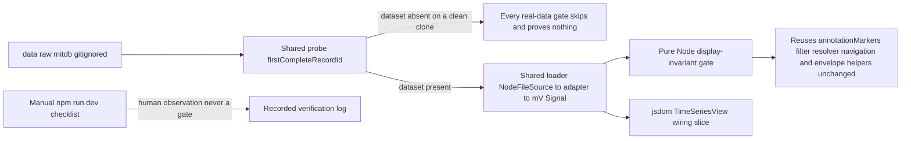

# Phase 16 — Real-browser + real-data hardening: opt-in real-record verification of the display invariants (tests + docs only)

Status: proposed (awaiting approval)
Baseline: Phase 15 complete and green — 59 test files / 693 tests, build 167 modules
Owner: Architect (this document) → Code (execution, item by item)

---

## Active increment (approved)

The user approved **Candidate 1** from the Phase-15 checkpoint:

> *"Real-browser + real-data hardening: an opt-in real-data interaction test plus re-measuring the
> display invariants on real MIT-BIH records."*

This closes the two **verification gaps** the Phase 12–15 presentation phases left open, **without
touching any production code**:

1. **Real-data.** The display stack (overlay, legend, symbol filter, detail line, cursor readout,
   navigation, envelope) has only ever been asserted over *synthetic* fixtures. This phase
   re-measures its **invariants against a genuine MIT-BIH record** — the record's own annotations and
   its own mV signal — in an **opt-in** gate that **skips** when the gitignored dataset is absent.
2. **Real-browser.** The residual risks that only a real browser can exercise (local ingestion, the
   live canvas, the pointer gestures) are recorded as a **manual `npm run dev` observation**, never
   an automated gate.

This is a **tests-and-docs** increment. **No** domain, DSP/DWT, ML, worker, parser, adapter,
application-service, view, or configuration change. The only production-tree file added is a
**test-support** module under a `__tests__` directory (mirroring
[`src/dsp/__tests__/support.ts`](src/dsp/__tests__/support.ts:1)); the default suite and the browser
bundle are unchanged by it.

**The single most important honesty constraint:** every claim this phase makes is about the
**display of domain facts already present in the record** — the density-capped overlay, the symbol
legend/filter, the cursor/detail readouts and the navigation window are *displays*, never detections
and never clinical claims (rules §47/§49, ADR-013). A re-measurement on real data must therefore
**assert invariants of the display mapping**, not anything the science did not compute, and the
manual browser record must be an **observation**, never a pass/fail gate (rules §51).

---

## Verified state (baseline)

- `npm run check` = `typecheck && svelte-check && lint && test && build`; the Phase-15 close state is
  green: **59 test files / 693 tests**, build **167 modules** (svelte-check 0/0).
- Machine: win32 x64, Windows 11, Node v24.18.0, npm 11.16.0, Vitest 3.2.7, Svelte 5.57,
  `@testing-library/svelte` 5.4.2, jsdom 30. The workspace is **not** a git repository and has **no
  browser-automation dependency** in [`package.json`](package.json:1).
- The opt-in real-data precedent already exists and defines the pattern this phase generalizes:
  [`realData.integration.test.ts`](src/datasets/__tests__/realData.integration.test.ts:32) probes
  `data/raw/mitdb` with a **sync** `firstCompleteRecordId()` (`existsSync` + `readdirSync`, preferring
  a `.hea`+`.dat`+`.atr` record) and runs a single `it.skipIf(recordId === undefined)` case over
  [`NodeFileSource`](src/datasets/nodeSource.ts:26) →
  [`discoverMitBihRecordIds()`](src/datasets/mitbih/catalog.ts:113) →
  [`MitBihDatasetAdapter`](src/datasets/mitbih/adapter.ts:182) →
  [`recordToMillivoltSignal()`](src/datasets/load.ts:35).
- The raw dataset on this machine: `data/raw/mitdb` holds `100.atr`, `101.atr/.dat/.hea/.xws`,
  `102.atr`, `102-0.atr` — **no `RECORDS`**, and **record `101` is the only complete record**. Its
  [`101.hea`](data/raw/mitdb/101.hea:1) reads `101 2 360 650000` with two format-212 `101.dat`
  channels (`MLII`, `V1`), gain 200, baseline 1024 → **2 channels, 360 Hz, 650,000 samples, mV**.
  The shared probe therefore returns `'101'` here, so the opt-in gates **actually run** on this
  machine (they are not skipped).
- Test configuration is single-sourced in [`vite.config.ts`](vite.config.ts) (Vitest `test` block):
  `environment: 'node'`, `include: ['src/**/*.test.ts']`, per-file `// @vitest-environment jsdom`
  opt-in, `svelteTesting({ autoCleanup: false })`. A non-`*.test.ts` module under `__tests__` is
  **not** collected — which is what makes a shared support module safe.
- The display helpers this phase re-measures already exist and are unchanged by it:
  [`annotationMarkers()`](src/presentation/views/timeSeries/annotationGeometry.ts:169),
  [`filterAnnotationsBySymbol()`](src/presentation/views/timeSeries/annotationGeometry.ts:252),
  [`resolveSymbolFilter()`](src/presentation/views/timeSeries/annotationGeometry.ts:273),
  [`nearestAnnotationEventAtFraction()`](src/presentation/views/timeSeries/annotationGeometry.ts:300),
  [`formatAnnotationDetail()`](src/presentation/views/timeSeries/annotationGeometry.ts:390),
  [`sampleWindowOfTime()`](src/presentation/views/timeSeries/geometry.ts:104),
  [`envelopeColumns()`](src/presentation/views/timeSeries/geometry.ts:192),
  [`visibleAmplitudeBounds()`](src/presentation/views/timeSeries/geometry.ts:218),
  [`viewportBoundsOf()`](src/presentation/views/timeSeries/navigationGeometry.ts:125),
  [`clampViewport()`](src/presentation/views/timeSeries/navigationGeometry.ts:146),
  [`zoomViewport()`](src/presentation/views/timeSeries/navigationGeometry.ts:170),
  [`panViewport()`](src/presentation/views/timeSeries/navigationGeometry.ts:209) and
  [`readoutAtFraction()`](src/presentation/views/timeSeries/navigationGeometry.ts:273).
- [`TimeSeriesView.svelte`](src/presentation/views/timeSeries/TimeSeriesView.svelte:30) takes
  `signal`, `channelName?`, `viewport?`, `annotations?` (`[]` default), `onViewportCommit?`, `width`
  (720) and `height` (220) — so a jsdom slice can render it with a **real** `Signal` and the record's
  **real** annotations **without** any analysis/DWT.
- The stubbed-`getBoundingClientRect` precedent the jsdom slice must reuse:
  [`TimeSeriesView.test.ts`](src/presentation/views/timeSeries/__tests__/TimeSeriesView.test.ts:466)
  (`200×100` rect) and [`App.test.ts`](src/presentation/__tests__/App.test.ts:50).

---

## Honesty framing

- **Display of a domain fact, never a detection.** Every string the gates inspect is read from
  `record.annotations` (the record's own `AnnotationEvent`s) and the mV signal; the pure helpers own
  no algorithm and no threshold beyond the documented display fractions.
- **A re-measurement on real data is an invariant check, not a finding.** The Node gate asserts
  *structural* properties of the mapping (one marker per column, counts consistent, windows
  contained, bounds ordered) — never that a beat "exists", never a clinical statement.
- **The default suite never depends on the gitignored dataset.** The dataset is absent on a clean
  clone (ADR-006 local-first); every real-data gate **skips** there. A skipped gate **proves
  nothing** — that limit is stated, not hidden.
- **Real-browser verification is a recorded observation, never a gate.** With no browser-automation
  dependency and no new-dependency precedent (ADR-012), the `npm run dev` pass is captured as a
  human checklist + observation log; it is **not** wired into `npm run check` and never asserts
  wall-clock timing (rules §51).
- **jsdom cannot measure layout or pixels.** The jsdom slice proves **wiring only**, over the stubbed
  `200×100` rect; the numbers and strings stay the pure **Node** gate. Canvas pixels and timing are
  never asserted.
- **The gates are additive and read-only.** They add no production behaviour, mutate no input, and
  re-run the record's own facts; they cannot change what the app computes.

---

## Design decisions

### 1. Real-browser verification is a recorded manual observation — never an automated gate

The candidate is named "real-browser", but the honest scope is a **manual** pass recorded in
[`plans/phase-16-manual-verification.md`](plans/phase-16-manual-verification.md:1), exactly as the
repo already records manual `npm run dev` checks (e.g. `plans/phase-10-measurement.md`) — the same
convention ADR-012 used for "validated manually". The document is a **checklist + observation log**
covering both ingestion paths (`<input type=file multiple>`/drag-drop floor and the Chromium-only
directory picker), the annotation overlay/legend, navigation (zoom/pan/reset + the "Custom (zoomed)"
option), the cursor readout, the hover detail, the symbol filter and the click-to-pin, plus a
"no console errors" check. Code records the confirmations it can make without a human (the
production `build` is already in the gate; a brief `npm run dev` smoke proves the dev server serves
`index.html` and resolves the worker/`.onnx` assets) and leaves the interactive steps as **blank,
honestly-pending** observation slots for a human to complete.

- **Rejected alternative:** add a browser-automation dependency (Playwright/Vitest browser mode).
  Rejected because it adds a heavy dependency, contradicts ADR-012's no-new-dependency precedent,
  and would turn a machine-dependent, flaky, layout-sensitive check into a supposed gate — contrary
  to rules §51 and the project's "never a committed wall-clock/pixel assertion" stance.
- **If a defect surfaces during the manual pass:** stop and report it; do **not** silently widen this
  phase into a production fix (Reminder 8).

### 2. One shared opt-in probe + loader; the default suite never depends on the dataset

Factor the probe out of [`realData.integration.test.ts`](src/datasets/__tests__/realData.integration.test.ts:32)
into a single **test-support** module so the datasets test, the new Node display gate and the new
jsdom slice share one definition of "which real record". New file
[`src/datasets/__tests__/realRecordSupport.ts`](src/datasets/__tests__/realRecordSupport.ts:1):

```ts
/** Absolute path of the gitignored raw dataset root. */
export const MITDB_DIR: string;
/** First record whose `.hea` (+ `.dat`, preferring `.atr`) is present, else `undefined`. */
export function firstCompleteRecordId(): string | undefined;
/** The stable reason a real-data gate is skipped when the dataset is absent. */
export const REAL_RECORD_SKIP_REASON: string;
export interface RealRecord {
    readonly recordId: string;
    readonly record: SignalRecord;   // canonical, raw-ADC (annotations preserved)
    readonly signal: Signal;         // the single audited ADC->mV step
}
/** `undefined` when the dataset is absent; otherwise the probed record + its mV signal. */
export async function loadRealRecord(): Promise<RealRecord | undefined>;
```

- **The skip decision is sync; the load is async.** Each gate calls the **sync**
  `firstCompleteRecordId()` at declaration time to drive `it.skipIf(...)`, and loads inside a
  `beforeAll` (guarded by the probe) so the 650k-sample record is read **once** per file.
- **Never hard-code a record id.** The gates use whatever `firstCompleteRecordId()` returns, so a
  machine with a different (or no) real record behaves correctly. **Record 101 is not named in any
  test.**
- **Read-only and browser-safe.** `loadRealRecord` imports `node:fs` **only** through the existing
  [`NodeFileSource`](src/datasets/nodeSource.ts:26) (deliberately not re-exported from the datasets
  barrel), so nothing here can reach the web bundle; the dataset is opened read-only and never
  modified (ADR-006/ADR-012 — "treat as-is").
- **Rejected alternative (a):** duplicate the probe in each test file. Rejected — three copies of the
  probe drift, and "which record" must have exactly one definition (mirrors the "one spine" rule).
- **Rejected alternative (b):** place the support in `src/testing/` or `src/datasets/` proper.
  Rejected — a Node-only helper outside `__tests__` could be pulled into the browser bundle and would
  breach the "Node-only seams confined to tests" rule (ADR-009, rules §27).
- **Rejected alternative (c):** ship the dataset or make the tests non-optional. Rejected — the
  dataset is gitignored by design; the whole point is local-first with an opt-in gate.

### 3. The display invariants are re-measured in a pure Node gate — over the record's own facts, with no DWT

New Node gate
[`src/presentation/views/timeSeries/__tests__/realDataDisplay.integration.test.ts`](src/presentation/views/timeSeries/__tests__/realDataDisplay.integration.test.ts:1)
loads the real record once and asserts the **invariants** below over its own annotations and mV
signal. It uses the pure helpers directly (as
[`TimeSeriesView.svelte`](src/presentation/views/timeSeries/TimeSeriesView.svelte:1) does) and
therefore needs **no `analyzeRecord`/DWT** — it is cheap, deterministic and fast.

- **Overlay / density cap** ([`annotationMarkers()`](src/presentation/views/timeSeries/annotationGeometry.ts:169)):
  `markers.length ≤ columnCount`; one marker per populated column; markers ordered left→right by
  ascending `xFraction` with every `xFraction ∈ [0, 1]`; every marker's sample inside
  `[startSample, endSample)`; `visibleCount` equals an independently counted in-window total;
  `mergedCount === visibleCount - markers.length ≥ 0`; each column representative is the **lowest**
  sample index (asserted by feeding a shuffled copy and comparing); `symbols` equals the distinct
  in-window symbols derived independently, ascending; the input list is **not mutated**.
- **Filter** ([`filterAnnotationsBySymbol()`](src/presentation/views/timeSeries/annotationGeometry.ts:252) /
  [`resolveSymbolFilter()`](src/presentation/views/timeSeries/annotationGeometry.ts:273)): `null`
  returns the input **unchanged** (identity); a real symbol returns the exact-match subset whose
  symbols are all that symbol; a legend symbol resolves to itself; an unknown symbol resolves to
  `null`; nothing is mutated.
- **Detail** ([`nearestAnnotationEventAtFraction()`](src/presentation/views/timeSeries/annotationGeometry.ts:300) /
  [`formatAnnotationDetail()`](src/presentation/views/timeSeries/annotationGeometry.ts:390)): querying
  at a real event's own `xFraction` returns the **record's own event object** (`toBe`); the formatted
  line carries that event's real `symbol` and `sampleIndex`.
- **Navigation** ([`viewportBoundsOf()`](src/presentation/views/timeSeries/navigationGeometry.ts:125),
  [`clampViewport()`](src/presentation/views/timeSeries/navigationGeometry.ts:146),
  [`zoomViewport()`](src/presentation/views/timeSeries/navigationGeometry.ts:170),
  [`panViewport()`](src/presentation/views/timeSeries/navigationGeometry.ts:209),
  [`readoutAtFraction()`](src/presentation/views/timeSeries/navigationGeometry.ts:273)): the bounds
  span `[startTimeSec, startTimeSec + sampleCount / fs]`; a clamped/zoomed/panned window stays inside
  the record and never grows past it; a pan preserves duration; a readout at an interior fraction
  lands inside the drawn [`sampleWindowOfTime()`](src/presentation/views/timeSeries/geometry.ts:104)
  window and never reports a negative sample index.
- **Envelope / amplitude** ([`envelopeColumns()`](src/presentation/views/timeSeries/geometry.ts:192) /
  [`visibleAmplitudeBounds()`](src/presentation/views/timeSeries/geometry.ts:238)): exactly
  `columnCount` columns; every populated column has finite `min ≤ max`; the amplitude bounds are
  finite and ordered when populated. *(Amplitude bounds carry no clinical meaning — they frame the
  drawing.)*

- **Annotation-dependent cases are guarded:** when the probed record happens to have no `.atr` (zero
  annotations), the annotation/filter/detail cases use `it.skipIf(...)` on that record's annotation
  count, while the navigation/envelope cases still run. The probe prefers an annotated record, so on
  this machine all cases run.
- **Rejected alternative:** exercise the full
  [`analyzeRecord`](src/application/analysis.ts:199) pipeline on the real record. Rejected — a db4
  level-4 DWT over 650k×2 samples risks the default per-test timeout, and the pipeline is already
  gated against fixtures; "display invariants" are a property of the *display helpers*, which take
  the signal and annotations directly. (A full-pipeline real-data smoke is deliberately **out of
  scope** here; if wanted, it belongs in its own phase with an explicit timeout budget.)

### 4. The real-data interaction slice renders `TimeSeriesView` directly, not `App`

New jsdom gate
[`src/presentation/views/timeSeries/__tests__/realDataInteraction.integration.test.ts`](src/presentation/views/timeSeries/__tests__/realDataInteraction.integration.test.ts:1)
(`// @vitest-environment jsdom`) renders
[`TimeSeriesView.svelte`](src/presentation/views/timeSeries/TimeSeriesView.svelte:30) with the real
`Signal` + the record's real annotations, over the stubbed `200×100`
[`getBoundingClientRect`](src/presentation/views/timeSeries/__tests__/TimeSeriesView.test.ts:474)
precedent, and asserts **wiring**: the idle detail by default; a `pointerMove` over a real
annotation's plot fraction making the detail **non-idle and naming a symbol from the record's own
set**; the symbol filter offering the real window's distinct symbols; selecting a real symbol
narrowing the caption. It renders the view **directly** (not `App`) to avoid
[`analyzeRecord`](src/application/analysis.ts:199) over 650k samples; it reuses the shared
`loadRealRecord()` so "which record" stays single-sourced.

- The **numbers and strings stay the Node gate** (decision 3); the jsdom slice only proves the
  pointer-fraction → helper → DOM wiring, guarded on `rect.width > 0`.
- **Rejected alternative:** mount [`App.svelte`](src/presentation/App.svelte:1) as `App.test.ts` does.
  Rejected — that requires a service and an analysis pass over the whole real record, which is slow
  and unnecessary for a display-wiring claim.

### 5. One documented, material decision → a short ADR-017

Mirroring the ADR-013/014/015/016 cadence, **ADR-017 — Real-data verification and the opt-in gate
policy** pins: (a) real-data gates are **opt-in** and **skip** when the gitignored dataset is absent,
and the default suite never depends on it; (b) the gates re-measure **display invariants** on the
record's own facts — never a detection, never a clinical claim (ADR-013); (c) real-browser
verification is a **recorded manual observation**, never an automated gate, and **no
browser-automation dependency** is added; (d) "which real record" has exactly one definition, in a
test-only support module. It also states explicitly the **skipped-gate limit** (a skip proves
nothing about real data).

---

## Data flow



---

## Checklist (each item ends green on `npm run check`)

- **Item 0 — Pre-flight.** Confirm the baseline is green (**59 files / 693 tests / 167 modules**). No
  files touched.
- **Item 1 — Shared opt-in real-record support.** Create
  [`src/datasets/__tests__/realRecordSupport.ts`](src/datasets/__tests__/realRecordSupport.ts:1)
  (`MITDB_DIR`, `firstCompleteRecordId()`, `REAL_RECORD_SKIP_REASON`, `RealRecord`, `loadRealRecord()`)
  and refactor [`realData.integration.test.ts`](src/datasets/__tests__/realData.integration.test.ts:1)
  to import the shared probe (its single test stays green and still **runs** on this machine, where
  the dataset is present). Gate green (no file-count change: the support module is not collected;
  counts stay **59 / 693 / 167**).
- **Item 2 — Opt-in real-data display-invariant Node gate.** Create
  [`src/presentation/views/timeSeries/__tests__/realDataDisplay.integration.test.ts`](src/presentation/views/timeSeries/__tests__/realDataDisplay.integration.test.ts:1)
  (Node env, default) with `it.skipIf` on the shared probe and a `beforeAll` load, covering the
  overlay/filter/detail/navigation/envelope invariants of Design decision 3. Gate green (expected
  **+1 file**, **+~12 tests** → **60 files / ~705 tests / 167 modules**).
- **Item 3 — Opt-in real-data jsdom interaction slice.** Create
  [`src/presentation/views/timeSeries/__tests__/realDataInteraction.integration.test.ts`](src/presentation/views/timeSeries/__tests__/realDataInteraction.integration.test.ts:1)
  (`// @vitest-environment jsdom`, stubbed `200×100` rect) covering the wiring of Design decision 4,
  with explicit `cleanup()` in `afterEach`. Gate green (expected **+1 file**, **+~4 tests** →
  **61 files / ~709 tests / 167 modules**).
- **Item 4 — Manual real-browser verification record.** Create
  [`plans/phase-16-manual-verification.md`](plans/phase-16-manual-verification.md:1): the `npm run dev`
  checklist for both ingestion paths and every Phase 12–15 interaction, an **observation log** with
  the automated confirmations Code can make (build already gated; a brief dev-server smoke) and the
  **blank, honestly-pending** interactive slots for a human. State plainly that it is **never a
  gate** and that a defect must be reported, not silently fixed here (Design decision 1). Gate green
  (docs-only).
- **Item 5 — ADR-017 + architecture updates.** Create
  [`plans/adr/ADR-017-real-data-verification.md`](plans/adr/ADR-017-real-data-verification.md:1)
  (Status/Date/Scope → Context → Decision → Consequences → References, mirroring ADR-016, with a
  "Rejected alternative:" paragraph); add a §K **Testing architecture** bullet (opt-in real-data
  verification: skip-if-absent, invariants on the record's own facts, manual browser observation,
  never a gate) in [`ecg-lab-architecture.md`](plans/ecg-lab-architecture.md:305), a §M **item 16**
  (Phase 16) after [line 341](plans/ecg-lab-architecture.md:341), and a decision-register entry after
  [line 400](plans/ecg-lab-architecture.md:400). Gate green (docs-only).
- **Item 6 — Audit + final gate.** Write
  [`plans/phase-16-audit.md`](plans/phase-16-audit.md:1) (scope quote, files added/touched/not-touched,
  item map, evidence at Node/jsdom levels, proves/does-not-prove — including the skipped-gate limit
  and the pending manual observations — residual risk, test counts, gate history) and run the final
  full `npm run check`. Gate green.

---

## Key files

### To create

- [`src/datasets/__tests__/realRecordSupport.ts`](src/datasets/__tests__/realRecordSupport.ts:1) — the
  shared opt-in probe + loader (Item 1).
- [`src/presentation/views/timeSeries/__tests__/realDataDisplay.integration.test.ts`](src/presentation/views/timeSeries/__tests__/realDataDisplay.integration.test.ts:1)
  — the real-data display-invariant Node gate (Item 2).
- [`src/presentation/views/timeSeries/__tests__/realDataInteraction.integration.test.ts`](src/presentation/views/timeSeries/__tests__/realDataInteraction.integration.test.ts:1)
  — the real-data jsdom interaction slice (Item 3).
- [`plans/adr/ADR-017-real-data-verification.md`](plans/adr/ADR-017-real-data-verification.md:1) — the
  opt-in real-data / manual-browser policy (Item 5).
- [`plans/phase-16-manual-verification.md`](plans/phase-16-manual-verification.md:1) — the manual
  real-browser checklist + observation log (Item 4).
- [`plans/phase-16-audit.md`](plans/phase-16-audit.md:1) — completion record (Item 6).

### To touch

- [`src/datasets/__tests__/realData.integration.test.ts`](src/datasets/__tests__/realData.integration.test.ts:1)
  — refactor to import the shared probe/loader; its single case stays green and still runs here
  (Item 1).
- [`plans/ecg-lab-architecture.md`](plans/ecg-lab-architecture.md:298) — §K bullet / §M item 16 /
  decision register (Item 5).

### Do not touch

- All production `src/**` outside the two new `__tests__` files: `src/domain/*`, `src/dsp/*`,
  `src/ml/*`, `src/workers/*`, `src/bench/*`, `src/application/*`, `src/datasets/*` (only the
  test-support file is added — no parser/adapter/`load`/`catalog` change), `src/presentation/App.svelte`,
  `src/presentation/dataset/*`, `src/presentation/workers/*`, `src/main.ts`.
- The display helpers themselves — [`annotationGeometry.ts`](src/presentation/views/timeSeries/annotationGeometry.ts:1),
  [`geometry.ts`](src/presentation/views/timeSeries/geometry.ts:1),
  [`navigationGeometry.ts`](src/presentation/views/timeSeries/navigationGeometry.ts:1),
  [`TimeSeriesView.svelte`](src/presentation/views/timeSeries/TimeSeriesView.svelte:1) — **unchanged**;
  this phase only *measures* them.
- [`package.json`](package.json:1) — **no new dependency and no new script**. The real-data gates are
  already opt-in via skip-if-absent, so a `test:real` convenience script would edit `package.json`
  for no new capability; considered and declined.
- [`vite.config.ts`](vite.config.ts) — the existing `test` block already collects `*.test.ts` and
  supports per-file jsdom; no configuration change.
- `plans/phase-15-*.md` and earlier phase records — read-only history.
- The canonical DWT stays `db4 / 4 / periodic`; no science-config control is added.

### Read-only references

- [`src/datasets/__tests__/realData.integration.test.ts`](src/datasets/__tests__/realData.integration.test.ts:32)
  — the probe + seam path this phase factors out and extends.
- [`vite.config.ts`](vite.config.ts) — the single Vitest/Vite config (`environment`,
  `include`, benchmark include) that makes a non-test support module and per-file jsdom safe.
- [`src/presentation/views/timeSeries/__tests__/TimeSeriesView.test.ts`](src/presentation/views/timeSeries/__tests__/TimeSeriesView.test.ts:466)
  — the stubbed `200×100` rect / jsdom wiring precedent (and `makeSignal`/`makeAnnotations` shapes).
- [`src/dsp/__tests__/support.ts`](src/dsp/__tests__/support.ts:1) and
  [`src/ml/__tests__/support.ts`](src/ml/__tests__/support.ts:1) — the shared test-support module
  precedent (never collected as a test).
- [`plans/adr/ADR-012-browser-local-ingestion.md`](plans/adr/ADR-012-browser-local-ingestion.md:1)
  — "no new dependency", local-first, the opt-in real-data test, and the manual-validation convention.
- [`plans/adr/ADR-010-performance-measurement-policy.md`](plans/adr/ADR-010-performance-measurement-policy.md:1)
  and [`plans/phase-9-bench-policy.md`](plans/phase-9-bench-policy.md:1) — "timing is never a CI
  gate" (rules §51).
- [`plans/adr/ADR-013-annotation-display.md`](plans/adr/ADR-013-annotation-display.md:1),
  [`ADR-014-signal-navigation.md`](plans/adr/ADR-014-signal-navigation.md:1),
  [`ADR-015-cursor-annotation-readout.md`](plans/adr/ADR-015-cursor-annotation-readout.md:1) and
  [`ADR-016-annotation-interaction.md`](plans/adr/ADR-016-annotation-interaction.md:1) — the
  display-only decisions and the ADR template this phase mirrors.
- [`plans/phase-15-plan.md`](plans/phase-15-plan.md:1),
  [`plans/phase-15-audit.md`](plans/phase-15-audit.md:1) and
  [`plans/phase-15-checkpoint.md`](plans/phase-15-checkpoint.md:1) — the plan/audit/checkpoint
  templates this phase mirrors, and the candidate wording this increment executes.

---

## Reminders for execution (Code mode)

1. **Work item by item; do not batch.** After each item run `npm run check` and confirm exit 0 before
   starting the next. Report the captured test-file / test / module counts.
2. **Additive and read-only.** Add only the two test files and the one support module; touch no
   production behaviour, no display helper, no config. The helpers are *measured*, never modified.
3. **One definition of "which record."** Both new gates and the refactored datasets test import the
   shared probe/loader; never hard-code `101` (or any record id). The skip decision is the **sync**
   probe; the load is a guarded `beforeAll`.
4. **Opt-in by absence.** Every real-data case is `it.skipIf(...)`; a clean clone must stay green with
   the cases **skipped**. Do **not** make the default suite depend on `data/raw/mitdb`.
5. **Node gate for numbers, jsdom for wiring.** The jsdom slice asserts wiring over the stubbed rect
   and never window geometry or pixels; the invariant numbers and strings stay the pure Node gate.
6. **jsdom cannot measure layout.** Guard pointer paths on `rect.width > 0`; stub
   `getBoundingClientRect` only to exercise wiring; call `cleanup()` in `afterEach`.
7. **`import type` everywhere** (`verbatimModuleSyntax`, `consistent-type-imports`); keep
   `no-explicit-any` clean and honour `noUnusedLocals`/`noUnusedParameters`. Import
   [`NodeFileSource`](src/datasets/nodeSource.ts:1) directly (it is intentionally absent from the
   datasets barrel) so nothing reaches the browser bundle.
8. **Report honestly.** If a real-data or manual-browser step surfaces a **defect**, stop and report
   it rather than silently widening the phase into a production fix. Record the manual browser pass
   as **observations**, and leave the skipped-gate limit stated in the audit.
9. **Update the architecture doc last**, re-reading the exact target lines (§K bullet after
   [line 305](plans/ecg-lab-architecture.md:305); §M item 16 after
   [line 341](plans/ecg-lab-architecture.md:341); decision register after
   [line 400](plans/ecg-lab-architecture.md:400)) before applying each edit.
10. **Keep the existing suite green.** All `annotationGeometry` / `navigationGeometry` / `geometry` /
    `TimeSeriesView` / `App` / `datasets` tests remain green and unchanged in behaviour.
