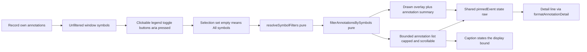

# Phase 17 — Beyond single-symbol filtering: multi-symbol selection, a clickable legend and a bounded annotation list (presentation only)

Status: proposed (awaiting approval)
Baseline: Phase 16 complete and green — 61 test files / 712 tests, build 167 modules
Owner: Architect (this document) → Code (execution, item by item)

---

## Active increment (approved)

The user approved **Candidate 1** from the Phase-16 checkpoint and fixed its scope:

> *"The whole candidate: multi-symbol selection + clickable legend + a bounded annotation list panel
> (the window's own symbol/sample/note, capped and scrollable, click-to-pin), each with its own
> Node + jsdom gate. Empty selection = All symbols."*

The Phase 12–16 display stack can only ever **hide all but one** symbol (the Phase-15
`<select aria-label="Symbol filter">`), which forces the user to look at one annotation family at a
time and gives a 650k-sample real record (~2,000 annotations) no bounded way to *read* them. This
phase closes that gap with three display-only additions over the **record's own events**:

1. **Multi-symbol selection.** The single-symbol filter becomes a **set** of symbols where the
   **empty set is "All symbols"** — so any subset of annotation families can be shown together.
2. **A clickable legend.** The `Symbols:` legend text becomes the **control**: one toggle button per
   distinct symbol of the **unfiltered** window, `aria-pressed` reflecting the current selection, so
   the off-switch can never be hidden by the filter.
3. **A bounded annotation list panel.** A capped, scrollable list of the window's own
   `symbol`/`sample`/`auxNote`, one row per in-window event, whose rows **click-to-pin** the same
   detail the canvas click already pins.

This is a **presentation-only** increment. **No** domain, DSP/DWT, ML, worker, parser, adapter,
application-service or configuration change; **no new prop**; **no new dependency**. It edits one
presentation helper ([`annotationGeometry.ts`](src/presentation/views/timeSeries/annotationGeometry.ts:1)),
one view ([`TimeSeriesView.svelte`](src/presentation/views/timeSeries/TimeSeriesView.svelte:1)) and the
two test files that already cover them; the science, the bundle module count and `package.json` are
unchanged.

**The single most important honesty constraint:** every symbol, sample and note the new controls show
is read **verbatim from `result.sourceRecord.annotations`** — the record's own `AnnotationEvent`s. A
symbol selection and the annotation list are *displays* of a domain fact, never detections and never
clinical claims (ADR-013, rules §47/§49). Selecting symbols **hides markers; it never claims**, never
re-invokes `service.analyze`, never queries the record and never writes a sample buffer
(ADR-008, rules §26/§28/§30). The list is a **bounded** view of the same filtered events the canvas
draws, so the panel can never describe a marker that is not drawn.

---

## Verified state (baseline)

- `npm run check` = `typecheck && svelte-check && lint && test && build`; the Phase-16 close state is
  green: **61 test files / 712 tests**, build **167 modules** (svelte-check 0 errors / 0 warnings).
- Machine: win32 x64, Windows 11, Node v24.18.0, npm 11.16.0, Vitest 3.2.7, Svelte 5, jsdom 30,
  `@testing-library/svelte` 5.4.2. The workspace is **not** a git repository.
- The single-symbol spine this phase generalizes, in
  [`annotationGeometry.ts`](src/presentation/views/timeSeries/annotationGeometry.ts:1):
  [`filterAnnotationsBySymbol()`](src/presentation/views/timeSeries/annotationGeometry.ts:252)
  (`null`/`""` → the input **unchanged**, same reference), and
  [`resolveSymbolFilter()`](src/presentation/views/timeSeries/annotationGeometry.ts:273)
  (member → itself, else `null`/"All"). Both are pure, Node-tested and never mutate their input.
- The detail/selection helpers this phase reuses unchanged:
  [`nearestAnnotationEventAtFraction()`](src/presentation/views/timeSeries/annotationGeometry.ts:300),
  [`nearestAnnotationAtFraction()`](src/presentation/views/timeSeries/annotationGeometry.ts:348) (a
  projection over the former) and
  [`formatAnnotationDetail()`](src/presentation/views/timeSeries/annotationGeometry.ts:390) (renders
  `Annotation: {symbol} · sample {i}` plus a non-empty `auxNote`; never renders `code`).
- The view state this phase generalizes, in
  [`TimeSeriesView.svelte`](src/presentation/views/timeSeries/TimeSeriesView.svelte:1):
  [`symbolFilter`](src/presentation/views/timeSeries/TimeSeriesView.svelte:143) (`string | null`),
  [`pinnedEvent`](src/presentation/views/timeSeries/TimeSeriesView.svelte:158) (`$state.raw`,
  holding the record's own event so the "still drawn?" identity test holds),
  [`allSymbols`](src/presentation/views/timeSeries/TimeSeriesView.svelte:218) (the **unfiltered**
  window's distinct symbols — the options that can never be filtered away),
  [`resolvedFilter`](src/presentation/views/timeSeries/TimeSeriesView.svelte:234),
  [`visibleAnnotations`](src/presentation/views/timeSeries/TimeSeriesView.svelte:243),
  [`detailHit`](src/presentation/views/timeSeries/TimeSeriesView.svelte:308) (pinned-first, honoured
  only while `visibleAnnotations.includes(pinned)`), and
  [`annotationLegendOf()`](src/presentation/views/timeSeries/TimeSeriesView.svelte:660) (the
  `Symbols: …` string).
- The markup this phase replaces: the
  [`<select aria-label="Symbol filter">`](src/presentation/views/timeSeries/TimeSeriesView.svelte:723)
  and the [`series-symbols`](src/presentation/views/timeSeries/TimeSeriesView.svelte:748) legend
  span.
- The two test files this phase extends, and the exact Phase-15 assertions it re-points:
  [`annotationGeometry.test.ts`](src/presentation/views/timeSeries/__tests__/annotationGeometry.test.ts:15)
  (Node; describes for `annotationMarkers`, the resolver, `filterAnnotationsBySymbol`,
  `resolveSymbolFilter`, `formatAnnotationDetail`) and
  [`TimeSeriesView.test.ts`](src/presentation/views/timeSeries/__tests__/TimeSeriesView.test.ts:459)
  (jsdom; `Symbols:` assertions at
  [line 155](src/presentation/views/timeSeries/__tests__/TimeSeriesView.test.ts:155),
  [line 174](src/presentation/views/timeSeries/__tests__/TimeSeriesView.test.ts:174),
  [line 191](src/presentation/views/timeSeries/__tests__/TimeSeriesView.test.ts:191),
  [line 600](src/presentation/views/timeSeries/__tests__/TimeSeriesView.test.ts:600); the
  `<select>`-driven Phase-15 describe at
  [line 459](src/presentation/views/timeSeries/__tests__/TimeSeriesView.test.ts:459) with its
  [`symbolFilter()`](src/presentation/views/timeSeries/__tests__/TimeSeriesView.test.ts:489) helper,
  and the filter-drops-pin case at
  [line 742](src/presentation/views/timeSeries/__tests__/TimeSeriesView.test.ts:742)).
- The jsdom mechanics every new wiring case reuses: the stubbed `200×100`
  [`getBoundingClientRect`](src/presentation/views/timeSeries/__tests__/TimeSeriesView.test.ts:474),
  `HTMLCanvasElement.prototype.getContext = () => null` in `beforeEach`, and `cleanup()` in
  `afterEach`.
- [`App.svelte`](src/presentation/App.svelte:1) already forwards `result.sourceRecord.annotations`
  (ADR-016), so the new state stays **view-local** with **no new prop** and no `App` change.

---

## Honesty framing

- **Display of a domain fact, never a detection.** Every symbol/sample/note the legend, the list and
  the detail show is read from `record.annotations`; the helpers own no algorithm, no threshold and
  no scan of DSP/ML output. A non-empty selection is a *view choice*, not a query.
- **Empty selection is "All symbols".** The absence of a selection draws every marker, byte-identical
  to Phase 15's "All symbols" — the increment is strictly additive in what can be *shown*.
- **A selection hides; it never claims — structurally.** `filterAnnotationsBySymbols` reads only
  `annotation.symbol`; the service is never re-invoked, no sample buffer is touched, and the options
  come from the **unfiltered** window so a symbol can always be switched back on (ADR-008).
- **The list is bounded and never a finding.** It is the *same filtered events the canvas draws*,
  capped to a display limit and sorted deterministically; `truncated`/`visibleCount` state the bound
  rather than hiding it. The cap is a **presentation** bound (DOM size), never a measurement or a
  detection threshold.
- **One selection spine.** The multi-symbol helpers become the definition; the Phase-15 single-symbol
  helpers are kept as **projections** over them so their existing Node cases stay green **unchanged**
  and no second, divergent filter rule exists.
- **jsdom cannot measure layout or pixels.** jsdom proves **wiring only** (toggle → DOM,
  row-click → pin) over the stubbed `200×100` rect; every number and string stays the pure **Node**
  gate. Canvas pixels and wall-clock timing are never asserted (rules §51).

---

## Design decisions

### 1. Selection becomes a set with empty = "All"; the single-symbol helpers are kept as projections

New pure exports in
[`annotationGeometry.ts`](src/presentation/views/timeSeries/annotationGeometry.ts:1), beside the
filter they generalize:

- `filterAnnotationsBySymbols(annotations, symbols)` — the events whose `symbol` is a **member** of
  `symbols`, in input order; an **empty** set returns the input **unchanged** (the same reference,
  so "All symbols" is a no-op the renderer can rely on). Read-only: no event is copied or mutated and
  nothing is synthesised.
- `resolveSymbolFilters(active, available)` — the members of `active` that remain **available**,
  **deduplicated** and returned in `available` order (which is ascending), so a selection that a
  channel/window change removed falls back deterministically with no effect and no manual reset.
  Empty result = "All symbols".

The Phase-15 helpers are then **re-expressed as projections** so exactly one filter rule exists and
every existing Node case stays green **unchanged**:

- [`filterAnnotationsBySymbol(annotations, symbol)`](src/presentation/views/timeSeries/annotationGeometry.ts:252)
  = `filterAnnotationsBySymbols(annotations, symbol === null || symbol === '' ? [] : [symbol])`
  (the `[]` branch preserves the identity guarantee).
- [`resolveSymbolFilter(active, available)`](src/presentation/views/timeSeries/annotationGeometry.ts:273)
  = the one-element case of `resolveSymbolFilters` (`null`/`""` → `null`; else the single resolved
  member, or `null` when it is unavailable).

- **Rejected alternative:** keep two independent implementations (a single and a set filter).
  Rejected — two filter rules drift and break the "one spine" property the resolver already
  enforces; a projection is the smallest change that adds the capability without a second rule.
- **Rejected alternative:** model the selection as a predicate/`Set` in the view rather than a
  `readonly string[]`. Rejected — a `readonly string[]` is the value the resolver, the filter and the
  `aria-pressed` state all read directly, is trivially serialisable/deterministic and needs no
  object identity; a predicate would put filter logic back in the view (rules §30/§28).

### 2. A bounded, pure annotation list helper — the record's own events, sorted and capped

New pure exports in
[`annotationGeometry.ts`](src/presentation/views/timeSeries/annotationGeometry.ts:1):

```ts
/** Display cap on the annotation list panel: a DOM-size bound, never a claim. */
export const ANNOTATION_LIST_LIMIT = 200;

export interface AnnotationList {
    /** In-window events, ascending by sampleIndex, capped to the requested limit. */
    readonly entries: readonly AnnotationEvent[];   // the record's OWN objects, verbatim
    /** In-window total, before the cap. */
    readonly visibleCount: number;
    /** `visibleCount > entries.length` (the panel is showing only the first slice). */
    readonly truncated: boolean;
}

export function annotationList(
    annotations: readonly AnnotationEvent[],
    viewport: TimeViewport,
    sampling: SamplingInfo,
    sampleCount: number,
    limit: number,
): AnnotationList;
```

- **Same half-open window rule as the overlay:** only annotations whose `sampleIndex` falls inside
  `[startSample, endSample)` from [`sampleWindowOfTime`](src/presentation/views/timeSeries/geometry.ts:104)
  are considered, so the list can never name an event the marker mapping hides.
- **Deterministic order:** ascending `sampleIndex`, ties broken by the lexicographically smaller
  `symbol`, so the first slice never depends on input order.
- **Bounded:** `entries` is the first `limit` events; `visibleCount` is the uncapped in-window total;
  `truncated` is `visibleCount > entries.length`. No event is copied — the entries are the record's
  own objects, so the panel's click-to-pin keeps the exact identity the canvas pin uses.
- **Validation:** a non-positive/non-integer `limit` is `invalid-input`, mirroring the existing
  `requirePositiveSafeInteger` guard used for `sampleCount`/`columnCount`.
- A pure `formatAnnotationListCaption(list)` states the bound honestly:
  `visibleCount === 0` → `No annotations in view`; `truncated` →
  `Showing first {entries.length} of {visibleCount} in view`; else → `{visibleCount} in view`.

- **Rejected alternative:** render every in-window event (no cap). Rejected — a real record's window
  holds ~2,000 events; an uncapped DOM list is a size/scroll hazard with no added honesty, so the
  bound is explicit and captioned instead. The cap is a display bound, not a threshold.
- **Rejected alternative:** index the sample buffer to build the list. Rejected — the list is a
  display of `record.annotations`; nothing indexes a buffer (rules §26).

### 3. The legend becomes the control; the Phase-15 single-select is superseded

[`TimeSeriesView.svelte`](src/presentation/views/timeSeries/TimeSeriesView.svelte:1) replaces two
Phase-15 controls with one coherent, keyboard-accessible control:

- State: [`symbolFilter`](src/presentation/views/timeSeries/TimeSeriesView.svelte:143) (`string |
  null`) becomes `let symbolFilters = $state<readonly string[]>([])` (**empty = All**). Every change
  **reassigns** the array, so the rune stays reactive.
- Derived: `resolvedFilters = resolveSymbolFilters(symbolFilters, allSymbols)` and
  `visibleAnnotations = filterAnnotationsBySymbols(annotations, resolvedFilters)` — the
  [`allSymbols`](src/presentation/views/timeSeries/TimeSeriesView.svelte:218) **unfiltered** window
  still feeds the options, so a toggle can never hide its own off-switch.
- Legend markup: the
  [`series-symbols`](src/presentation/views/timeSeries/TimeSeriesView.svelte:748) text span and the
  [`<select>`](src/presentation/views/timeSeries/TimeSeriesView.svelte:723) are replaced by a
  `<div class="series-legend" role="group" aria-label="Symbol selection">` of one
  `<button type="button" aria-pressed={resolvedFilters.includes(symbol)}>` per `allSymbols` entry. A
  toggle assigns `symbolFilters` from `resolvedFilters` (add if unpressed, remove if pressed), so
  the raw state can never accumulate a stale, now-unavailable member.
- [`annotationLegendOf()`](src/presentation/views/timeSeries/TimeSeriesView.svelte:660) and its
  `annotationLegend` derived are **removed as superseded** (the toggle group carries the symbols);
  [`annotationSummaryOf()`](src/presentation/views/timeSeries/TimeSeriesView.svelte:648) and the
  `Annotations: …` caption are unchanged.

This is the one deliberate behaviour change: the symbol control moves from a **single-select** to a
**set of toggles**. It is recorded in ADR-018 and the affected Phase-15 jsdom assertions are
**re-pointed**, not dropped (Design decision 6).

- **Rejected alternative:** keep the `<select>` **and** add the toggles. Rejected — two controls
  express the same selection, invite disagreement between them, and duplicate the "which symbols"
  definition; the toggle legend is the single control the increment is about.
- **Rejected alternative:** keep the `Symbols: …` text legend **and** add a separate toggle row.
  Rejected — the toggle group already names every symbol, so the text span would be a second,
  drifting rendering of the same set.
- **Rejected alternative:** a "Clear / All" button for the empty selection. Rejected — pressing the
  last pressed toggle already yields the empty set = "All symbols" (the approved semantics); an
  extra control would add a second way to express the same state.

### 4. The bounded annotation list panel shares the existing pin — one pin spine

A new `<section class="series-annotation-list" aria-label="Annotations in view">` renders:

- the pure `formatAnnotationListCaption(annotationListResult)` line, and
- a scrollable `<ol>` of one `<button>` per entry (capped by
  `ANNOTATION_LIST_LIMIT`), each labelled by the **existing**
  [`formatAnnotationDetail()`](src/presentation/views/timeSeries/annotationGeometry.ts:390) with
  `{ event, distanceFraction: 0 }`, so the row string has exactly one definition (no second
  formatter).

- The list is built from [`visibleAnnotations`](src/presentation/views/timeSeries/TimeSeriesView.svelte:243)
  — the **same filtered list the canvas draws** — so the panel can never show a hidden event.
- A row click calls a new `pinEvent(event)` that sets the **existing**
  [`pinnedEvent`](src/presentation/views/timeSeries/TimeSeriesView.svelte:158) to that row's own
  event; the canvas click path
  ([`pinNearestAtFraction`](src/presentation/views/timeSeries/TimeSeriesView.svelte:432)) is
  unchanged and sets the same cell. One pin, two entry points; the
  [`detailHit`](src/presentation/views/timeSeries/TimeSeriesView.svelte:308) precedence rule is
  untouched.
- The pinned row is marked with `aria-current="true"` via the identity test
  `pinnedEvent === entry.event` (so `$state.raw` is required, exactly as ADR-016 decided).
- A row click is a **DOM control**, not the canvas, so it **commits no viewport** — the navigation
  and drag geometry are untouched.
- Styling gives the panel a `max-height` and `overflow-y: auto`; the cap plus the scroll make the
  list bounded regardless of the record length.

- **Rejected alternative:** a second, independent pin state for the list. Rejected — two pins could
  disagree with the detail line and the canvas highlight; one `pinnedEvent` keeps a single "which
  annotation" identity the caption, the canvas and the panel all agree on.
- **Rejected alternative:** reuse the density-capped marker list (`annotationMarkers`) as the rows.
  Rejected — the overlay is capped to one marker per **pixel column**, so its rows would be a
  function of the plot width and would merge events; the panel lists the **record's** in-window
  events (rules §30).
- **Rejected alternative:** make rows a `<select>`/listbox. Rejected — buttons are the
  keyboard-accessible, jsdom-testable control (`aria-pressed`/`aria-current`) and keep the panel a
  plain, scrollable list.

### 5. Testability split — a pure Node gate and a jsdom wiring gate per sub-feature

- **Multi-symbol selection (Node):** new describes in
  [`annotationGeometry.test.ts`](src/presentation/views/timeSeries/__tests__/annotationGeometry.test.ts:1)
  for `filterAnnotationsBySymbols` (empty set = identity/same reference; single/multi/absent symbols;
  input order preserved; no mutation; agreement with the single-symbol projection) and for
  `resolveSymbolFilters` (empty → empty; only-available members; dedupe; deterministic
  available-order; unknown-only → empty; and agreement with `resolveSymbolFilter`).
- **Clickable legend (jsdom):** new/re-pointed cases in
  [`TimeSeriesView.test.ts`](src/presentation/views/timeSeries/__tests__/TimeSeriesView.test.ts:1)
  over the stubbed `200×100` rect: one toggle per distinct window symbol, none pressed by default;
  pressing one/two narrows the `Annotations: …` summary to that set with the pressed state on the
  right buttons; pressing the last pressed toggle returns to the whole window; every symbol toggle
  stays present regardless of the selection (off-switch never hidden).
- **Bounded annotation list (Node):** new describe for `annotationList` (in-window only, half-open
  end exclusion; ascending `sampleIndex` with the symbol tie-break, independent of input order;
  capped to `limit`; `visibleCount`/`truncated` consistent; the record's own objects by identity;
  `invalid-input` for a bad `limit`; no mutation) and for `formatAnnotationListCaption` (the empty,
  truncated and complete branches).
- **Bounded annotation list (jsdom):** a row per in-window event naming `symbol · sample · auxNote`;
  a row click pins that event's detail (non-idle, naming its own symbol/auxNote) and commits **no**
  viewport; the list shrinks with the selection; with more in-window events than the cap exactly
  `ANNOTATION_LIST_LIMIT` rows render and the caption states `Showing first … of … in view`.
- **Never asserted:** canvas pixels (jsdom has no 2d context; the draw pass runs on its guarded path)
  and no wall-clock timing (rules §51).

### 6. The Phase-15 jsdom assertions are re-pointed, never dropped

Because the symbol control's *kind* changes (single-select → toggle set), two Phase-15 jsdom blocks
are updated with their behavioural assertions **preserved**:

- The `Symbols:` text assertions at
  [line 155](src/presentation/views/timeSeries/__tests__/TimeSeriesView.test.ts:155),
  [line 174](src/presentation/views/timeSeries/__tests__/TimeSeriesView.test.ts:174) and
  [line 191](src/presentation/views/timeSeries/__tests__/TimeSeriesView.test.ts:191) become
  assertions that the **toggle group** lists the same distinct symbols (one button each, none
  pressed), and
  [line 139](src/presentation/views/timeSeries/__tests__/TimeSeriesView.test.ts:139) becomes "no
  `Symbol selection` group when the window has no annotations".
- The Phase-15 describe
  [`annotation detail and symbol filter`](src/presentation/views/timeSeries/__tests__/TimeSeriesView.test.ts:459)
  keeps the same three behaviours — *offers the window's distinct symbols*, *narrows the summary to
  the chosen symbol while keeping every option*, *returns to the whole window on reset* — driven by
  the toggle group instead of the `<select>`, and the filter-drops-pin case at
  [line 742](src/presentation/views/timeSeries/__tests__/TimeSeriesView.test.ts:742) toggles the
  symbol **off** instead of changing the select.

No behavioural assertion is removed; only the control's DOM shape and the assertions' selectors
change. The new cases are added in a clearly-labelled Phase-17 describe.

### 7. One documented, material decision → a short ADR-018

Mirroring the ADR-013…017 cadence, **ADR-018 — Annotation set filtering, a clickable legend and a
bounded annotation list (display only)** pins: (a) the selection is a **set** of symbols where the
**empty set is "All symbols"**; (b) the single-symbol helpers stay as **projections** over the set
helpers, so there is exactly one filter rule; (c) the legend **is** the control (DOM toggle buttons
with `aria-pressed`), superseding the Phase-15 single-select, with options from the **unfiltered**
window; (d) the annotation list is **bounded** (`ANNOTATION_LIST_LIMIT`), built from the **same
filtered list the canvas draws**, deterministic and identity-preserving, and shares the single
`pinnedEvent` pin; (e) everything is display-only — a selection hides markers and never re-invokes
the service (ADR-008); (f) the test split is pure Node for numbers/strings and jsdom for wiring, with
canvas pixels and wall-clock timing never asserted (rules §51).

---

## Data flow



---

## Checklist (each item ends green on `npm run check`)

- **Item 0 — Pre-flight.** Confirm the baseline is green (**61 files / 712 tests / 167 modules**).
  No files touched.
- **Item 1 — Multi-symbol selection helpers (pure Node gate).** Add
  `filterAnnotationsBySymbols` and `resolveSymbolFilters` to
  [`annotationGeometry.ts`](src/presentation/views/timeSeries/annotationGeometry.ts:1), re-express
  [`filterAnnotationsBySymbol`](src/presentation/views/timeSeries/annotationGeometry.ts:252) and
  [`resolveSymbolFilter`](src/presentation/views/timeSeries/annotationGeometry.ts:273) as projections
  over them, and extend
  [`annotationGeometry.test.ts`](src/presentation/views/timeSeries/__tests__/annotationGeometry.test.ts:1)
  with the two new describes (Design decision 1). No view change yet, so the Phase-15 single-symbol
  behaviour is untouched. Gate green (no new file; counts stay **61 files / 167 modules**, test count
  rises).
- **Item 2 — Clickable legend and multi-symbol wiring (jsdom gate).** In
  [`TimeSeriesView.svelte`](src/presentation/views/timeSeries/TimeSeriesView.svelte:1) replace
  [`symbolFilter`](src/presentation/views/timeSeries/TimeSeriesView.svelte:143) with
  `symbolFilters`, use `resolvedFilters`/`filterAnnotationsBySymbols`, replace the `<select>` and the
  `Symbols:` span with the toggle legend group, remove
  [`annotationLegendOf()`](src/presentation/views/timeSeries/TimeSeriesView.svelte:660), and add the
  toggle handler (Design decision 3). In
  [`TimeSeriesView.test.ts`](src/presentation/views/timeSeries/__tests__/TimeSeriesView.test.ts:1)
  re-point the Phase-15 `Symbols:`/`<select>` assertions to the toggle group and add the Phase-17
  legend cases (Design decisions 3 and 6). Gate green (no new file; counts stay **61 / 167**).
- **Item 3 — Bounded annotation list (pure Node + jsdom gates).** Add
  `ANNOTATION_LIST_LIMIT`, `AnnotationList`, `annotationList` and `formatAnnotationListCaption` to
  [`annotationGeometry.ts`](src/presentation/views/timeSeries/annotationGeometry.ts:1) with their Node
  describes in
  [`annotationGeometry.test.ts`](src/presentation/views/timeSeries/__tests__/annotationGeometry.test.ts:1);
  add the capped, scrollable panel and the shared-pin `pinEvent`/`aria-current` wiring to
  [`TimeSeriesView.svelte`](src/presentation/views/timeSeries/TimeSeriesView.svelte:1) with its jsdom
  cases in [`TimeSeriesView.test.ts`](src/presentation/views/timeSeries/__tests__/TimeSeriesView.test.ts:1)
  (Design decisions 2 and 4). Gate green (no new file; counts stay **61 / 167**).
- **Item 4 — ADR-018 + architecture updates.** Create
  [`plans/adr/ADR-018-annotation-set-filtering.md`](plans/adr/ADR-018-annotation-set-filtering.md:1)
  (Status/Date/Scope → Context → Decision → Consequences → References, mirroring ADR-016, with the
  rejected alternatives and the "supersedes the Phase-15 single-select" note); add a §K
  **Testing architecture** bullet (annotation selection is displayed, never claimed: a set filter
  whose empty value is All, a clickable legend, a bounded list — Node for the helpers, jsdom for the
  wiring) in [`ecg-lab-architecture.md`](plans/ecg-lab-architecture.md:306), a §M **item 17**
  (Phase 17) after [line 344](plans/ecg-lab-architecture.md:344), and a decision-register entry
  after [line 405](plans/ecg-lab-architecture.md:405). Gate green (docs-only).
- **Item 5 — Audit + final gate.** Write [`plans/phase-17-audit.md`](plans/phase-17-audit.md:1)
  (scope quote, files added/touched/not-touched, item map, evidence at Node/jsdom levels, what it
  proves and does **not** prove — including that a selection is a display, the cap is a display
  bound and there is no detection — the re-pointed Phase-15 assertions listed explicitly, residual
  risk, test counts, gate history) and run the final full `npm run check`. Gate green.

---

## Key files

### To create

- [`plans/adr/ADR-018-annotation-set-filtering.md`](plans/adr/ADR-018-annotation-set-filtering.md:1)
  — the set-filter / clickable-legend / bounded-list decision (Item 4).
- [`plans/phase-17-audit.md`](plans/phase-17-audit.md:1) — completion record (Item 5).

### To touch

- [`src/presentation/views/timeSeries/annotationGeometry.ts`](src/presentation/views/timeSeries/annotationGeometry.ts:1)
  — add `filterAnnotationsBySymbols`, `resolveSymbolFilters`, `ANNOTATION_LIST_LIMIT`,
  `AnnotationList`, `annotationList`, `formatAnnotationListCaption`; re-express the single-symbol
  helpers as projections; update the module header (Items 1 and 3).
- [`src/presentation/views/timeSeries/TimeSeriesView.svelte`](src/presentation/views/timeSeries/TimeSeriesView.svelte:1)
  — `symbolFilters` state, the toggle legend, the bounded list panel, the shared `pinEvent`;
  remove `annotationLegendOf`/`annotationLegend` (Items 2 and 3).
- [`src/presentation/views/timeSeries/__tests__/annotationGeometry.test.ts`](src/presentation/views/timeSeries/__tests__/annotationGeometry.test.ts:1)
  — the new pure describes (Items 1 and 3).
- [`src/presentation/views/timeSeries/__tests__/TimeSeriesView.test.ts`](src/presentation/views/timeSeries/__tests__/TimeSeriesView.test.ts:1)
  — re-pointed Phase-15 assertions plus the new jsdom describes (Items 2 and 3).
- [`plans/ecg-lab-architecture.md`](plans/ecg-lab-architecture.md:298) — §K bullet / §M item 17 /
  decision register (Item 4).

### Do not touch

- All production `src/**` outside the two presentation files above: `src/domain/*`, `src/dsp/*`,
  `src/ml/*`, `src/workers/*`, `src/bench/*`, `src/application/*`, `src/datasets/*`,
  `src/presentation/App.svelte`, `src/presentation/dataset/*`, `src/presentation/workers/*`,
  `src/main.ts`. In particular **no new prop** on `TimeSeriesView` and no `ViewControls` change.
- [`package.json`](package.json:1) — **no new dependency and no new script**.
- [`vite.config.ts`](vite.config.ts) — the existing `test` block already collects `*.test.ts` and
  supports per-file jsdom; no configuration change.
- The DWT/resolver/navigation helpers —
  [`navigationGeometry.ts`](src/presentation/views/timeSeries/navigationGeometry.ts:1),
  [`geometry.ts`](src/presentation/views/timeSeries/geometry.ts:1) — and the resolver
  [`nearestAnnotationEventAtFraction`](src/presentation/views/timeSeries/annotationGeometry.ts:300)
  are reused **unchanged**.
- `plans/phase-16-*.md` and earlier phase records — read-only history.
- The canonical DWT stays `db4 / 4 / periodic`; no science-config control is added.

### Read-only references

- [`plans/adr/ADR-016-annotation-interaction.md`](plans/adr/ADR-016-annotation-interaction.md:1) —
  the single-symbol filter / detail / `$state.raw` pin this phase generalizes, and the ADR template
  it mirrors.
- [`plans/adr/ADR-013-annotation-display.md`](plans/adr/ADR-013-annotation-display.md:1) — "display,
  never a detection"; [`ADR-008-display-selection-controls.md`](plans/adr/ADR-008-display-selection-controls.md:1)
  — "selection is a display concern; the service is never re-run".
- [`plans/phase-16-plan.md`](plans/phase-16-plan.md:1),
  [`plans/phase-16-audit.md`](plans/phase-16-audit.md:1) and
  [`plans/phase-16-checkpoint.md`](plans/phase-16-checkpoint.md:1) — the plan/audit/checkpoint
  templates this phase mirrors, and the candidate wording this increment executes.
- [`plans/ecg-lab-architecture.md`](plans/ecg-lab-architecture.md:298) §K, §M items 12–16 and the
  decision register (ADR-001…ADR-017) — the exact targets of Item 4.
- [`src/presentation/views/timeSeries/__tests__/TimeSeriesView.test.ts`](src/presentation/views/timeSeries/__tests__/TimeSeriesView.test.ts:459)
  and [`annotationGeometry.test.ts`](src/presentation/views/timeSeries/__tests__/annotationGeometry.test.ts:1)
  — the existing describe/helper shapes to extend (`makeSignal`, `makeAnnotations`, `annotated`,
  `measurableCanvas`, `commitRecorder`, the stubbed `200×100` rect).

---

## Reminders for execution (Code mode)

1. **Work item by item; do not batch.** After each item run `npm run check` and confirm exit 0 before
   starting the next. Report the captured test-file / test / module counts.
2. **Display-only and view-local.** No domain/DSP/ML/worker/parser/adapter/application change, no new
   prop, no `package.json`/config change. The selection and the list are displays of
   `record.annotations`; a selection hides markers and **never** re-invokes the service, queries the
   record or writes a sample buffer (ADR-008, rules §30).
3. **One spine.** Re-express the single-symbol helpers as projections over the set helpers so there
   is exactly one filter rule; reuse `formatAnnotationDetail` for the list rows rather than adding a
   second formatter; keep the single `pinnedEvent` cell for both the canvas click and a row click.
4. **Empty selection = All symbols.** The empty set draws every marker (identity for the filter,
   `null`-equivalent for the resolver); the options always come from the **unfiltered** window
   (`allSymbols`), so a toggle can never hide its own off-switch.
5. **Bound the list explicitly.** Cap to `ANNOTATION_LIST_LIMIT`, sort deterministically, and caption
   `Showing first … of … in view`; state that the cap is a **presentation** bound, never a threshold.
6. **Node for numbers, jsdom for wiring.** The helper numbers and strings stay the pure Node gate;
   jsdom proves only toggle → DOM and row-click → pin over the stubbed `200×100` rect. Never assert
   canvas pixels or wall-clock timing (rules §51); call `cleanup()` in `afterEach`.
7. **Re-point, do not drop, the Phase-15 assertions.** The `Symbols:`/`<select>` cases move to the
   toggle group with the same behaviours; the audit lists each re-pointed case explicitly. Do not
   delete a behavioural assertion.
8. **`import type` everywhere** (`verbatimModuleSyntax`, `consistent-type-imports`); keep
   `no-explicit-any` clean and honour `noUnusedLocals`/`noUnusedParameters` (remove the superseded
   `annotationLegendOf` and its derived so nothing is left unused).
9. **Keep the existing suite green.** All `annotationGeometry` / `navigationGeometry` / `geometry` /
   `TimeSeriesView` / `App` / `datasets` tests remain green; the single-symbol Node cases stay
   **unchanged** and pass via the projections.
10. **Update the architecture doc last**, re-reading the exact target lines (§K bullet after
    [line 306](plans/ecg-lab-architecture.md:306); §M item 17 after
    [line 344](plans/ecg-lab-architecture.md:344); decision register after
    [line 405](plans/ecg-lab-architecture.md:405)) before applying each edit.
11. **Report honestly.** If a wiring case surfaces a **defect** (a toggle that disagrees with the
    drawn set, a row that pins a hidden event, a cap that leaks an unbounded count), stop and report
    it rather than widening the phase; record the display-bound limit in the audit.
