# Phase 18 — Worker-channel correctness, then two folded-in increments

Phases in one increment, in this order:

- **Part A (Items 0–5) — defect-driven hardening.** The increment the Phase-17 real-browser pass
  forced: **Item 1 is the fix for [`DEFECT-001`](defect-001-worker-onmessage-delivery.md)**, the
  remainder closes the verification gap that let the defect live undetected since Phase 10, and
  re-runs the manual pass Item 7 was supposed to complete.
- **Part B (Items 6–7) — the two folded-in increments**, approved by the user on 2026-09-14: a
  **second, non-WFDB dataset adapter (EDF/EDF+)**, and **surfacing the model's own output in a view**.
- **Part C (Item 8) — audit and close-out** for all three parts.

Part A is **blocking**: until Item 1 lands the application renders nothing at all in a real browser,
so no Part B observation can be made by hand and no Part B item may be started.

## Active increment (approved)

Two approvals, both 2026-09-14, both verbatim:

> Do not change code yet — record the defect report in the plan docs, and plan Phase 18 (which then
> absorbs this fix as its first item) in Architect mode.

> Revise the plan first: also fold the second dataset adapter (and/or wiring a view to
> WorkerInferenceEngine) into Phase 18 as later items.

The first approval fixed Part A's shape and its first item. The second approval **revises** it: the
two candidates that stood in the previous revision's *Not in this phase* section are now approved
scope, as Items 6 and 7 — **after** every hardening item, never before or interleaved.

## Verified state (baseline)

- **Phases 1–17 are complete, audited and green.** `npm run check` → typecheck ✓, svelte-check
  (0 errors / 0 warnings) ✓, lint ✓, **61 test files / 750 tests** ✓, production build **167
  modules** ✓. Last confirmed at the Phase-17 close
  ([`plans/phase-17-checkpoint.md`](phase-17-checkpoint.md:1)).
- **One blocking defect is open** — [`DEFECT-001`](defect-001-worker-onmessage-delivery.md):
  `bindDspCore`/`bindInferenceCore` install a **payload-shaped** handler on an **event-shaped**
  channel, so a real `DedicatedWorkerGlobalScope` delivery is silently discarded, the worker never
  replies, the orchestrator promise never settles, and the app hangs on `Analyzing default record…`
  with a clean console. Root-caused **and reproduced** (report §4).
- **Why the green gate missed it:** every harness that reaches the binder delivers the raw payload
  directly (`bind.test.ts`, the parity test loopback, `worker.bench.ts`), so the suite encodes the
  fake's contract as if it were the platform's. No gate, and no human, ever exercised the browser
  delivery — every manual browser step recorded in Phases 10–17 is still *Pending (human)*.
- **Nothing in Phase 17 is at fault and nothing further in it is modified.** Phase 17 stays closed at
  61/750/167; it already carries the honest blocked-pass observation written when DEFECT-001 was
  routed ([`plans/phase-17-manual-verification.md`](phase-17-manual-verification.md:1)).
- **The Part B seams already exist and are already gated** — Part B adds no new architecture, only a
  second implementation behind two of the existing boundaries:
  - the dataset boundary [`DatasetAdapter`](src/datasets/types.ts:28) (`datasetId` +
    `listRecordIds()` + `readRecord()` → canonical [`SignalRecord`](src/domain/record.ts:85)) over
    the file seam [`DatasetFileSource`](src/datasets/source.ts:20), whose ADC→mV step is
    single-sourced in [`recordToMillivoltSignal`](src/datasets/load.ts:35) (ADR-006);
  - the inference boundary [`InferenceEngine`](src/ml/engine.ts:23) (`backendId` + `run()` +
    `dispose()`), already implemented by
    [`WorkerInferenceEngine`](src/ml/onnx/workerInferenceEngine.ts:35), already backed by a committed
    probe artifact ([`probeAsset.ts`](src/ml/onnx/probeAsset.ts:1)) and already interpreted by
    [`interpretPrediction`](src/ml/interpret.ts:73) — with **no caller in the UI at all**.

## Honesty framing

- **A hang is a correctness failure, not a performance one.** The defect is that a request is
  **never answered**; it is *not* that the worker is slow. No wall-clock claim is made anywhere in
  this increment (rules §51, ADR-010), and no timing assertion is added.
- **The bug is one line of contract, and 750 green tests agreed with it.** The lesson is the reason
  Item 3 exists: a hand-written fake that *claims* to satisfy a platform contract was believed
  without ever being checked against the platform. The fix must therefore repair the **contract**,
  and the gate must pin the **delivery**, not merely the dispatch.
- **The gate could not have been a green test.** The real-browser pass is an *observation, never a
  gate* (ADR-017). Its value is exactly this: a human hit a wall that 750 automated tests walked
  past. That is not a failure of the policy — it is the policy's product.
- **Parts A and B are science-free.** Part A changes no domain, DSP/DWT, ML, parser, adapter or
  application-service behaviour: it restores the transport the Phase-10/ADR-011 worker model always
  assumed (rules §30). Part B adds **one new adapter** that produces the canonical record shape
  through the *same* single ADC→mV step, and **one new view** that renders what a model already
  outputs — no new DSP, no new DWT, no new model semantics, no threshold, no detection.
- **Part B displays; it never classifies.** The panel renders the model's own declared facts
  (identity, declared input contract, declared output semantics, per-label scores, provenance) and
  states plainly that a development probe is not a clinical classifier (rules §47, §49; ADR-004,
  the ADR-013 precedent). It never invents "confidence", never renames a label, never adds an
  interpretation of its own.
- **The second adapter reads a standard's own declarations and refuses the rest.** EDF/EDF+ states
  each signal's physical dimension, its physical and digital ranges and its samples per data record,
  so the canonical calibration is *derived from declared numbers* rather than assumed. But the
  canonical model is narrower than EDF, and every gap is a classified refusal, never an invention —
  no µV-to-mV rescale, no resampling to a common rate, no concatenation across an `EDF+D` gap, no
  half-read annotations (ADR-006's "explicit, logged, unit-tested calibration" rule).

## Design decisions

### 1. The contract lives at the port, and the fake imitates the platform

The defect is a *type lie* in [`WorkerPort`](src/workers/port.ts:17): its documentation asserts that
a real `DedicatedWorkerGlobalScope` and an in-memory fake **both** satisfy `onmessage:
((message: unknown) => void) | null`. They do not. The platform delivers a `MessageEvent`; the fake
delivers the payload. One of the two must change — and it must be the fake, because a test double's
only job is to imitate reality. `WorkerPort.onmessage` is corrected to the platform's shape,
`(event: { readonly data: unknown }) => void`, and its comment is rewritten to say plainly that the
**fake models the platform's `MessageEvent` delivery**.

### 2. The binder unwraps explicitly; the guards are untouched

[`bindDspCore`](src/workers/bind.ts:25) and [`bindInferenceCore`](src/workers/bind.ts:45) read
`event.data` and then apply the **existing** guards unchanged. Nothing else moves: no new module, no
new abstraction, no dispatch logic, no cast away from the problem. `entries/*.worker.ts` should need
**no change at all** — `self as unknown as WorkerPort` becomes *true* rather than aspirational.

The rejected alternative is the tempting one: keep the payload contract and teach the binder to
tolerate both shapes (duck-typing `event.kind ?? event.data.kind`). Rejected because it keeps two
truths in circulation ("sometimes an event, sometimes a payload"), which is the defect's root cause
rather than its fix; the next binder would have to remember the same folklore.

### 3. The gate pins the *delivery*, not the dispatch

The existing cases assert that the binder dispatches correctly **given a payload**. The missing case
asserts that the binder is reachable **at all through the platform's delivery**. Item 2 adds it for
both cores, in both directions (answered when it should be, silent when it should be), and includes
a contract case that fails if the handler is ever re-declared with a payload parameter. This is the
difference between "the dispatcher works" and "the dispatcher is ever called".

### 4. Fix the class, not the instance — then write down what was checked

The instance is one `onmessage`. The class is *any place a hand-written double is asserted to
satisfy a platform contract without comparison against the platform's real signature*. Item 3 sweeps
them: both worker handles in [`browserWorkers.ts`](src/presentation/workers/browserWorkers.ts:1), the
`transfer` argument of `WorkerPort.postMessage`, the `pagehide` teardown in
[`main.ts`](src/main.ts:71), and every remaining loopback harness. Findings are recorded **including
the ones that turn out clean** — a short list of what was checked and how, so "audited" is evidence
rather than a word. Anything that cannot be settled without a browser is handed to Item 5, never
declared confirmed.

### 5. The manual pass runs once, and all of it is recorded in *this* phase's own document

Phase 18 does **not** write further rows into the closed Phase-17 document. Item 5 re-runs the
Phase-17 Part-2 checklist A–F over `101` — the checklist already exists and is not re-derived — and
records the observed result of every row, **by row id**, in a new
[`plans/phase-18-manual-verification.md`](phase-18-manual-verification.md:1) Part A. Items 6 and 7
record their own new-UI observations in that same document's Part B. The rejected alternative —
filling Part 2/3 of [`plans/phase-17-manual-verification.md`](phase-17-manual-verification.md:101) —
would reopen a closed, audited artifact to carry a later phase's evidence, which is precisely the
discipline ADR-017 §(d) exists to protect.

### 6. One material decision → ADR-019

The delivery contract is a durable interface decision with a rejected alternative and a permanent
gate — ADR material by the same bar as ADR-011 (which defined the worker model this repairs).
Recorded as **ADR-019**, folded into architecture §I / §M / the decision register.

### 7. The second adapter is EDF/EDF+, and it refuses what the canonical model cannot carry

The canonical channel is **raw `Int16Array` ADC counts plus an explicit `{gain, baseline}`**
([`RecordChannel`](src/domain/record.ts:61)); mV only appears after
[`recordToMillivoltSignal`](src/datasets/load.ts:35). EDF/EDF+ fits that shape unusually well: a
256-byte fixed header plus one 256-byte field-major block per signal declares the signal count, the
record duration, the data-record count, and per signal the label, physical dimension, physical and
digital minima/maxima and samples per data record — so `gain` (digital span / physical span) and
`baseline` (the digital value of zero amplitude, `digitalMin − physicalMin × gain`) follow by
arithmetic on declared numbers. `RecordChannel.samples` is an `Int16Array` and EDF stores signed
16-bit little-endian digital values, so the sample mapping is exact and lossless.

The canonical model is narrower than EDF, so the adapter **refuses** rather than invents, and each
refusal is a permanent, gated decision (ADR-020):

- **Unit.** The domain understands `'adc' | 'mV' | 'normalized'`; EDF files commonly declare `uV`.
  Only a declared millivolt dimension is accepted — the same rule the MIT-BIH adapter's
  `canonicalUnitOf` already applies — and anything else raises `unsupported-format`. Rejected:
  silently rescaling µV to mV, which is a *calibration* change and belongs to the one audited step
  in [`load.ts`](src/datasets/load.ts:35).
- **Rate.** EDF derives a per-signal rate as samples-per-data-record divided by record duration,
  while the canonical [`SamplingInfo`](src/domain/sampling.ts:1) is single-rate for every channel.
  All signals must agree, else `unsupported-format`. Rejected: resampling to a common rate — that
  fabricates samples, and resampling is a DSP concern ([`src/dsp/resample.ts`](src/dsp/resample.ts:1)),
  not an adapter one.
- **Continuity.** Plain EDF and `EDF+C` are continuous and concatenate into one uniform timeline;
  `EDF+D` is discontinuous, and a single `sampling` cannot represent its gaps, so it raises
  `unsupported-format`. Rejected: concatenating the data records anyway, which would invent a
  timeline no machine recorded.
- **Annotations.** An `EDF Annotations` signal is not a physiological channel. It is excluded from
  the record's channels, its exclusion is stated in the record's `comments`, and the record's
  `annotations` stay **empty** — EDF+ TAL parsing is a later increment, never a silent half-read.
- **Degenerate declared ranges.** A zero physical span or zero digital span leaves `gain` undefined
  or non-finite, so the adapter raises `malformed-header` naming the offending field *before*
  `createSignalRecord` ever sees it (which would otherwise reject the same record as an invariant
  violation).
- **Unknown record count.** EDF permits `-1` for a streamed count; the count is then derived from the
  bytes actually present, which must divide the data-record size exactly, else `malformed-header`.
- **Out-of-range digital values.** Samples outside the declared range are read **as declared** and
  never clipped or rescaled; their count is recorded as a provenance transform parameter so the fact
  travels with the record instead of being hidden.

`adcZero` and the zero-amplitude baseline come from the declared ranges; `initialValue` and
`blockSize` are the header's own declarations; `adcResolutionBits` is derived from the declared
digital span; `sourceFormat` is `'EDF'` or `'EDF+C'`. `checksum` stays `0` because EDF declares none —
nothing is invented to fill a field.

**Sub-decision (recorded in Item 6, not assumed):** the adapter is only reachable by hand if local
ingestion dispatches on the picked files, so Item 6 adds a small **extension-keyed** format dispatch
to [`prepareBrowserDataset`](src/presentation/dataset/browserDatasetService.ts:67): `.hea` with its
`.dat`/`.atr` companions selects MIT-BIH, `.edf` selects EDF, and a selection that matches both or
neither fails classified (no silent preference, no guessing by content). The WFDB path,
`discoverMitBihRecordIds` included, must behave **byte-identically** — the pinned jsdom App cases
(`opens local WFDB files…`, `switches to another discovered record…`) stay green and unedited.

### 8. The model-output view consumes an application service, not an engine

Presentation may not call a science helper directly — the existing pattern is
`application service → domain-typed result → view`. Item 7 therefore adds
[`src/application/inference.ts`](src/application/inference.ts:1), which takes an injected
`InferenceEngine` + the model's `ModelMetadata`, builds the window's `ModelInput` with the existing
input helpers, calls `run()`, interprets through the existing
[`interpretPrediction`](src/ml/interpret.ts:73), and returns a **display-ready description** of what
the model declared and produced. The Svelte view renders that description and nothing else: no
window arithmetic, no score conversion, no label text of its own. The engine is injected (a stub in
tests, the worker-backed engine in the browser), so the same seam that Items 0–2 repair is the one
the panel uses in production.

### 9. Part B is additive and gated item by item

Items 6 and 7 each add their own files and their own Node + jsdom gates and each end green on
`npm run check`. Neither modifies an existing assertion, and neither touches
[`src/dsp/**`](src/dsp/dwt/dwt.ts:1), [`src/domain/**`](src/domain/signal.ts:1) or any existing ML
semantics. Item 6 writes **ADR-020** because Design decision 7's refusals are exactly what the ADR bar
asks for: a permanent interface rule with a rejected alternative each. Item 7 writes **ADR-021** only
if its display rule carries the same weight; otherwise it is recorded as an architecture §I/§M bullet
plus a decision-register line, so the ADR set is not inflated with repetition of ADR-004 or ADR-013.

## Data flow

Parts A and B in one picture. The **DEFECT** edge is the whole of Part A; the two edges marked
**NEW** are Part B.

```mermaid
flowchart TB
    subgraph PartA [Part A the defect and its gate]
        A1[App sets busy true] --> A2[RecordAnalysisService analyze]
        A2 --> A3[WorkerDspExecutor execute]
        A3 --> A4[LatestOnlyDspClient posts dsp request]
        A4 --> A5[Platform delivers a MessageEvent]
        A5 --> A6[DEFECT handler reads the argument as the payload]
        A6 --> A7[Guard returns silently so no reply is posted]
        A7 --> A8[Orchestrator promise never settles]
        A8 --> A9[busy stays true and the UI sits on Analyzing default record]
        A5 --> A10[FIX unwrap event data then the same guards]
        A10 --> A11[core handle posts a dsp result]
        A11 --> A12[Orchestrator resolves and the signal renders]
    end
    subgraph PartB [Part B two folded-in increments]
        B1[Picked local files] --> B2[NEW extension-keyed format dispatch]
        B2 --> B3[NEW EDF adapter over DatasetFileSource]
        B3 --> B4[Gain and baseline derived from the declared ranges]
        B4 --> B5[Refuse microvolt rate mismatch and EDF plus D gaps]
        B5 --> B6[Canonical SignalRecord with raw 16-bit ADC samples]
        B6 --> B7[recordToMillivoltSignal the single audited ADC to mV step]
        B7 --> B8[Same analysis pipeline unchanged]
        C1[AnalysisResult of the committed viewport] --> C2[NEW application inference service]
        C2 --> C3[InferenceEngine run on the window ModelInput]
        C3 --> C4[interpretPrediction the existing declared-semantics conversion]
        C4 --> C5[NEW display-only panel with identity scores and provenance]
    end
```

---

## Checklist (each item ends green on `npm run check`)

### Part A — the defect and its gate

- **Item 0 — Pre-flight.** Re-run `npm run check` and confirm the baseline is unchanged and green
  (**61 files / 750 tests / 167 modules**). Re-confirm [`DEFECT-001`](defect-001-worker-onmessage-delivery.md)
  with a throwaway probe outside `src/` run through the repo's own `vite-node` (the probe in report
  §4: raw payload answers, `MessageEvent` does not) and **delete it in the same item** so no
  unapproved file survives. No production file touched. Gate green.

- **Item 1 — Repair the delivery contract and align every existing harness.** Change
  [`WorkerPort.onmessage`](src/workers/port.ts:21) to the platform shape
  (`(event: { readonly data: unknown }) => void`) and rewrite its comment to state that the fake
  models the platform. Unwrap `event.data` in both binders
  ([`bindDspCore`](src/workers/bind.ts:25), [`bindInferenceCore`](src/workers/bind.ts:45)) with the
  guards applied to the unwrapped value. Update every harness that drives a binder to deliver the
  platform shape — [`bind.test.ts`](src/workers/__tests__/bind.test.ts:51) `PortHarness.receive`,
  the loopback in
  [`workerAnalysis.parity.test.ts`](src/application/__tests__/workerAnalysis.parity.test.ts:1), and
  [`worker.bench.ts`](src/bench/worker.bench.ts:1). Leave
  [`entries/dsp.worker.ts`](src/workers/entries/dsp.worker.ts) and
  [`entries/inference.worker.ts`](src/workers/entries/inference.worker.ts) unchanged and state that
  in the audit. **Every existing assertion must keep its meaning** — no case deleted, no expected
  value changed. Gate green (counts stay **61 files / 750 tests / 167 modules**; a count change here
  means an assertion was silently altered).

- **Item 2 — Add the delivery-contract gate (Node).** Extend
  [`bind.test.ts`](src/workers/__tests__/bind.test.ts:1) with a **delivery contract** describe:
  a platform-shaped `{ data: DspRequest }` yields exactly one `dsp-result` bit-identical to the
  direct call; a platform-shaped inference request yields an `inference-result`; a foreign-kind,
  unknown or missing `data` yields **nothing** on either binder; and a contract case asserting the
  handler is an **event** handler, so re-declaring it with a payload parameter fails the gate. This
  is the case whose absence let [`DEFECT-001`](defect-001-worker-onmessage-delivery.md) pass 750
  green tests. Gate green (counts stay **61 files / 167 modules**; test count rises).

- **Item 3 — Sweep the class: every fake/stub that claims a platform contract.** Audit and record,
  with a verdict for each: both worker handles and their `onmessage` wiring
  ([`browserWorkers.ts`](src/presentation/workers/browserWorkers.ts:51)); the `transfer` argument
  declared on [`WorkerPort.postMessage`](src/workers/port.ts:19); the `pagehide` teardown in
  [`main.ts`](src/main.ts:80); the `WorkerPort` consumers left in the tree; and the remaining
  in-memory loopbacks. Correct any further mismatch found, each correction as its own sub-step with
  a green gate. Explicitly record the clean results too, and hand anything browser-only to Item 5
  rather than declaring it confirmed. Gate green.

- **Item 4 — ADR-019 + architecture updates.** Create
  [`plans/adr/ADR-019-worker-message-delivery-contract.md`](plans/adr/ADR-019-worker-message-delivery-contract.md:1)
  (Status/Date/Scope → Context → Decision → Consequences → References, mirroring ADR-018, carrying
  the verbatim probe evidence and the rejected "accept both shapes" alternative); add a §I worker
  bullet (the scope delivers a `MessageEvent`; the port models that; a fake imitates the platform),
  a §M **item 18** (Phase 18) after the Phase-17 entry at
  [line 347](plans/ecg-lab-architecture.md:347), and a decision-register entry after
  [line 410](plans/ecg-lab-architecture.md:410) — re-reading the exact target lines before each edit
  as the Phase-17 plan required. Gate green (docs-only).

- **Item 5 — Re-run the real-browser manual pass (closes Phase-17 Item 7).** Create
  [`plans/phase-18-manual-verification.md`](phase-18-manual-verification.md:1) with **Part A = the
  Phase-17 A–F checklist**, each row citing its Phase-17 row id and its observed result, and work
  down it with the dev server up and the console open — over `101` for the ingestion rows and the
  boot record for the rest. A1–A2 must flip to pass; anything that does not is a new finding. Add
  **Part B = a checklist for Items 6–7**, to be filled as those items land. Observation only — never
  a gate, never a wall-clock or pixel assertion (ADR-017, rules §51). Any new defect is reported and
  routed, never patched mid-flight. No gate change; `npm run check` unaffected.

### Part B — the two folded-in increments

- **Item 6 — Second dataset adapter: EDF/EDF+.** Add `src/datasets/edf/` implementing
  [`DatasetAdapter`](src/datasets/types.ts:28) over the existing
  [`DatasetFileSource`](src/datasets/source.ts:20) seam (no new file-source type, no new dependency):
  (a) a pure header parser for the 256-byte fixed header plus the field-major per-signal block —
  version, reserved tag (`EDF+C` / `EDF+D` / plain EDF), patient and recording identification, start
  date and time, header byte count, data-record count and duration, signal count, and per signal
  label, physical dimension, physical and digital minima/maxima, samples per data record and
  prefiltering — with **only** classified failures: `malformed-header` (a field that will not parse,
  a zero signal count, a header byte count disagreeing with the signal count, a data section that is
  not a whole number of data records, a negative samples-per-record, a zero physical or digital span),
  `unsupported-format` (not EDF/EDF+, a declared dimension other than mV, signals whose derived rates
  disagree, `EDF+D`), `file-not-found`;
  (b) the calibration derivation `gain = digitalSpan / physicalSpan` and
  `baseline = digitalMin − physicalMin × gain`, so the record's own invariants are then checked by
  `createSignalRecord` rather than assumed;
  (c) the adapter itself — `listRecordIds()` over [`listFileNames()`](src/datasets/source.ts:20)
  filtered to `.edf`, ascending (deterministic and independent of directory order); `readRecord()`
  decoding the little-endian signed 16-bit data records per signal into `Int16Array`, excluding an
  `EDF Annotations` signal from the channels while stating the exclusion in `comments` and leaving
  `annotations` empty, recording the out-of-range sample count as a provenance transform, and
  performing **no** scaling of its own;
  (d) export it from the browser-safe [`src/datasets/index.ts`](src/datasets/index.ts:1) barrel
  alongside `mitbih`/`synthetic` (the barrel already omits the Node-only `nodeSource`);
  (e) the extension-keyed format dispatch in
  [`prepareBrowserDataset`](src/presentation/dataset/browserDatasetService.ts:67) (Design decision 7),
  keeping MIT-BIH ids on `discoverMitBihRecordIds` and failing mixed or unrecognised selections
  classified;
  (f) docs — an architecture §J bullet, a §M item and a decision-register line, plus **ADR-020**
  recording each refusal (unit, rate, continuity, annotations, degenerate ranges, unknown record
  count) with its rejected alternative.
  Gate: hermetic `InMemoryFileSource` fixtures built by a small test helper that lays out header
  bytes and data records explicitly — at least one plain-EDF and one `EDF+C` file, a single-signal and
  a multi-signal file, a multi-data-record file, a `-1`-count file, an out-of-range-value file, and one
  file corrupted in each documented way (bad header byte count, non-numeric field, truncated data
  section, `uV` dimension, disagreeing rates, `EDF+D`). Adapter Node tests assert: the decoded
  `Int16Array`s equal the file's own declared digits exactly; the derived `gain` equals
  `(digitalMax − digitalMin) / (physicalMax − physicalMin)` and the zero-amplitude baseline the
  derivation above; an `EDF Annotations` signal is absent from the channels and named in `comments`;
  `listRecordIds()` ordering; every refusal above raises its classified code and the offending field
  is named in the message; and — crucially — the mV conversion comes from
  [`recordToMillivoltSignal`](src/datasets/load.ts:35) **alone**, asserted byte-identical to the
  `adcToMillivolt(count, calibration)` identity for every sample (and, where the existing in-memory
  MIT-BIH fixture harness exposes an equivalent record, parity of the mV buffers between the two
  adapter paths — **state which form was used** in the audit). Plus the pinned jsdom App cases for the
  WFDB path, unedited, still green. Counts rise (new files).

- **Item 7 — Display the model's own output in a view.** Add
  [`src/application/inference.ts`](src/application/inference.ts:1): a service taking an injected
  [`InferenceEngine`](src/ml/engine.ts:23) + [`ModelMetadata`](src/domain/ml.ts:116) and the
  analysis result's selected channel + committed viewport, realising the window into a `ModelInput`
  with the existing input helpers, ruling out incompatibility with the existing
  `describeInputCompatibilityProblems` (a classified failure, **never** a silent reshape — the
  engine contract), calling `run()`, converting through the existing
  [`interpretPrediction`](src/ml/interpret.ts:73), and returning a display-ready description (model
  identity, declared input contract, declared output semantics, per-label score with its
  `semantics`, provenance, and the window/candidate identity it scored). Then a display-only Svelte
  view under `src/presentation/views/inference/` rendering that description verbatim, plus an
  **optional** injected prop on [`App.svelte`](src/presentation/App.svelte:70) following the existing
  `prepareLocalDataset` pattern — absent, the markup is unchanged, so the jsdom bootstrap slice is
  untouched — with the composition root injecting the worker-backed engine
  ([`createWorkerInferenceEngine`](src/presentation/workers/browserWorkers.ts:124), whose worker
  already registers the committed probe). Non-negotiable captions: the model's own identity and
  provenance, its declared semantics word for word, and a plain statement that a development probe
  is **not** a clinical classifier — no threshold, no detection, no renamed label, never the word
  "confidence" (rules §47, §49; ADR-004). Gates: a Node gate on the service using the committed stub
  engine ([`src/ml/testing/stub.ts`](src/ml/testing/stub.ts:1)) — declared semantics decide
  probability vs uncalibrated score, an incompatible window fails classified, an inconsistent
  prediction fails, ordering is deterministic, and nothing in the description claims a probability
  the metadata does not declare; and a jsdom gate on the view — identity/labels/scores rendered for
  a stub engine, the honest failure rendered for an incompatible window, and nothing rendered or
  inert without an injected engine. Counts rise (new files).

### Part C — close-out

- **Item 8 — Audit + close-out.** Write [`plans/phase-18-audit.md`](plans/phase-18-audit.md:1)
  (the two scope quotes, files added/touched/not-touched across all three parts, an item map, the
  Item-3 sweep table with its verdicts, the Item-6 dispatch decision and which parity form was used,
  what each part proves and does **not** prove — Part A: no science and no timing claim; Part B: a
  display and an adapter, never a detection — residual risk, honest deviations, the final test-file /
  test / module counts, gate history) and
  [`plans/phase-18-checkpoint.md`](plans/phase-18-checkpoint.md:1). Complete Part B of
  [`plans/phase-18-manual-verification.md`](phase-18-manual-verification.md:1) with the observed
  results of Items 6–7. Run the final full `npm run check`. Gate green.

---

## Key files

### To create

- [`plans/defect-001-worker-onmessage-delivery.md`](defect-001-worker-onmessage-delivery.md:1) — the
  defect record (**already written** with this plan).
- [`plans/adr/ADR-019-worker-message-delivery-contract.md`](plans/adr/ADR-019-worker-message-delivery-contract.md:1)
  (Item 4) and
  [`plans/adr/ADR-020-edf-adapter-refusals.md`](plans/adr/ADR-020-edf-adapter-refusals.md:1)
  (Item 6); `plans/adr/ADR-021-…` for Item 7 only if it meets the same bar.
- [`plans/phase-18-manual-verification.md`](plans/phase-18-manual-verification.md:1) (Items 5, 8).
- `src/datasets/edf/` — the header parser, the calibration derivation, the adapter and its barrel
  (Item 6).
- [`src/application/inference.ts`](src/application/inference.ts:1) — the model-output service
  (Item 7).
- `src/presentation/views/inference/` — the display-only panel (Item 7).
- New Node + jsdom test files for both (Items 6, 7).
- [`plans/phase-18-audit.md`](plans/phase-18-audit.md:1),
  [`plans/phase-18-checkpoint.md`](plans/phase-18-checkpoint.md:1) (Item 8).

### To touch

- [`src/workers/port.ts`](src/workers/port.ts:17), [`src/workers/bind.ts`](src/workers/bind.ts:25),
  [`bind.test.ts`](src/workers/__tests__/bind.test.ts:1),
  [`workerAnalysis.parity.test.ts`](src/application/__tests__/workerAnalysis.parity.test.ts:1),
  [`worker.bench.ts`](src/bench/worker.bench.ts:1) — Part A only.
- [`plans/ecg-lab-architecture.md`](plans/ecg-lab-architecture.md:1) — §I / §M item 18 / register
  (Item 4), plus the Part B bullets and register lines (Items 6, 7).
- [`src/datasets/index.ts`](src/datasets/index.ts:1),
  [`src/datasets/source.ts`](src/datasets/source.ts:20) only if a read-only seam needs a doc line,
  and [`browserDatasetService.ts`](src/presentation/dataset/browserDatasetService.ts:67) — the
  additive dispatch (Item 6).
- [`src/presentation/App.svelte`](src/presentation/App.svelte:70) — one **optional** prop and one
  conditional block (Item 7); [`src/main.ts`](src/main.ts:1) — inject the engine (Item 7).

### Do not touch

- `src/dsp/**` and `src/domain/**` — no science, no new domain type. If a Part B diff wants one, the
  change has gone out of scope.
- `src/ml/**` except reading it: the engine contract, the input-compatibility rules and
  `interpretPrediction` are consumed unchanged (Items 6, 7).
- `src/datasets/mitbih/**`, `src/datasets/synthetic/**`, `src/datasets/load.ts` — the existing
  adapters and the single ADC→mV step stay exactly as they are (Item 6).
- The pinned jsdom App cases for local WFDB ingestion and record switching — unedited, still green
  (Item 6).
- [`src/application/analysis.ts`](src/application/analysis.ts:1) and
  [`src/application/dspExecutor.ts`](src/application/dspExecutor.ts:1) — the executor and assembly
  path are correct; they merely awaited a reply that never came.
- Every existing view — Part B adds a new one; it does not re-purpose the time-series or DWT views.
- [`package.json`](package.json:1), `tsconfig`, `vitest.config.ts`, `eslint.config.mjs`,
  `index.html` — no new dependency, script or config (ADR-012 precedent).
- `src/workers/entries/*.worker.ts` — expected to need no change; if one seems to, stop and re-read
  the contract instead of patching the entry.

### Read-only references

- [`DEFECT-001`](defect-001-worker-onmessage-delivery.md:1) — root cause, reproduction transcript,
  blast radius.
- [`plans/phase-17-plan.md`](phase-17-plan.md:484) — the execution discipline this plan inherits.
- [`ADR-005`](adr/ADR-005-browser-worker-strategy.md:1) / [`ADR-011`](adr/ADR-011-worker-execution-model.md:1)
  — the worker strategy and execution model being repaired.
- [`ADR-006`](adr/ADR-006-dataset-abstraction.md:1) — the adapter boundary, the explicit
  calibration rule and the "fixtures are self-contained and deterministic" consequence Item 6
  inherits.
- [`ADR-004`](adr/ADR-004-onnx-runtime-contract.md:1) and
  [`ADR-013`](adr/ADR-013-annotation-display.md:1) — the "display a declared fact, never a claim"
  precedent Item 7 follows.
- [`ADR-017`](adr/ADR-017-real-data-verification.md:1) — the manual pass is an observation and a
  finding is routed as its own increment; the rule that produced Part A.

---

## Reminders for execution (Code mode)

1. **Work item by item; do not batch.** After each item run `npm run check` and confirm exit 0
   before starting the next. Report the captured test-file / test / module counts every time.
2. **Part A first, in order, and nothing from Part B before Item 5.** The app is non-functional in a
   browser until Item 1 lands; starting a feature item first would hide the defect behind new work.
3. **Part A carries no science, and Part B carries no science either.** Part A changes only the
   delivery contract and the harnesses that drive it; Part B adds a reader that ends at the canonical
   record shape and a view that renders a description. If a diff reaches `src/dsp`, `src/domain` or
   existing ML semantics, the change has gone out of scope — stop and re-read Design decisions 2, 8
   and 9.
4. **Never "fix" by weakening.** The guard must not be taught to duck-type an event, and the binder
   must not accept two shapes. Unwrap `event.data` explicitly, then use the existing guards verbatim.
5. **Update the fake, never the platform.** If an existing test fails in Item 1, the correct reading
   is that the *harness* is still delivering the old shape — not that the contract should revert.
6. **Assertion meaning is frozen in Item 1.** Counts must stay **61 / 750 / 167** through Items 0–1.
   A changed test count there means an assertion was altered or dropped; Item 2 is where the count
   legitimately rises. Parts B and C raise the file and test counts, and every count is reported.
7. **`import type` everywhere** (`verbatimModuleSyntax`, `consistent-type-imports`); keep
   `no-explicit-any` clean and honour `noUnusedLocals`/`noUnusedParameters`. The `self` cast in
   `entries/dsp.worker.ts` stays the single documented cast (ADR-011).
8. **No timing, no pixels.** Never assert wall-clock duration or canvas pixels (rules §51) — the
   defect is "never answered", and the gate proves the answer, not its speed.
9. **The EDF adapter never invents what the file does not declare.** No µV-to-mV rescale, no
   resampling to a common rate, no concatenation across an `EDF+D` gap, no clipped or rescaled
   out-of-range sample, no annotation read half-way, no fabricated `checksum`. Each is a classified
   refusal, and the ADC→mV conversion happens only in `recordToMillivoltSignal` (ADR-006, ADR-020).
10. **The panel never classifies.** Render the declared identity, semantics, scores and provenance;
    never invent a label, a threshold, a detection or the word "confidence" (rules §47, §49).
11. **Presentation calls the application service, never an engine or an ML helper directly** (Design
    decision 8) — the panel renders a returned description and computes no science of its own.
12. **Report honestly.** If Item 3, 5, 6 or 7 surfaces another defect, stop and report it as its own
    finding; do not widen Phase 18 mid-flight (the phase-16 Reminder 8 / phase-17 Reminder 11
    lineage). Record clean audit results as well as failures.
13. **Leave no throwaway artefact.** The Item-0 probe, and any other temporary file, is deleted in
    the same item that creates it and its absence is recorded.
14. **Update the architecture doc last**, re-reading the exact target lines (the §I bullet, §M item 18
    after [line 347](plans/ecg-lab-architecture.md:347), the decision register after
    [line 410](plans/ecg-lab-architecture.md:410)) before applying each edit.
15. **The manual pass is never wired into `npm run check`** (ADR-017). Items 5 and 8 record
    observations; they do not create a gate. Phase 18's observations live in Phase 18's own
    document — the Phase-17 artifact is not reopened.

---

## Not in this phase (candidates, not approved)

Named so they are not smuggled in, and so the next increment has a written starting point:

- **EDF+ annotations (TAL) and discontinuous `EDF+D` support.** Item 6 reads EDF/EDF+ waveforms,
  refuses `EDF+D`, leaves `annotations` empty and states the excluded annotation signal plainly.
  Turning TALs into canonical `AnnotationEvent`s — and representing a gapped timeline a single
  `SamplingInfo` cannot hold — are increments of their own, with their own ADRs and fixtures.
- **A unit-converting adapter path.** A declared transform in `provenance` would let a µV-declared
  file be read honestly instead of refused; that is a change to the calibration story, not a
  widening of the adapter.
- **Any further binary format as a third adapter** (EDF is the second; each further format repeats
  the same pattern and needs its own fixtures).
- **Running the model over many windows** — an evaluation runner, metrics, or a training path over
  the adapter's records. Item 7 displays one window's own output; it builds no evaluation.
- **Dataset-level partitioning or experiment wiring for the new adapter** (ADR-007's reproducibility
  model is untouched here).
- **Extending the ingestion control's folder picker** beyond the format dispatch Item 6 adds.
- **An annotation-symbol glossary ("what do these symbols mean?").** Raised during the Phase-18
  manual pass (round 1: *"a little info of what they mean may be useful"*) and deliberately
  **not** built here. The legend shows the record's own `symbol` strings; explaining them means
  shipping a WFDB code-to-text table, which is a display decision with a claim-shaped failure
  mode — a label like "PVC" beside a beat reads as a **finding about that patient**, not as a
  quotation of the file's own code. It therefore needs its own ADR with its own rejected
  alternatives (quote the code verbatim with its source; never translate it into a clinical
  term), its own fixtures, and the rules §47/§49 limits Item 7 carries. Routed here rather than
  folded into any Phase-18 row (ADR-017 §(d)); the observation is recorded in
  [`plans/phase-18-manual-verification.md`](phase-18-manual-verification.md:1).
