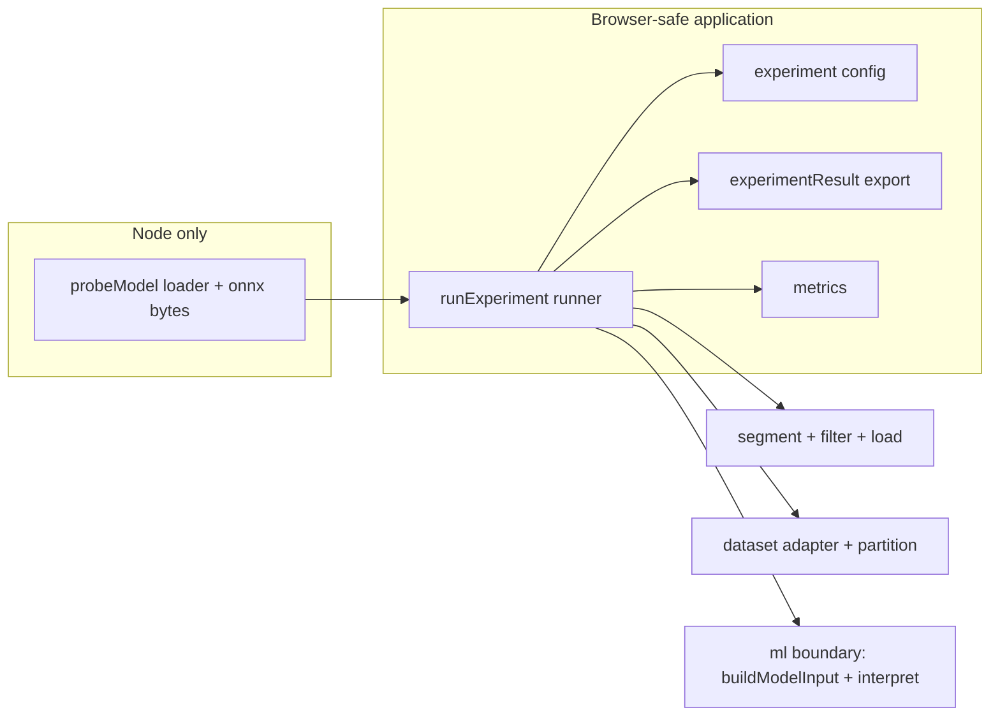

# Phase 8 Plan — Experiment / evaluation

Recorded 2026-09-04. Purpose: a resumable, itemized Phase-8 plan to execute
item-by-item in Code mode with a green `npm run check` gate at every item —
mirroring the `plans/phase-7-handoff.md` cadence.

## Active increment (approved)

> "Recommended: build the experiment/evaluation machinery + prove it end-to-end
> via the probe-model sign-of-mean oracle on the synthetic 'sync' record (real
> computed metrics, explicitly non-clinical); subject-level split runner + JSON
> provenance export; library/application slice with tests only, no new UI;
> every item green-gated."

Phase 8 scope (architecture §M / §L / ADR-007): `ExperimentConfiguration` and
`ExperimentResult`, per-record evaluation, subject-level splits, provenance
export. No training in the browser — this phase only *consumes* the one committed
model artifact and evaluates it; no new UI.

## Verified state (baseline)

- **Baseline green** (Phase 7 close): `npm run check` passed — typecheck, lint,
  **43 test files / 422 tests**, Vite build (135 modules / 76.32 kB). Node
  v24.18.0, npm 11.16.0.
- Phases 1–7 implemented. `src/application/` exists and is intentionally minimal
  ([`src/application/index.ts`](../src/application/index.ts) header states ML
  orchestration "is added as those phases land") — application → ml imports are
  the intended evolution.
- One committed model artifact: probe `ecg-lab-probe-linear-mean-2` v1.0.0
  (metadata + `.onnx` under
  [`data/fixtures/models/`](../data/fixtures/models/ecg-lab-probe-linear-mean-2.metadata.json));
  integrity-pinned in
  [`src/ml/testing/probeModel.ts`](../src/ml/testing/probeModel.ts).
- Real-session Node integration precedent exists:
  [`src/ml/onnx/__tests__/onnxWeb.integration.test.ts`](../src/ml/onnx/__tests__/onnxWeb.integration.test.ts)
  (loads committed bytes → `createOnnxWebEngine` → run → interpret; zero-mean
  window ties to label index 0 `positive-mean`).

## Honest-evaluation framing (must stay true through every item)

The lab has **no trained physiological classifier**. Its only committed model is
the probe, whose metadata methodology states: `logits = [+Σ, −Σ]` of the
float32 window, so `softmax argmax` is the sign of the window mean. The probe
metadata's own limitations text says it is a "development seam-validation probe"
with no physiological or clinical meaning.

Consequences baked into the design:

- The ground-truth **labeler for the seam run is the same analytic rule** (sign
  of window mean / sum), so agreement is near-perfect **by construction**. The
  run therefore validates the *evaluation pipeline* (input building, engine,
  interpretation, metrics, export, determinism) — **not** model predictive
  performance. Every exported result carries an explicit scope/limitations note
  saying exactly this. Rules §47 (performance claims) and §49 (no fake
  confidence) are honored by wording, never by omission.
- Synthetic record `sync` (360 Hz, 3600 samples/channel) segments into **exactly
  10 non-overlapping 360-sample windows per channel** under a `360/360/drop`
  window config. Channel `lead-b` (1.2 Hz, so each 1 s window spans 1.2 cycles)
  has robustly non-zero per-window means with a sign pattern across the 10
  windows; channel `lead-a` (1.0 Hz, full periods) integrates to ~zero means and
  would sit on the tie boundary. **Evaluate channel `lead-b`** and document why.
- All reported metrics are **computed** by a pure metrics module from recorded
  per-window outcomes (rules §24). Undefined denominators are recorded as
  `null`, never a fabricated 0/NaN.

## Design decisions

### Layer placement — `src/application/`, NOT `src/domain/`

`ExperimentConfiguration`/`ExperimentResult` bundle DSP types
(`WindowConfig`, optional `FilterSpec`/`DwtConfig`), and ADR-002 forbids
`domain/` from importing `dsp/`. Precedent: [`RecordAnalysisOptions`](../src/application/analysis.ts)
already lives in `src/application/`. Therefore:

- The Phase-8 experiment/evaluation machinery lives in new `src/application/`
  modules (`metrics.ts`, `experiment.ts`, `experimentResult.ts`, `runExperiment.ts`).
- Those modules may import `domain/`, `dsp/`, `datasets/`, and `ml/`.
- The probe **loader** (`ml/testing/probeModel.ts`) stays Node-only and is
  imported only by the Node seam test / demo, never by application code.
- This supersedes the architecture §F line that listed
  `ExperimentConfiguration/EvaluationResult` under the domain entity list
  ("see L") — recorded as **ADR-009** in the docs item.

### Runner: everything scientific is injected

`runExperiment` takes an injected `DatasetAdapter`, `InferenceEngine`,
`ModelMetadata`, a ground-truth **labeler** function, and a software-version
string. Composition-root style, exactly like the analysis service and the ORT
worker: unit tests use `StubInferenceEngine` + deterministic synthetic fixtures;
the seam demonstration drives the real `createOnnxWebEngine` over the committed
probe in Node (the Phase 6/7 integration path). The runner never knows whether
the engine is real or a stub and never fabricates a label.

Per record the runner: `adapter.readRecord` → `recordToMillivoltSignal` (capture
the provenance transform chain) → optional declared filter (none for the probe:
its `preprocessingAssumptions` is `identity-window`) → segment the selected
channel with the config window → per window `buildModelInput` →
`engine.run(metadata, input)` → `interpretPrediction(...)[0]` (argmax) →
labeler ground truth → record a `WindowOutcome`.

### Provenance / export shape

`ExperimentResult` is JSON-serializable and round-trip-validated:
`experimentId` (deterministic, from identity fields, `analysisIdOf` precedent) +
configuration snapshot + injected software version + labeler description +
explicit scope/limitations note + per-record `{ recordId, subjectId, channelName,
provenance transform chain, windows[] }` + aggregate `ClassificationMetrics`.
`windowId` is stable, e.g. `` `${recordId}/ch/${channelIndex}/w${startSample}` ``.

### Metrics model

Pure, multi-class, deterministic; `null` for undefined denominators (e.g.
precision is `null` when true-positives + false-positives = 0); support counted
per class; overall accuracy `null` for an empty evaluation.

## Checklist (items 1–7, each ends green on `npm run check`)

1. **Pure metrics module** — new `src/application/metrics.ts` + Node tests
   `src/application/__tests__/metrics.test.ts`:
   - `ConfusionCell`/matrix over declared class labels from
     `{trueLabel, predictedLabel}[]` (validates labels are declared), plus
     per-class rates `precision/recall/specificity/f1/support` with `null`
     semantics, overall accuracy, totals. Export from
     [`src/application/index.ts`](../src/application/index.ts).
   - Tests: perfect binary agreement; all-one-class (null denominators);
     multi-class confusion; empty evaluation; determinism/no mutation.
   - Gate: `npm run check`.

2. **ExperimentConfiguration** — new `src/application/experiment.ts` + Node
   tests. Types + `describeExperimentConfigurationProblems`/
   `assertValidExperimentConfiguration` + deterministic `experimentIdOf` +
   pure subject/record selection helpers over
   [`src/datasets/partition.ts`](../src/datasets/partition.ts) refs
   (`choosePartitionRecords` returning `records + roleSubjects` with
   `assertNoSubjectLeakage`).
   - Config carries: dataset id; selection as explicit `recordIds` **or** a
     subject `partition + role`; `channelName`; optional declared `filter`;
     `window` (`WindowConfig`); model `{modelId, modelVersion}`;
     evaluation `{labelerId, description}`. Everything to re-run the evaluation.
   - Tests: schema accept/reject, snapshot JSON, id determinism/stability under
     reordering, role selection edges (single subject → `test`), leakage guard.
   - Export the new surface from the application barrel.
   - Gate: `npm run check`.

3. **ExperimentResult + JSON export** — new `src/application/experimentResult.ts`
   + Node tests. `RecordEvaluation` (per-record provenance transform chain from
   `recordToMillivoltSignal`, frozen) + `WindowOutcome` (windowId, record,
   channel index/name, startSample/length, trueLabel, predictedLabel,
   predictedScore, semantics) + `ExperimentResult`
   (experimentId, config snapshot, softwareVersion, labeler, scope/limitations
   note, evaluatedAtIso, records, metrics). `serializeExperimentResult` (stable
   key ordering via `stableStringify`) and `parseExperimentResult` with strict
   round-trip validation; classified error on malformed input.
   - Tests: serialize → parse → deep-equal round trip; stable output across
     equivalent results; malformed JSON/structural rejections.
   - Gate: `npm run check`.

4. **Evaluation runner** — new `src/application/runExperiment.ts` + Node tests
   with `StubInferenceEngine` and multi-record synthetic fixtures:
   - `runExperiment(adapter, engine, metadata, config, labeler, {softwareVersion})`
     returns an `ExperimentResult`; aggregates metrics via `metrics.ts`;
     surfaces classified errors (unknown record → adapter error; engine /
     compatibility failures propagate as `EcgError`).
   - Tests: plumbing (window count per channel, channel filtering, provenance
     captured), oracle agreement with a controllable fake labeler, determinism,
     classified error propagation, dispose/idempotence hygiene.
   - Export from the application barrel.
   - Gate: `npm run check`.

5. **Seam end-to-end demonstration** (Node) — new test
   `src/application/__tests__/experimentSeam.integration.test.ts` mirroring the
   Phase 6/7 real-session pattern:
   - Load probe metadata/bytes, `createOnnxWebEngine`, register synthetic `sync`
     via `SyntheticDatasetAdapter`, config = `sync` / channel `lead-b` /
     window `360/360/drop` / probe identity, labeler = binary sign-of-sum rule
     (boundary: sum ≥ 0 → `positive-mean`, matching the documented tie-break),
     software version literal.
   - Assert: 10 windows/channel outcome rows; determinism across two runs
     (identical ids, scores, metrics); every window's predicted label equals the
     analytic sign oracle; metrics are real numbers with `null` only where
     undefined; full serialize/parse round trip.
   - Header comment documents the **seam-validation, non-clinical** scope.
   - Gate: `npm run check`.

6. **Subject-level split runner demonstration** — extend runner tests / add Node
   tests with a **multi-subject deterministic fixture** (several synthetic
   records; synthetic `subjectId = recordId`, so each record is its own subject):
   - Register N records with distinct lead specs (distinct waveform → distinct
     oracle labels), partition at subject level via `partitionSubjects`/`partitionRecords`,
     select role `test`, assert `assertNoSubjectLeakage`, and assert the adapter
     `readRecord` was only called for records in the selected role (structural
     no-leakage evidence). Cover the single-subject → `test` edge.
   - Add a canonical factory to
     [`src/application/defaults.ts`](../src/application/defaults.ts)
     (`createProbeSeamExperimentConfiguration`) so the seam run has one source
     of truth reused by tests and any future runner wiring; re-verify default
     jsdom smoke slices still green.
   - Gate: `npm run check`.

7. **Docs + final gate** —
   - Write **ADR-009** recording: (a) the `src/application/` layer placement for
     the experiment/evaluation machinery (superseding the architecture §F
     domain list — `ExperimentConfiguration`/`EvaluationResult`/`PartitionSpec`
     placement), and (b) the seam-validation evaluation scope with the
     non-clinical wording it mandates; update the architecture decision
     register and any §F/§M cross-reference.
   - Record a short Phase-8 completion/audit note (verified state, files added,
     what the seam run proves and does not prove) in `plans/`.
   - **Final full gate**: `npm run check` green; note the new test-file/test
     counts in the audit note.

## Key files to create / touch

- Create: `src/application/metrics.ts`, `experiment.ts`, `experimentResult.ts`,
  `runExperiment.ts`; tests `src/application/__tests__/{metrics,experiment,
  experimentResult,runExperiment}.test.ts` +
  `experimentSeam.integration.test.ts` (item 5); ADR `plans/adr/ADR-009-*.md`.
- Touch: `src/application/index.ts` (export the new surface as it lands),
  `src/application/defaults.ts` (canonical seam config factory, item 6),
  `plans/ecg-lab-architecture.md` (decision register + §F cross-ref, item 7).
- Read-only inputs the runner builds on: [`src/datasets/load.ts`](../src/datasets/load.ts)
  (`recordToMillivoltSignal` provenance), [`src/dsp/segment.ts`](../src/dsp/segment.ts),
  [`src/ml/input.ts`](../src/ml/input.ts), [`src/ml/interpret.ts`](../src/ml/interpret.ts),
  [`src/ml/engine.ts`](../src/ml/engine.ts), [`src/datasets/partition.ts`](../src/datasets/partition.ts),
  [`src/datasets/synthetic/adapter.ts`](../src/datasets/synthetic/adapter.ts),
  [`src/ml/testing/stub.ts`](../src/ml/testing/stub.ts),
  [`src/ml/testing/probeModel.ts`](../src/ml/testing/probeModel.ts).

## Reminders for execution

- Do NOT import `ml/testing/` or `ml/onnx/` from application source; they are
  Node-only and enter only via the Node seam test / demo and browser/worker
  wiring respectively.
- Windows are per-channel (`SignalWindow.channelIndex`); select one channel and
  keep `windowId` stable and unique per record+channel+start.
- `interpretPrediction` returns classes sorted by descending score; `[0]` is the
  argmax. Probe semantics are honest `predicted-probability` (logits + softmax).
- The single-subject partition edge lands in role `test` — the seam demo can
  therefore also be described as a one-subject `test`-role evaluation.
