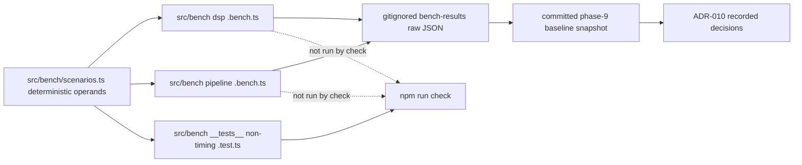

# Phase 9 Plan — Optimization (measurement-driven)

Recorded 2026-09-04. Purpose: a resumable, itemized Phase-9 plan to execute
item-by-item in Code mode with a green `npm run check` gate at every item —
mirroring the `plans/phase-8-plan.md` cadence.

## Active increment (approved)

> "Measurement-only Phase 9: build the vitest-bench harness over `src/bench/`,
> deterministic scenario inputs (3600..650000 samples), run baselines for DSP
> (filter/normalize/segment/DWT db4/resample), `buildModelInput`, and a
> `runExperiment` seam over the real ONNX probe; record numbers + a gitignored
> raw-output dir + committed policy/README; record worker/WASM/WebGPU deferral
> decisions in ADR-010 with the measured numbers. NO production-code optimization
> this phase — any real optimization becomes a later phase driven by these
> numbers. Also delete the stray `tmp_split_oracle.cjs` pre-flight."

Phase 9 scope (architecture §M item 9 / §I worker + WASM/WebGPU bullets / §K):
**benchmark harness only; worker/WASM/WebGPU decisions only from baselines.**
This phase changes **no production scientific code**. Its outputs are: (a) a
deterministic benchmark harness under `src/bench/`, (b) recorded baselines on
this machine, (c) a committed measurement policy + gitignored raw output,
(d) ADR-010 recording the measured decision status of worker offload, WASM DWT,
and WebGPU. Correctness-preserving optimization is deliberately **deferred to a
later phase** that will be driven by these numbers (rules §50, §51; AGENTS §14).

## Verified state (baseline)

- **Baseline green** (Phase 8 close): `npm run check` passed — typecheck,
  svelte-check 0/0, lint, **48 test files / 492 tests**, Vite build (135 modules
  / 76.32 kB). Node v24.18.0, npm 11.16.0.
- Phases 1–8 implemented. Pure DSP surface under
  [`src/dsp/`](../src/dsp/index.ts) (filter/resample/normalize/segment + DWT db4
  periodic via [`src/dsp/dwt/`](../src/dsp/dwt/dwt.ts)); ML input builder
  [`src/ml/input.ts`](../src/ml/input.ts); evaluation runner
  [`src/application/runExperiment.ts`](../src/application/runExperiment.ts).
- Committed probe `ecg-lab-probe-linear-mean-2` v1.0.0 (metadata + `.onnx` under
  [`data/fixtures/models/`](../data/fixtures/models/ecg-lab-probe-linear-mean-2.metadata.json)),
  integrity-pinned in [`src/ml/testing/probeModel.ts`](../src/ml/testing/probeModel.ts).
- Real-session Node precedent + a pinned 10-window `sync`/`lead-b` seam result:
  [`src/application/__tests__/experimentSeam.integration.test.ts`](../src/application/__tests__/experimentSeam.integration.test.ts)
  — the correctness anchor the pipeline bench builds on.
- Config facts that shape where bench code may live:
  - [`vite.config.ts`](../vite.config.ts) is the **sole** Vitest/Vite config
    (the `vitest.config.ts` open tab is stale). `test.include =
    ['src/**/*.test.ts']` confines `npm run test`/check to `*.test.ts`, so
    `*.bench.ts` files are **not** executed by check.
  - [`tsconfig.json`](../tsconfig.json) `include: ["src", "vite.config.ts"]` →
    any `src/bench/**` file **is typechecked** by `npm run typecheck`.
  - ESLint lints `src` + `vite.config.ts` and ignores `plans/**`/`data/**` →
    bench files under `src/` **are linted** and must be lint-clean.
  - No `bench` npm script exists yet.
- `.gitignore`: `/data/raw/` and `/data/processed/` are gitignored;
  `data/fixtures/` is committed. `plans/` is committed (architecture + ADRs).
- **Loose end:** a throwaway [`tmp_split_oracle.cjs`](../tmp_split_oracle.cjs)
  (self-described "Throwaway numeric verifier" from Phase-8 Item 6) still sits at
  the repo root even though the Phase-8 audit records it as deleted. Its job is
  fully covered by the committed oracles in
  [`runExperiment.test.ts`](../src/application/__tests__/runExperiment.test.ts)
  and the seam test — remove it in Item 0.

## Honest-measurement framing (must stay true through every item)

Rules §50/§51/§52 and AGENTS §14/§15/§35 govern the whole phase:

- Timing is **machine- and environment-dependent**. Recorded baselines are a
  snapshot of *this* machine on 2026-09-04, never a CI wall-clock gate. Raw
  per-run output is gitignored; what is committed is policy + a labelled
  snapshot. No committed test ever asserts a duration (rules §51).
- "Faster"/"slower" claims may only be written with a before/after measurement on
  the same machine. This phase records the *before* (the baseline); there is no
  *after* yet because no optimization lands here.
- Benchmark **results are engineering throughput** (operation duration / windows
  per second). They are **never** phrased as model-performance or clinical claims
  (§47/§49). The `runExperiment` pipeline bench is **seam-validation scope only**
  and its file header must say so, exactly like the Phase-8 seam test.
- **Deterministic where practical**: seeded/analytic synthetic operands (no
  randomness, no I/O — `generateSyntheticRecord` is a pure function of its spec),
  fixed iteration counts, derived-but-stable algorithm configs. Track input size,
  sample rate, algorithm config, iterations, and execution time per the §51 list.
- **Memory discipline** (AGENTS §15): operands stay
  `Float64Array`/`Float32Array`; a full-length ~650 000-sample record is
  synthesized in memory only — never written to `data/`, never committed.

## Design decisions

### Harness: Vitest bench under `src/bench/`

Vitest 3.2.7 ships a built-in `vitest bench` runner. Because `test.include`
already confines `vitest run` to `*.test.ts`, `.bench.ts` files under `src/bench/`
stay out of `npm run check`'s test step while still being typechecked (tsconfig)
and linted (eslint). To run benches:

- Add an explicit bench-include (the exact key as declared by installed vitest
  3.2.7 types, e.g. `test.bench.include = ['src/bench/**/*.bench.ts']`) to
  [`vite.config.ts`](../vite.config.ts), so `vitest bench` executes **only** the
  bench suite and never drags in `*.test.ts` files. Verify with
  `npx vitest bench --run` that the reported file list is exactly `src/bench/`.
- Add an npm script `"bench": "vitest bench"` (run mode flag per local
  preference). **Never** add `bench` to `npm run check`.
- Scenario/input builders that need non-timing correctness tests live under
  `src/bench/` too, but as `*.test.ts` (e.g.
  `src/bench/__tests__/scenarios.test.ts`), which `npm run test` *does* run —
  giving shape/determinism assertions without any wall-clock dependency.

### Deterministic scenario inputs

`SyntheticRecordSpec` (see [`adapter.ts`](../src/datasets/synthetic/adapter.ts:49))
exposes optional `sampleRateHz` (default 360) and `sampleCount` (default 3600),
so a record of any length is generated deterministically in memory with no I/O.

| size (samples @360 Hz) | meaning |
|---|---|
| 3 600 | default synthetic 10 s (`sync`) |
| 36 000 | 100 s |
| 360 000 | ≈16.7 min |
| 650 000 | ≈30 min full-length MIT-BIH record |

A single `src/bench/scenarios.ts` module memoizes per-size prepared operands:
`SignalRecord → recordToMillivoltSignal` Float64 channel(s) (reusing
[`src/datasets/load.ts`](../src/datasets/load.ts)), plus representative
`FilterSpec`, `DwtConfig`, `WindowConfig`, and a resample target (e.g. 360→128
Hz). DWT level is derived deterministically (e.g. via `maxPeriodicLevelForLength`
or a fixed level the length supports). These builders are pure; the
non-timing tests assert size, determinism, validity via the existing
`assert*` helpers, and that the full-length operand exists.

### What to benchmark

- **DSP micro-benchmarks** (`src/bench/dsp.bench.ts`), each across all four
  sizes with fixed iteration counts: FIR design + zero-phase filtering
  (`designFirFilter`/`firZeroPhase`), normalization (`fitNormalization` +
  `applyNormalization`, or `normalizeSignal`), segmentation (`segmentSignal`
  with a fixed window/stride), DWT db4 periodic `decomposeSignal` +
  `reconstructSignal`, and representative `resampleSignal`. Each case records
  sample rate + config + iterations; results carry mean/p99 ms from the runner.
- **ML/pipeline benches** (`src/bench/pipeline.bench.ts`):
  - `buildModelInput` over windows at each size.
  - A `runExperiment` seam over long synthetic records driven by the **real**
    ONNX probe engine (`probeModel` loader + `createOnnxWebEngine`, the Phase-8
    seam path), measuring steady-state throughput (windows evaluated per second)
    per size. Header documents **seam-validation, non-clinical** scope.
- Sizes/iteration counts stay small enough that the whole suite completes in a
  reasonable local wall time (fewer iterations at 650 000).

### Outputs, gitignore, committed artifacts

- Raw per-run JSON (vitest bench reporter output) → a **gitignored**
  `/bench-results/` directory (added to `.gitignore` in Item 1).
- **Committed** artifacts only:
  1. Measurement policy/protocol doc — `plans/phase-9-bench-policy.md`:
     protocol (machine snapshot command, warm-up/iteration rationale, how to
     re-run, reporter), explicit "machine-dependent, never a CI wall-clock gate"
     statement (rules §51), reproducibility mapping (§35 / AGENTS §35), and the
     mapping of measured axes to the architecture §I worker-table rows.
  2. Baseline snapshot doc — `plans/phase-9-baseline.md`: the 2026-09-04 numbers
     for this machine (input size / rate / config / mean ms; windows-per-second
     where relevant), clearly labelled a snapshot, not a gate.
  3. ADR-010 (Item 6) recording the decisions the numbers support.

### Decision framework recorded in ADR-010 (no code change)

The bench measures the **synchronous cost** of each DSP op per size. That number
is what the §52 execution-model decision is made from (a single-shot duration vs
the ≈16.7 ms browser frame budget, and whether the workload streams). ADR-010
records:

- **Worker offload** — whether any full-record DSP op's measured duration makes
  main-thread synchronous execution untenable, referencing the still-open
  worker seam #3 (real browser Worker glue is unwired: [`src/workers/`](../src/workers/client.ts)
  has the messaging core/contract but no production browser Worker wiring).
- **WASM DWT** — re-confirm the ADR-003 deferral or act, now that a TS db4
  baseline exists (only if the TS path is shown to be the bottleneck).
- **WebGPU** — remains deferred pending measurement + browser-support decision
  (architecture §I), unless the numbers change that.
- **A standing policy**: no optimization without a measured bottleneck; every
  future optimization re-runs this harness before/after on the same machine.

## Checklist (items 0–7, each ends green on `npm run check`)

0. **Pre-flight cleanup (no behavior change)** — delete the stray throwaway
   [`tmp_split_oracle.cjs`](../tmp_split_oracle.cjs) from the repo root (verified
   throwaway; its oracle is fully covered by committed tests). Confirm git status
   shows only intended changes.
   - Gate: `npm run check` green (test counts unchanged: 48 files / 492 tests).

1. **Harness scaffold + config** — add an explicit bench-include to
   [`vite.config.ts`](../vite.config.ts) so `vitest bench` matches only
   `src/bench/**/*.bench.ts` (exact key per installed vitest 3.2.7 types); confirm
   `test.include` still confines `npm run test` to `*.test.ts`. Add the npm
   `bench` script to [`package.json`](../package.json) — **not** into `check`.
   Add `/bench-results/` to [`.gitignore`](../.gitignore).
   - Verify locally: `npm run check` green, and `npx vitest bench --run` completes
     and reports **exactly** the `src/bench/` files (no-op while empty is fine).
   - Gate: `npm run check`.

2. **Deterministic scenario inputs + non-timing tests** — new
   `src/bench/scenarios.ts` exposing the canonical size list and memoized
   per-size prepared operands (mV Float64 channels + representative
   filter/DWT/window/resample configs, deterministic, no I/O). New
   `src/bench/__tests__/scenarios.test.ts` asserting: sizes as declared; operand
   lengths match; determinism (two builds identical); validity via existing
   `assert*` helpers; full-length ~650 000 operand present. These tests assert
   shape/determinism only — never duration.
   - Gate: `npm run check` green (test-file count rises to 49).

3. **DSP micro-benchmarks** — `src/bench/dsp.bench.ts` benchmarking FIR
   design+zero-phase, normalization, segmentation, DWT db4 periodic
   decompose+reconstruct, and representative resample across the four sizes with
   fixed iterations; each case records sample rate + config. Bench files must
   typecheck and lint clean (they do not run under check).
   - Gate: `npm run check` green; then a local `npm run bench` run captures first
     numbers to `/bench-results/` (raw, gitignored).

4. **ML/pipeline bench (seam-validation scope)** — `src/bench/pipeline.bench.ts`:
   `buildModelInput` windows per size, and a `runExperiment` seam over long
   synthetic records with the real ONNX probe engine measuring windows/second.
   Header documents seam-validation/non-clinical scope (§47/§49); reuse the
   Phase-8 pinned 10-window `sync` pattern as the correctness anchor.
   - Gate: `npm run check` green; local `npm run bench` run captures numbers.

5. **Measurement protocol + policy + baseline snapshot** — committed
   `plans/phase-9-bench-policy.md` (protocol, machine snapshot, re-run steps,
   explicit "not a CI gate" statement, §51/§35 mapping) and
   `plans/phase-9-baseline.md` (this machine's 2026-09-04 numbers, labelled a
   snapshot). Raw per-run JSON stays gitignored under `/bench-results/`.
   - Gate: `npm run check`.

6. **ADR-010 + architecture update** — write `plans/adr/ADR-010-performance-measurement-policy.md`
   recording the measurement-first policy and the worker offload / WASM DWT /
   WebGPU decisions with the numbers behind them (seam #3 reference). Update the
   architecture §I worker/WASM/WebGPU bullets only where the numbers change a
   stated deferral (otherwise add a pointer), §M Phase-9 bullet
   ([`plans/ecg-lab-architecture.md`](../plans/ecg-lab-architecture.md:324)) to
   note completion, and the decision register with the ADR-010 line.
   - Gate: `npm run check`.

7. **Audit + final gate** — write `plans/phase-9-audit.md` mirroring the
   phase-6/7/8 cadence: approved scope, files added, transcribed headline
   numbers (marked as a snapshot), the three recorded decisions, what measurement
   proves and does not prove, item mapping, and test counts.
   - **Final full gate**: `npm run check` green; note new test-file/test counts.

## Key files to create / touch

- Create: `src/bench/scenarios.ts`, `src/bench/__tests__/scenarios.test.ts`
  (item 2), `src/bench/dsp.bench.ts` (item 3), `src/bench/pipeline.bench.ts`
  (item 4), `plans/phase-9-bench-policy.md` + `plans/phase-9-baseline.md`
  (item 5), ADR `plans/adr/ADR-010-performance-measurement-policy.md` (item 6),
  `plans/phase-9-audit.md` (item 7).
- Touch: `.gitignore` (`/bench-results/`, item 1), `package.json` (`bench`
  script, item 1), `vite.config.ts` (bench include, item 1),
  `plans/ecg-lab-architecture.md` (§I pointer / §M note / decision register,
  item 6).
- Delete: `tmp_split_oracle.cjs` (item 0).
- Read-only inputs: [`src/dsp/filter.ts`](../src/dsp/filter.ts),
  [`src/dsp/normalize.ts`](../src/dsp/normalize.ts),
  [`src/dsp/segment.ts`](../src/dsp/segment.ts),
  [`src/dsp/resample.ts`](../src/dsp/resample.ts),
  [`src/dsp/dwt/dwt.ts`](../src/dsp/dwt/dwt.ts),
  [`src/dsp/dwt/catalog.ts`](../src/dsp/dwt/catalog.ts),
  [`src/ml/input.ts`](../src/ml/input.ts),
  [`src/ml/onnx/ortWebEngine.ts`](../src/ml/onnx/ortWebEngine.ts),
  [`src/ml/testing/probeModel.ts`](../src/ml/testing/probeModel.ts),
  [`src/application/runExperiment.ts`](../src/application/runExperiment.ts),
  [`src/application/defaults.ts`](../src/application/defaults.ts),
  [`src/datasets/synthetic/adapter.ts`](../src/datasets/synthetic/adapter.ts),
  [`src/datasets/load.ts`](../src/datasets/load.ts),
  [`src/workers/client.ts`](../src/workers/client.ts) (seam #3 reference only).

## Reminders for execution

- Bench files live under `src/`, so `npm run typecheck` and `npm run lint`
  include them even though `vitest run` never executes them — they must be fully
  type-safe and lint-clean. Do not add lint/typecheck exemptions for them.
- **Never** assert a wall-clock duration in any committed test (rules §51).
  Scenario tests assert shape/determinism only. `npm run bench` is local and
  machine-specific and is **never** added to `npm run check`.
- Do not import `ml/testing/` or `ml/onnx/` from application source; the pipeline
  bench uses them only inside `src/bench/` (Node-only, mirroring the Phase-8 seam
  test).
- No production scientific code changes anywhere in this phase except config
  (`.gitignore`, `package.json` script, `vite.config.ts` bench block) — by
  approved measurement-only scope.
- Reuse deterministic builders: `generateSyntheticRecord` +
  `recordToMillivoltSignal`; add a noise variant only through the committed RNG
  ([`src/fixtures/rng.ts`](../src/fixtures/rng.ts)) if ever needed.
- The ~650 000-sample operand is the full-length MIT-BIH-size reference that
  informs the architecture §I worker decision; it is synthesized in memory only
  and never touches gitignored `data/raw/`.
- Confirm the exact vitest bench config key from the installed vitest 3.2.7
  types (`node_modules/vitest`) before editing `vite.config.ts`, and confirm with
  `npx vitest bench --run` that only `src/bench/` files are reported.
