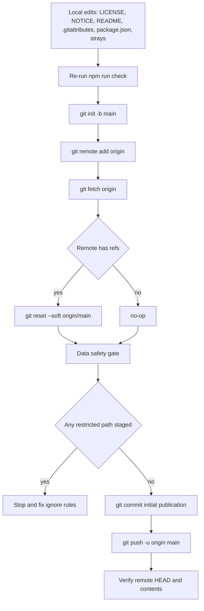

# Repository Publication Plan — ECG DWT Analyzer

Status: proposed (Architect) — awaiting execution in Code mode.

## 1. Context

- **Target remote:** https://github.com/manwell47/ECG-Analyzer (account `manuamigo1` added as collaborator).
- **Local workspace is not a git repository.** No `.git` exists, so the ignore policy in `.gitignore` has **never actually been exercised** — the first `git add` is the first real test of it.
- **Licensing decision:** Apache-2.0 for the source in this repository. The upstream PhysioNet MIT-BIH corpus is ODC-BY 1.0 and is **not distributed here** (it lives in the gitignored `data/raw/`).
- **Trigger:** Phase 18 is closed and the gate is green — `npm run check` exit 0, **66 test files / 838 tests / 181 build modules**, svelte-check 0 errors / 0 warnings.

## 2. Verified facts

| Fact | Evidence | Consequence |
| --- | --- | --- |
| No git repository | `.git` absent (`git status` → exit 128) | `git init` required; no history to migrate |
| Ignore policy already written | `.gitignore` | Excludes `/data/raw/`, `/data/processed/`, `node_modules/`, `dist/`, `coverage/`, `/bench-results/`, `*.log`, OS noise |
| Restricted data present on disk | `data/raw/mitdb/*.atr/.dat/.hea/.xws` | Must never be staged; the single hard safety gate |
| Committed fixtures are appropriate | `data/fixtures/` (ONNX probe model, `reference/db4.json`, `signals.json`, provenance READMEs, generator script) | Small, derived, license-appropriate — publish |
| No secrets | two scans over `src/` | Only benign env reads such as `FIXTURES_OVERWRITE` |
| No `README.md`, no `LICENSE` | top-level listing | Both are publication blockers |
| Stale metadata | `package.json` description says "Phase 1"; no `license`, no `repository` | Refresh before the first commit |
| Mis-named constitution file | `AGENTS.md.txt` was 929 lines of the real `AGENTS.md` | Renamed to `AGENTS.md`; every citing reference updated repo-wide (ADR-022) |
| Genesis brief | `first prompt.txt`, 891 lines (Architect initialization brief); referenced `.roo/rules-code/01-medical-engineering.md`, a path that did not exist | Relocated to `docs/origin-brief.md`; the rule path it names now resolves |
| Rule constitution | `.roo/01-medical-engineering.md.txt` (1250 lines) sat outside `.roo/rules-code/`, so Roo loaded no Code-mode rules | Moved to `.roo/rules-code/01-medical-engineering.md`; publish for consistency with `AGENTS.md` |

## 3. Hard invariants

- **I1 — Data safety.** No path under `data/raw/` or `data/processed/` may ever be committed. Proven with `git check-ignore -v` and a staged-path audit, not assumed.
- **I2 — Green tree.** The first commit is made only from a tree where `npm run check` passes.
- **I3 — Irreversibility.** The first push is permanent; history rewriting is not a remediation strategy.
- **I4 — No overclaiming.** Manual real-browser rows in `plans/phase-1x-manual-verification.md` remain `Pending (human)` per ADR-017. The README must describe the gate and the pending human passes as they are.

## 4. Execution sequence



**Step 0 — Reconnoitre.** `git --version`; `git config --get user.name`; `git config --get user.email`; `git ls-remote origin`. Set the repo-local commit identity to match the account that will push. Note: the first push triggers a Git Credential Manager browser prompt. Also measure the weight of the committed payload: `dir /s /-c data\fixtures`.

**Step 1 — `LICENSE`.** Apache License 2.0, verbatim, with the appendix copyright line completed for the repository owner.

**Step 2 — `NOTICE`.** Apache-2.0 attribution notice: `onnxruntime-web` (MIT), Svelte (MIT), Vite (MIT), Vitest (MIT); and an explicit statement that the MIT-BIH Arrhythmia Database (PhysioNet, ODC-BY 1.0) is **not** redistributed by this repository, with provenance pointers to `data/fixtures/*/README.md`.

**Step 3 — `README.md`.** English, matching the language of the existing documentation. Required sections:

1. Title + one-line description ("browser-first, local-first ECG DWT analysis and ONNX inference laboratory").
2. **Not a medical device** — non-diagnostic disclaimer, mirroring the wording mandated by `AGENTS.md`.
3. Status: Phase 18 complete; gate counts (66 / 838 / 181); explicit statement that real-browser manual passes remain pending per ADR-017.
4. Architecture: domain → application → dsp / ml / workers → presentation, pointing at `plans/adr/`.
5. Quick start: `npm install`, `npm run dev`, `npm run check`, `npm run bench`.
6. Datasets: synthetic, MIT-BIH and EDF+ adapters; `data/raw/` is local-only and never committed; provenance lives next to the fixtures.
7. Reproducibility: experiment model and fingerprints (ADR-007).
8. Documentation map into `plans/` (plans, audits, checkpoints, manual-verification protocols).
9. License section (Apache-2.0) and the dataset caveat.

**Step 4 — `.gitattributes`.** `* text=auto eol=lf`, plus explicit `binary` markers for `*.onnx`, `*.dat`, `*.atr`, `*.xws`, `*.png`, `*.ico`. This workspace is Windows-authored; without it the first cross-machine checkout produces CRLF churn.

**Step 5 — `package.json`.** Refresh `description` (drop the stale "Phase 1" wording); add `"license": "Apache-2.0"`; add `"repository"` with the GitHub URL; optionally `"engines": { "node": ">=20" }`. **Keep `"private": true`** — it blocks accidental `npm publish` and is unrelated to GitHub visibility.

**Step 6 — Stray-file triage.** Owner decision: rename to canonical paths *and* update every citation. Executed as `AGENTS.md.txt` → `AGENTS.md`, `.roo/01-medical-engineering.md.txt` → `.roo/rules-code/01-medical-engineering.md`, and `first prompt.txt` → `docs/origin-brief.md` (committed as the genesis record). All References lines citing the old names were updated in the same commit — ADR-001 through ADR-010 and `plans/ecg-lab-architecture.md` — and the rename is recorded in ADR-022.

**Step 7 — ADR-022.** New `plans/adr/ADR-022-repository-publication-and-licensing.md` recording: Apache-2.0 for source; upstream biomedical datasets are never distributed; `plans/` and `.roo/` are published deliberately; `package.json` stays `private: true`; visibility policy for the remote.

**Step 8 — Regate.** `npm run check` and confirm the counts are unchanged (66 / 838 / 181). Never commit from a red tree.

**Step 9 — Initialise and attach the remote.**

```
git init -b main
git remote add origin https://github.com/manwell47/ECG-Analyzer.git
git fetch origin
```

If `git init -b` is unsupported (git < 2.28), use `git init` then `git branch -M main`.

**Step 10 — Reconcile remote history.** If the repository was created with an initial commit (a GitHub-generated README/LICENSE), a plain push would be rejected. Preferred, history-preserving and linear:

```
git reset --soft origin/main
```

This points `HEAD` at the remote commit without touching the index or the working tree; the subsequent `git add -A` and commit then sit **on top of** the remote commit, and the push fast-forwards. Fallback if that is unavailable or unexpected:

```
git merge origin/main --allow-unrelated-histories -m "Merge remote initial commit"
```

If `git fetch origin` yields no refs, skip this step entirely.

**Step 11 — Data-safety gate (blocking).**

```
git check-ignore -v data/raw/mitdb/100.dat
git check-ignore -v data/processed
git add -A
git status --porcelain
```

Requirement: at least one `check-ignore` match on each; and **no line of `git status --porcelain` may begin with `A ` or `??` for a path under `data/raw/` or `data/processed/`**. If either fails, stop and fix `.gitignore` before committing.

**Step 12 — First commit.** Subject plus paragraph body, per this repository's commit style:

```
git commit -m "Initial publication: ECG DWT Analyzer (Phase 18)" -m "Browser-first, local-first ECG DWT analysis and ONNX inference laboratory. Phases 1-18 complete; gate green: 66 test files, 838 tests, 181 build modules." -m "plans/ carries the durable record: plans, audits, checkpoints, ADRs 001-022 and manual-verification protocols. Licensed Apache-2.0. MIT-BIH/PhysioNet data is never distributed; data/raw/ is gitignored."
```

**Step 13 — Push.**

```
git push -u origin main
```

**Step 14 — Verify.** `git ls-remote origin`, `git log --oneline --stat -1`, and on GitHub confirm: branch `main`, no `data/` restricted paths present, repository size sane, description and topics set. If the `gh` CLI is available, repository metadata can be set from the terminal; otherwise it is a manual step in the web UI.

## 5. Publication set

| Path | Publish? | Rationale |
| --- | --- | --- |
| `src/`, tests, configs | Yes | The product |
| `plans/` (plans, audits, checkpoints, ADRs, manual-verification) | Yes | The differentiator: decisions with rationale and residual risk |
| `.roo/`, `AGENTS.md` | Yes | Binding constitution the code was written against |
| `docs/origin-brief.md` | Yes | Genesis record |
| `data/fixtures/` | Yes | Small derived artifacts with provenance |
| `data/raw/`, `data/processed/` | **Never** | License-restricted and large |
| `bench-results/`, `dist/`, `coverage/`, `node_modules/` | No | Ignored: per-machine or regenerable |

## 6. Non-goals

- No CI workflow, no Pages deployment, no release tagging, no `npm publish`.
- No history rewriting, no force-push.
- No edits to source, tests or DSP/ML logic — this task is packaging and publication only. Any discovered defect becomes a separate phase.

## 7. Risks

| Risk | Mitigation |
| --- | --- |
| A restricted path slips into the first commit | Step 11 is a blocking, evidenced gate |
| Remote already has an initial commit | Step 10 handles it without force-push |
| Untrusted commit identity | Step 0 sets a repo-local identity explicitly |
| Windows line-ending churn | Step 4 `.gitattributes` |
| README overclaims verification | Invariant I4, worded to match ADR-017 |
| Binary fixture weight in history | Step 0 measures it before committing |
